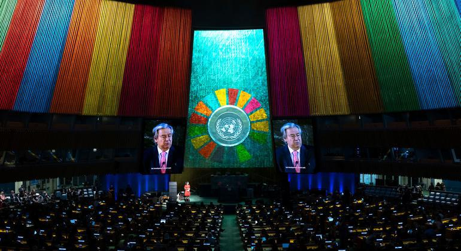
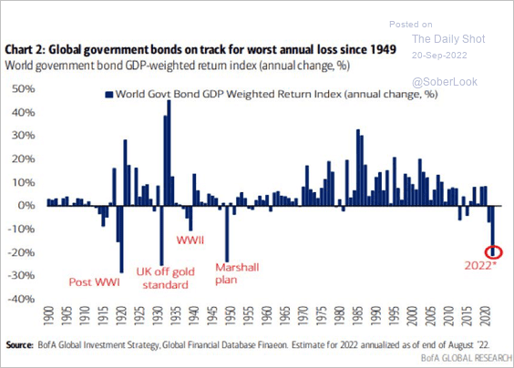
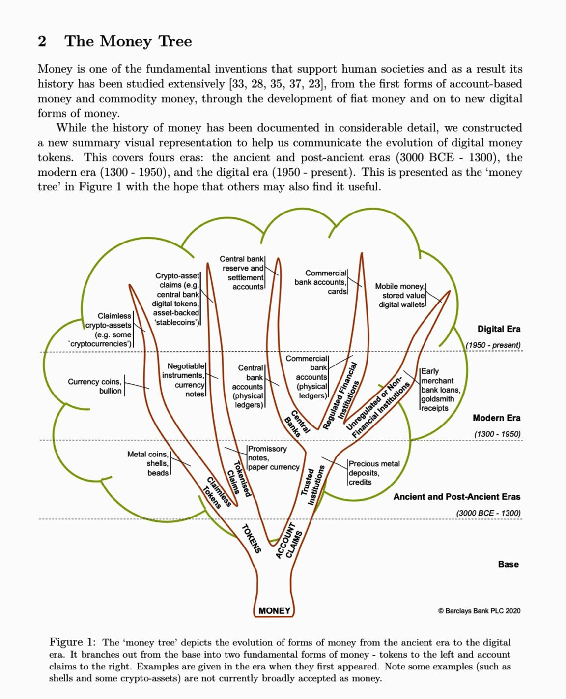
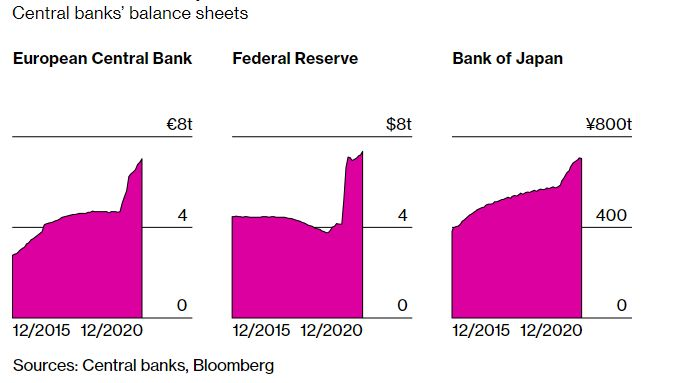
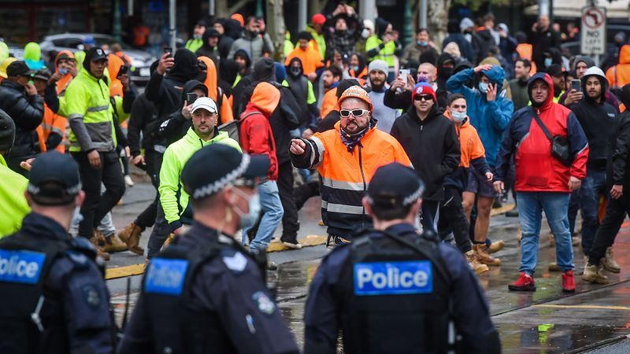

### 2023

> United Nations General Assembly marks halftime for the SDGs
> “The SDGs need a global rescue plan,” the U.N. chief said. He called the summit “the moment for governments to come to the table with concrete plans and proposals to accelerate progress.” Halfway to that goal, progress is lagging badly — and in some...

  

‘We all need to step up’ to rescue the SDG’s and fight for a better future: UN chief

> UN Secretary-General António Guterres on Saturday rallied a diverse cross section of civil society actors to use their passionate voices and energetic grassroots networks to “help rescue the Sustainable Development Goals (SDGs) and fight for the better future every person deserves.”

---

<a href="./documents/september/blog-ethereum-org-2014-08-21-introduction-futarchy.pdf" target="_blank">Futarchy</a>

<a href="./documents/september/ISLKG_The_Construction_of_Island_Knowledge_Graph.pdf" target="_blank">Knowledge Graph</a>

<a href="./documents/september/Kapitalizm-interesariuszy.pdf" target="_blank">Interesariusze</a>

---

  

---

### 2022

  

  

---

  

  

---

### 2021

Today's Thought?

Pandemic-Era Central Banking Is Creating Bubbles Everywhere...

A common thread runs through these scenes from the plague year 2020: Cheap money, gushing in from the world’s major central banks, inflated assets and reshaped how we save, invest, and spend. And that’s not the end of it. Unlike past recoveries, when investors had no clarity on when the monetary taps would be tightened, this time officials have explicitly said they’re going to stick to their loose policies well into a post-Covid recovery.

The strategy is clear and deliberate: make debt the cheapest it’s ever been to deter saving and encourage asset bubbles everywhere.

Central banks know they are basically lowering the return of safe assets to increase demand for risky ones. The wealth of the past and the future has been brought forward into the present and gifted to the bankers mates...

$17.8 trillion in debt is trading with a negative yield. Governments from Australia to Spain were effectively getting paid to borrow. Junk bonds in the U.S. were trading at yields similar to those of investment-grade corporate debt that priced just two years earlier.
When the shells stop, people will find that no pea exists under any of the central bankers shells. just empty air...

The world’s 500 richest people added $1.8 trillion to their combined net worth last year, taking it to $7.6 trillion, according to the Bloomberg Billionaires Index. 

Just saying: asset bubbles are designed to transfer wealth to those who own assets, from those who do not...

  

---

The government said all construction projects in Metropolitan Melbourne, Ballarat, Greater Geelong, Surf Coast Shire and Mitchell Shire would be closed, "with a strictly limited exemption for workers to attend the sites to respond to an emergency or perform urgent and essential work to protect health and safety".
"An amnesty will be put in place so that a limited number of workers can attend construction sites in order to shut them down safely," the government said in a statement.
"All government construction projects in metropolitan Melbourne and relevant LGAs will be closed, with no new work to be completed - other than work required to make the site safe and secure."

  

---

The last upgrade of the Tezos protocol, Granada, activated on August 6th, 2021. We are now glad to announce a new protocol proposal, Hangzhou, the result of a collaborative work from various teams.

(As usual, Hangzhou’s “true name” is its hash, which is PtHangzHogokSuiMHemCuowEavgYTP8J5qQ9fQS793MHYFpCY3r).

Hangzhou is the capital of East China's Zhejiang province, with a population of more than 10 millions. Founded in the 7th century, it is a city with a rich history ; more recently, it has become a dynamic economic zone, and is considered a major technological and innovation hub.

---

### 2020

Shares in HSBC Holdings hit a 25-year low, after news articles detailed “suspicious activity reports” filed by it and other major banks to US authorities, putting fresh pressure on a stock that has already dropped sharply this year.

By midafternoon in Hong Kong on 21 September, the bank’s Hong Kong-listed stock had fallen 3.6% to 29.80 Hong Kong dollars, the equivalent of $3.85, after earlier trading as low as HK$29.60. HSBC stock hasn’t traded below HK$30 a share since May 1995, FactSet shows.

BuzzFeed News, the International Consortium of Investigative Journalists, and partner media organisations published reports on Sunday citing documents leaked to BuzzFeed that included more than 2,100 reports filed by financial institutions with the US Treasury Department’s Financial Crimes Enforcement Network.

### 1942

W czasie żydowskiego święta Jom Kippur (Dzień Pojednania) zakończyła się akcja wysiedleńcza warszawskiego getta. Z Umschlagplatzu wyruszył wtedy ostatni transport z Żydami.
Według raportów żydowskich organizacji podziemnych akcja pochłonęła około 275 tysięcy ofiar, natomiast generał Stroop szacuje liczbę wywiezionych i zabitych na 310 tysięcy.
Niespełna tydzień po zakończeniu akcji
wysiedleńczej, 27 września 1942 roku, Delegatura Rządu powołała w Warszawie, z inicjatywy Zofii Kossak i Wandy Krahelskiej-Filipowiczowej, Tymczasowy Komitet Pomocy Żydom im. Konrada Żegoty, przekształcony 4 grudnia w Radę Pomocy Żydom pod kryptonimem „Żegota”.
W jej skład weszli przedstawiciele polskich i
żydowskich organizacji politycznych.
Na zdjęciu Żydzi oczekujący na transport na Umschlagplatzu.

  

### 1939

Prawo do możliwości sprzedawania broni zagranicę (wojny w Europie)

Cash and Carry was a policy by US President Franklin Delano Roosevelt announced at a joint session of the United States Congress.

### 1610

Wojska polskie pod wodzą Stanisława Żółkiewskiego wkroczyły do Moskwy.
Wydarzenie to poprzedziła zwycięska dla Polaków bitwa pod Kłuszynem, gdzie armia rosyjska została rozbita doszczętnie. Kolejnym wydarzeniem na drodze do tego militarnego sukcesu była detronizacja rosyjskiego cara, którą w ramach pertraktacji z Polakami przeprowadzili rosyjscy bojarzy.
Cel ten udało się osiągnąć 8 października 1610 roku.

  

---

<a href="https://github.com/TomaszWaszczyk/historia.waszczyk.com/edit/master/src/content/september-21.md" target="_blank">Edytuj tę stronę dzieląc się własnymi notatkami!</a>
