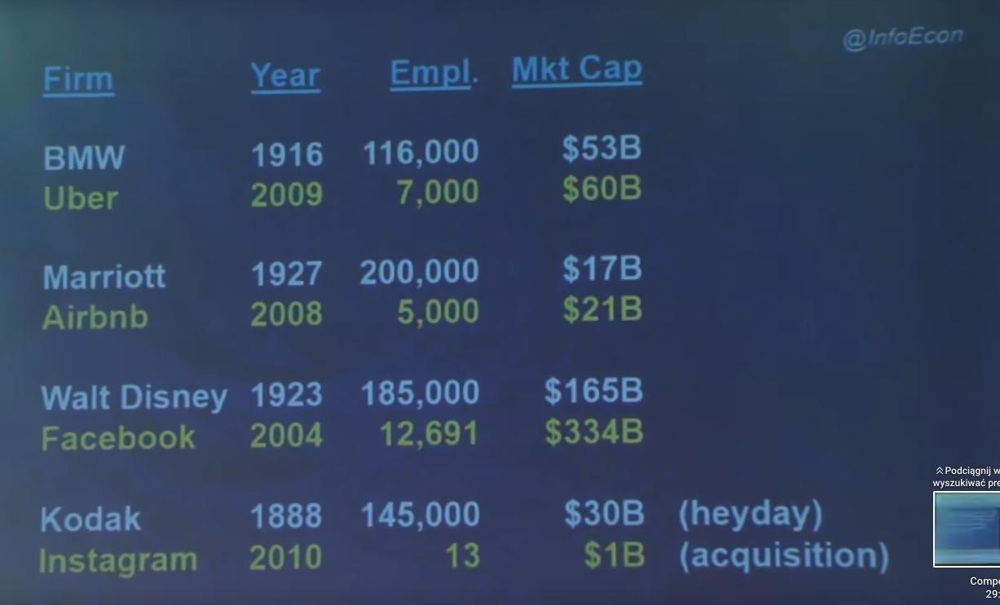
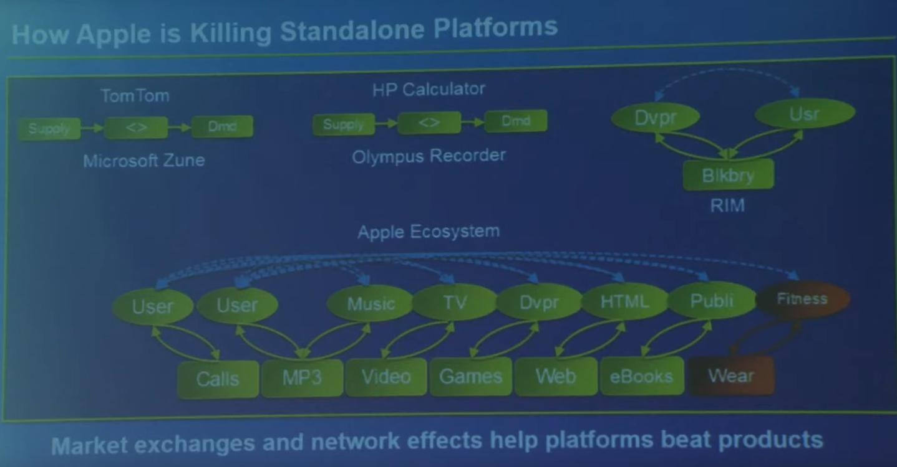
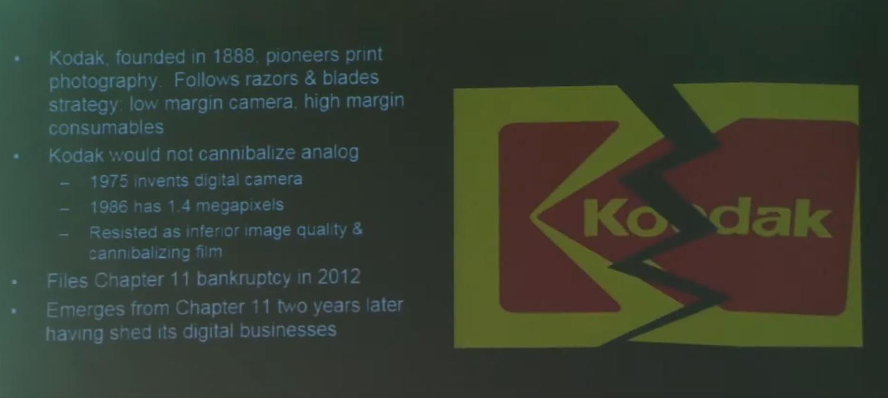
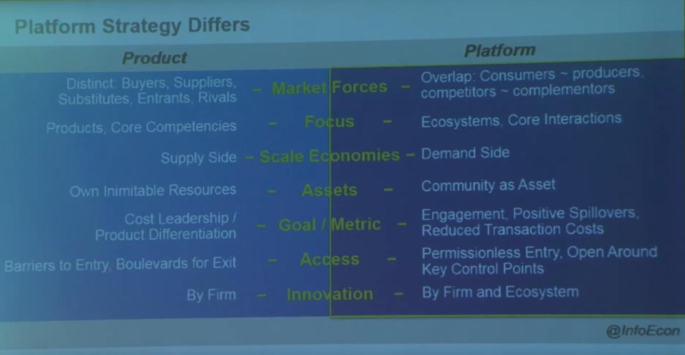

### 2023

  

<a href="./documents/september/wp16147.pdf" target="_blank">Sovereign Debt Restructuring and Growth</a>

<a href="./documents/september/2023060pap.pdf" target="_blank">Tokenization: Overview and Financial Stability Implications</a>

  

<a href="./documents/september/kaye-1995-why-do-ruling-classes-fear-history.pdf" target="_blank">Why-do-ruling-classes-fear-history</a>

<a href="./documents/september/Debord_Guy_Society_of_the_Spectacle_1970.pdf" target="_blank">Guy_Society_of_the_Spectacle</a>

<a href="./documents/september/tactical-nuclear-weapons-a-perspective-from-ukraine-en-8.pdf" target="_blank">tactical-nuclear-weapons-a-perspective-from-ukraine</a>

<!-- Debord_Guy_Society_of_the_Spectacle_1995.pdf
Debord_Guy_Society_of_the_Spectacle_2000.pdf -->
---

  

  

  

  

<video width="640" height="480" controls>
<source src="./movies/september/pm.mp4" type="video/mp4">
Your browser does not support the video tag.
</video>

---

Na Kaukazie ponownie rozpala się wojna między Armenią a Azerbejdżanem. Z punktu widzenia Izraela, Azerbejdżan jest jednym z trzech największych klientów izraelskich koncernów zbrojeniowych. Azerbejdżan kupuje niemal każdy system uzbrojenia jaki wpadnie mu w ręce, a około 70% broni używanej przez azerbejdżańską armię pochodzi od izraelskiego przemysłu obronnego. Są to zamówienia liczone w miliardach dolarów rocznie. Oto tylko wycinek zamówień Azerbejdżanu:

- izraelski karabin szturmowy Tavor zaprojektowany i wyprodukowany przez Israel Weapon Industries.
- wielokrotna wyrzutnia rakiet Lynx o zasięgu 150 km, opracowana i wyprodukowana przez Israel Military Industries.
- izraelski artyleryjski zestaw rakietowy LAR-160 o zasięgu 30 km, wyprodukowany przez Israel Military Industries.
- izraelska samobieżna armatohaubica Atmos-2000, kalibru 155 mm na podwoziu Tatry, zaprojektowana przez Soltam Systems, a następnie produkowana przez Elbit Systems. Zasięg 40 km.
- izraelski system moździerzy Cardom 120 mm, produkowany przez Soltam Systems.
- kierowane pociski moździerzowe Stell Sting (120 mmm) produkowane przez Elbit Systems.
- izraelskie bezzałogowe drony Hermes 450, opracowane przez Elbit Systems. Przeznaczony do prowadzenia długotrwałego rozpoznania na szczeblu korpusu lub dywizji.
- izraelskie bezzałogowe drony Hermes 900, opracowane przez Elbit Systems. Są to drony wielozadaniowe, latające na średnich wysokościach i długodystansowych, przeznaczone do misji taktycznych.
- miniaturowe drony bezzałogowe SkyStriker, opracowane przez Elbit Systems. Jest to krążąca w powietrzu amunicja, która może lokalizować i uderzać w wyznaczone cele za pomocą głowicy bojowej o masie 5 lub 10 kg zainstalowanej w kadłubie, zapewniając wysoką precyzję działania.
- miniaturowe drony Skylark, opracowane przez Elbit Systems. Drony służą do taktycznego nadzoru i rozpoznania.
- izraelskie drony bezzałogowe Heron, opracowane przez Israel Aerospace Industries. Są wykorzystywane do prowadzenia strategicznego i taktycznego rozpoznania, zwiadu i wywiadu, namierzania i wskazywania celów powierzchniowych oraz ich zwalczania.
- taktyczne drony bezzałogowe Aeronautics Orbiter, produkowane przez Aeronautics Defense Systems. Pełni funkcję amunicji krążącej.
- taktyczny pocisk balistyczny krótkiego zasięgu Lora, opracowany przez Israel Aerospace Industries. Zasięg 280 km, o zmiennej trajektorii lotu.
- projekt firmy Elbit Systems będący modernizacją czołgów T-72.
- izraelskie przeciwpancerne pociski kierowane Spike, opracowane przez Rafael Advanced Defense Systems. W wersji NLOS zasięg do 25 km.
- izraelskie naprowadzane laserowo pociski przeciwpancerne Lahat, opracowane przez Israel Aerospace Industries. Zasięg 8 km.
- sześć okrętów rakietowych, wzorowanych na modelu izraelskiej korwety typu Saar 4.5.
- szybkie łodzie patrolowe Sheldag 5.
- sprzęt komunikacyjny firmy Tadiran.
- radary lotnicze firmy Elta.
- systemy podsłuchowe i szpiegujące firm Verint i NSO.

### 2022

Mobilizacja wojskowa w Rosji:

  

---

2022/05/22 - JP morgan: Bitcoin jest niedowartościowany

2022/09/22 - Prezes JP Morgan: "Krypto jest schematem ponzi"

---

### 2021

  

  

### 2020

Ursula von der Leyen zaprezentowała swoją wizję Europy. To Europa traktująca suwerenne państwa narodowe jako zbędne obciążenie. Dlatego właśnie szefowa KE mówi o głosowaniu większością kwalifikowaną, o unijnej płacy minimalnej, o wprowadzeniu standardów LGBT na terenie całej UE. Jej marzeniem jest wielkie, jednolite unijne imperium, w którym to brukselskie elity, decydują o losach Europy.
Szefowa Komisji z jednej strony wprost wywołała Polskę do tablicy, z drugiej natomiast zarysowała szerszy plan rozwoju UE.
Jeżeli z jej wystąpienia odsączymy całe pustosłowie o jedności, sile i wytrwałości itd., to wyróżnić można trzy szczególnie istotne kwestie dla Polski: rewolucję obyczajową, kwestie ustrojowe oraz ochronę środowiska.
Elity unijne nic nie zrozumiały z kazusu Wielkiej Brytanii, która pod wpływem zaciskania pętli po prostu zdecydowała się opuścić Unię. Jedyną receptą jaką dysponują „unijczycy” na kryzys UE jest… jeszcze więcej Unii.
Von der Leyen powołująca się na autorytet Margaret Thatcher w swoim federacyjno-centralistycznym wystąpieniu wykazała się wprost niespotykanym wyrachowaniem.

### 2000

Po 27 latach zakończono produkcję Fiata 126 p czyli popularnego "malucha". Samochód ten produkowany na włoskiej licencji powstawał w fabrykach w Tychach i Bielsku Białej, a austriacka wersja w fabryce Steyra. W Polsce powstało 3 318 674 egzemplarzy tego samochodu.

### 1985

https://en.wikipedia.org/wiki/Plaza_Accord

### 1953

W trakcie pokazowego procesu władze komunistyczne skazały na 12 lat więzienia biskupa Dziecezji Kieleckiej Czesława Kaczmarka (zdjęcie). Został on aresztowany razem z Danilewiczem, autorem raportu o pogromie kieleckim 20 stycznia 1951 roku. Postawiono mu zarzut szpiegostwa na rzecz Stanów Zjednoczonych oraz Stolicy Apostolskiej, faszyzacji życia społecznego, nielegalnego handlu walutami i kolaboracji. Prawdziwym powodem aresztowania był jednak raport o pogromie kieleckim, w który Danilewicz wysunął oskarżenie w obec NKWD, jako służby, która miała go inspirować. Za pomocą procesu oraz Ruchu Księży Patriotów, a także grupy sprzyjających dziennikarzy wśród których czynnie udzielał się przyszły premier Tadeusz Mazowiecki, władze poróbowały skompromitować samego biskupa jak i instytucję Kościoła w Polsce.
Akt oskarżenia przygotowali; Józef Różański, dyrektor Departamentu Śledczego MBP, i płk Stanisław Zarako-Zarakowski, naczelny prokurator wojskowy.
Znajdujemy w nim:
"popieranie faszystowskich ugrupowań”, „współdziałanie z niemiecką władzą okupacyjną”, „nawoływanie wiernych do uległości i współpracy z okupantem”, „usiłowania obalenia przemocą władzy robotniczo-chłopskiej i ludowo-demokratycznego ustroju Polski”, „prowadzenie akcji przeciwko odbudowie kraju i planowej gospodarce”, „organizowania i kierowania akcją wywiadowczą na terenie Polski w interesie imperializmu amerykańskiego i Watykanu”, „przyjmowanie od zagranicznych ośrodków dywersyjnych i szpiegow- skich pieniędzy w walucie obcej”.
Biskup Kaczmarek przebywał w więzieniu do 8 lutego 1955 roku. Zwolniony został z odsiadywania kary ze względów zdrowotnych, po czym ponownie aresztowany i osadzony w więzieniu na Mokotowie, gdzie przebywał do roku 1956.

  

### 1939

Skapitulował Lwów. Miasto zajęła Armia Czerwona. Sowieci obiecali jego mieszkańcom gwarancję "wolności i nietykalności własności osobistej".
Jak zwodnicze były to słowa przyszło przekonać się już wkrótce. Warunki te nie zostały dotrzymane. Większość oficerów, orońców Lwowa znalazła się w obozie w Starobielsku, a następnie została zamordowana w Charkowie.

  

### 1927

https://pl.wikipedia.org/wiki/Bogus%C5%82aw_Wolniewicz

---

<a href="https://github.com/TomaszWaszczyk/historia.waszczyk.com/edit/master/src/content/september-22.md" target="_blank">Edytuj tę stronę dzieląc się własnymi notatkami!</a>
