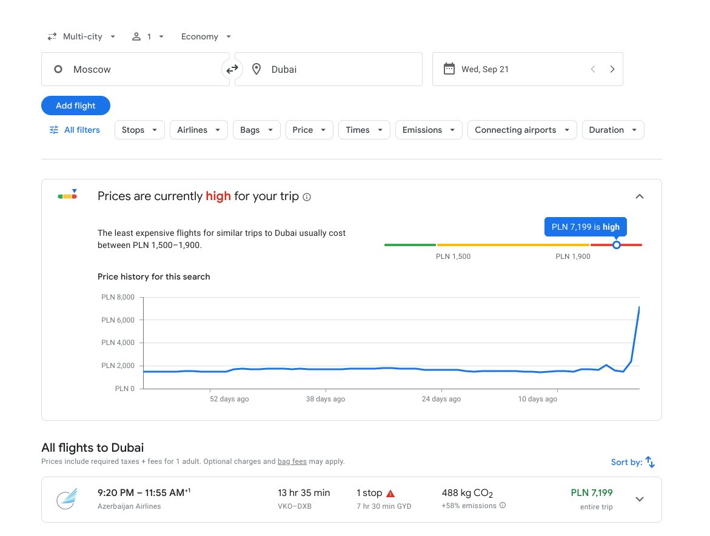
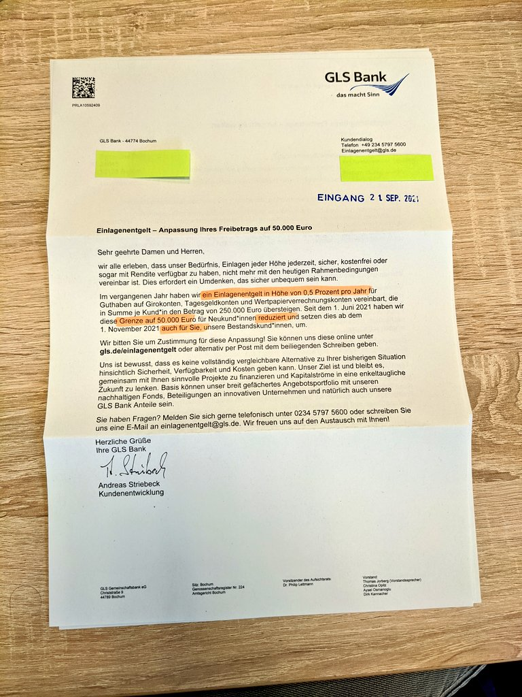
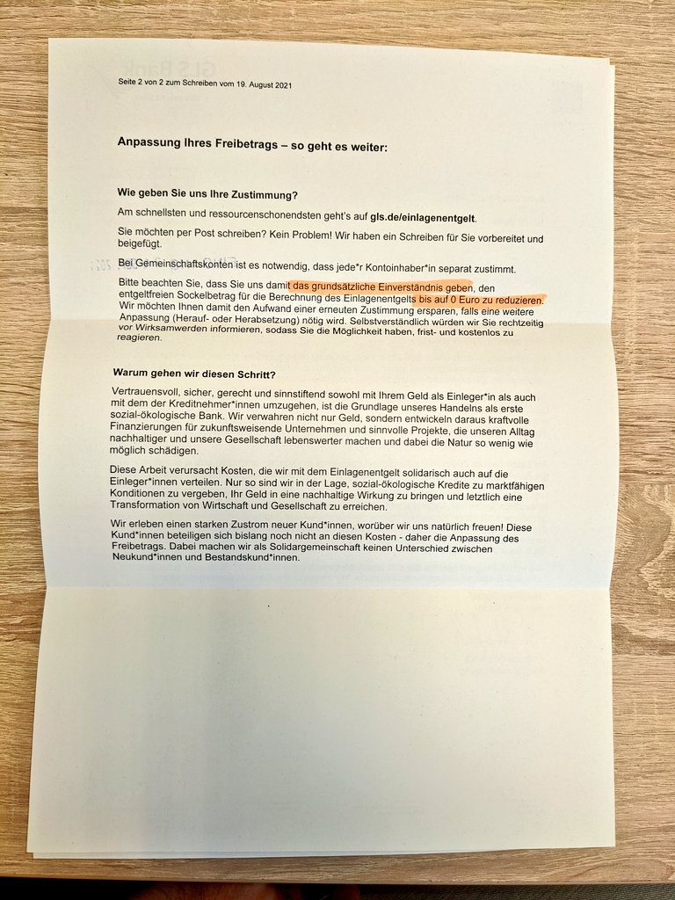
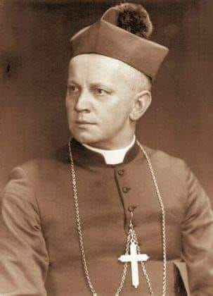
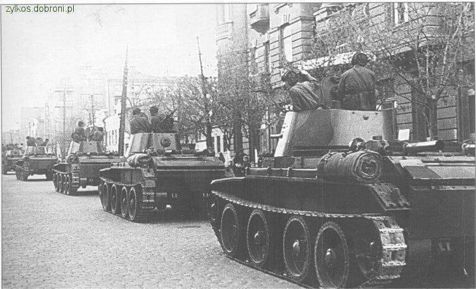

### 2022

Mobilizacja wojskowa w Rosji:

  

---

### 2021

  

  

### 2020

Ursula von der Leyen zaprezentowała swoją wizję Europy. To Europa traktująca suwerenne państwa narodowe jako zbędne obciążenie. Dlatego właśnie szefowa KE mówi o głosowaniu większością kwalifikowaną, o unijnej płacy minimalnej, o wprowadzeniu standardów LGBT na terenie całej UE. Jej marzeniem jest wielkie, jednolite unijne imperium, w którym to brukselskie elity, decydują o losach Europy.
Szefowa Komisji z jednej strony wprost wywołała Polskę do tablicy, z drugiej natomiast zarysowała szerszy plan rozwoju UE.
Jeżeli z jej wystąpienia odsączymy całe pustosłowie o jedności, sile i wytrwałości itd., to wyróżnić można trzy szczególnie istotne kwestie dla Polski: rewolucję obyczajową, kwestie ustrojowe oraz ochronę środowiska.
Elity unijne nic nie zrozumiały z kazusu Wielkiej Brytanii, która pod wpływem zaciskania pętli po prostu zdecydowała się opuścić Unię. Jedyną receptą jaką dysponują „unijczycy” na kryzys UE jest… jeszcze więcej Unii.
Von der Leyen powołująca się na autorytet Margaret Thatcher w swoim federacyjno-centralistycznym wystąpieniu wykazała się wprost niespotykanym wyrachowaniem.

### 2000

Po 27 latach zakończono produkcję Fiata 126 p czyli popularnego "malucha". Samochód ten produkowany na włoskiej licencji powstawał w fabrykach w Tychach i Bielsku Białej, a austriacka wersja w fabryce Steyra. W Polsce powstało 3 318 674 egzemplarzy tego samochodu.

### 1985

https://en.wikipedia.org/wiki/Plaza_Accord

### 1953

W trakcie pokazowego procesu władze komunistyczne skazały na 12 lat więzienia biskupa Dziecezji Kieleckiej Czesława Kaczmarka (zdjęcie). Został on aresztowany razem z Danilewiczem, autorem raportu o pogromie kieleckim 20 stycznia 1951 roku. Postawiono mu zarzut szpiegostwa na rzecz Stanów Zjednoczonych oraz Stolicy Apostolskiej, faszyzacji życia społecznego, nielegalnego handlu walutami i kolaboracji. Prawdziwym powodem aresztowania był jednak raport o pogromie kieleckim, w który Danilewicz wysunął oskarżenie w obec NKWD, jako służby, która miała go inspirować. Za pomocą procesu oraz Ruchu Księży Patriotów, a także grupy sprzyjających dziennikarzy wśród których czynnie udzielał się przyszły premier Tadeusz Mazowiecki, władze poróbowały skompromitować samego biskupa jak i instytucję Kościoła w Polsce.
Akt oskarżenia przygotowali; Józef Różański, dyrektor Departamentu Śledczego MBP, i płk Stanisław Zarako-Zarakowski, naczelny prokurator wojskowy.
Znajdujemy w nim:
"popieranie faszystowskich ugrupowań”, „współdziałanie z niemiecką władzą okupacyjną”, „nawoływanie wiernych do uległości i współpracy z okupantem”, „usiłowania obalenia przemocą władzy robotniczo-chłopskiej i ludowo-demokratycznego ustroju Polski”, „prowadzenie akcji przeciwko odbudowie kraju i planowej gospodarce”, „organizowania i kierowania akcją wywiadowczą na terenie Polski w interesie imperializmu amerykańskiego i Watykanu”, „przyjmowanie od zagranicznych ośrodków dywersyjnych i szpiegow- skich pieniędzy w walucie obcej”.
Biskup Kaczmarek przebywał w więzieniu do 8 lutego 1955 roku. Zwolniony został z odsiadywania kary ze względów zdrowotnych, po czym ponownie aresztowany i osadzony w więzieniu na Mokotowie, gdzie przebywał do roku 1956.

  

### 1939

Skapitulował Lwów. Miasto zajęła Armia Czerwona. Sowieci obiecali jego mieszkańcom gwarancję "wolności i nietykalności własności osobistej".
Jak zwodnicze były to słowa przyszło przekonać się już wkrótce. Warunki te nie zostały dotrzymane. Większość oficerów, orońców Lwowa znalazła się w obozie w Starobielsku, a następnie została zamordowana w Charkowie.

  

### 1927

https://pl.wikipedia.org/wiki/Bogus%C5%82aw_Wolniewicz

---

<a href="https://github.com/TomaszWaszczyk/historia.waszczyk.com/edit/master/src/content/september-22.md" target="_blank">Edytuj tę stronę dzieląc się własnymi notatkami!</a>
