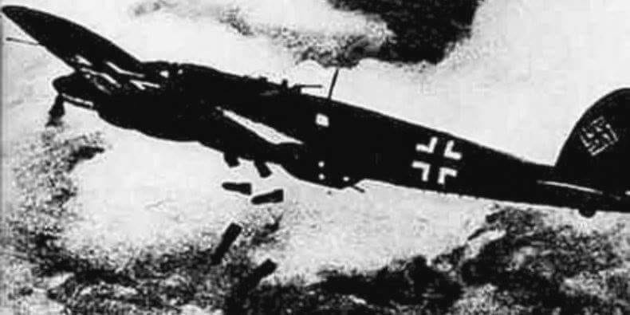

### 1939

,,Nigdy nie zapomnę 23 września, Dnia Pokuty w 1939 roku. Niemcy rozmyślnie wybrali to żydowskie święto na bombardowanie żydowskiej dzielnicy. W trakcie bombardowania miało miejsce dziwne zjawisko meteorologiczne: w samym środku jasnego, słonecznego dnia zaczął padać gęsty śnieg i grad. Na chwilę bombardowanie zostało przerwane, a Żydzi interpretowali ten śnieg jako specjalny akt boskiej interwencji; nawet najstarsi nie pamiętali czegoś podobnego. Ale później tego samego dnia wróg nadrabiał stracony czas ze zdwojoną siłą.''
(źródło: Mary Berg, Dziennik z getta warszawskiego)

  

Foto:
Niemieckie bombowce Heinkel He 111 – zrzucają bomby na Warszawę, Wrzesień 1939

### 1889

https://pl.wikipedia.org/wiki/Walter_Lippmann

---

<a href="https://github.com/TomaszWaszczyk/historia.waszczyk.com/edit/master/src/content/september-23.md" target="_blank">Edytuj tę stronę dzieląc się własnymi notatkami!</a>
