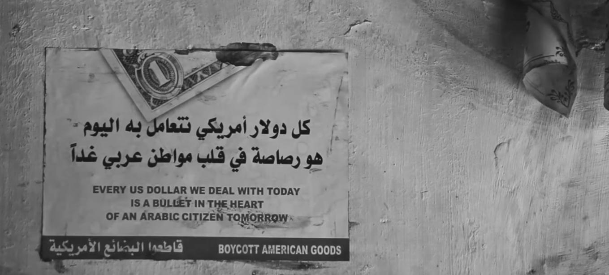

### 2023

  

---

Palermo

  

  

  

  

  

  

> light & darkness & responsibility & hope

  

  

  

---

  

<a href="./documents/september/Wyniki_przetargu_sprzedazy_20.09.2023.pdf" target="_blank">...</a>

<a href="./documents/september/Mentalillnessandtheleft.pdf" target="_blank">stupidity as a commodity</a>

---

### 2022

Von der Leyen threatens the Italians: "We will see the result of the vote in Italy. If things go in a difficult direction, we have tools, as in the case of Poland and Hungary." A desperate attempt to influence the vote in Italy that runs towards the far right. Game over Ursula!

### 2021

<video width="640" height="480" controls>
<source src="./movies/september/deutschland2021.mp4" type="video/mp4">
Your browser does not support the video tag.
</video>

---

Pres Erdogan has announced that Turkey is ‘in a war with Bitcoin’.

---

### 1939

,,Nigdy nie zapomnę 23 września, Dnia Pokuty w 1939 roku. Niemcy rozmyślnie wybrali to żydowskie święto na bombardowanie żydowskiej dzielnicy. W trakcie bombardowania miało miejsce dziwne zjawisko meteorologiczne: w samym środku jasnego, słonecznego dnia zaczął padać gęsty śnieg i grad. Na chwilę bombardowanie zostało przerwane, a Żydzi interpretowali ten śnieg jako specjalny akt boskiej interwencji; nawet najstarsi nie pamiętali czegoś podobnego. Ale później tego samego dnia wróg nadrabiał stracony czas ze zdwojoną siłą.''
(źródło: Mary Berg, Dziennik z getta warszawskiego)

  

Foto:
Niemieckie bombowce Heinkel He 111 – zrzucają bomby na Warszawę, Wrzesień 1939

---

Francuski krążownik „Emile Bertin”,  w tajemnicy przybył do Bejrutu, tam załadowano na niego 57 ton, pierwszą część rezerw złota polskiego i wywieziono go Tulonu we Francji. Odprawę i załadunek doglądał płk Ignacy Matuszewski. Pozostał on w Bejrucie oczekując na dalszy załadunek na kontrtorpedowce „Vauban” i „Epervier”.

  

---

### 1889

https://pl.wikipedia.org/wiki/Walter_Lippmann

---

<a href="https://github.com/TomaszWaszczyk/historia.waszczyk.com/edit/master/src/content/september-23.md" target="_blank">Edytuj tę stronę dzieląc się własnymi notatkami!</a>
