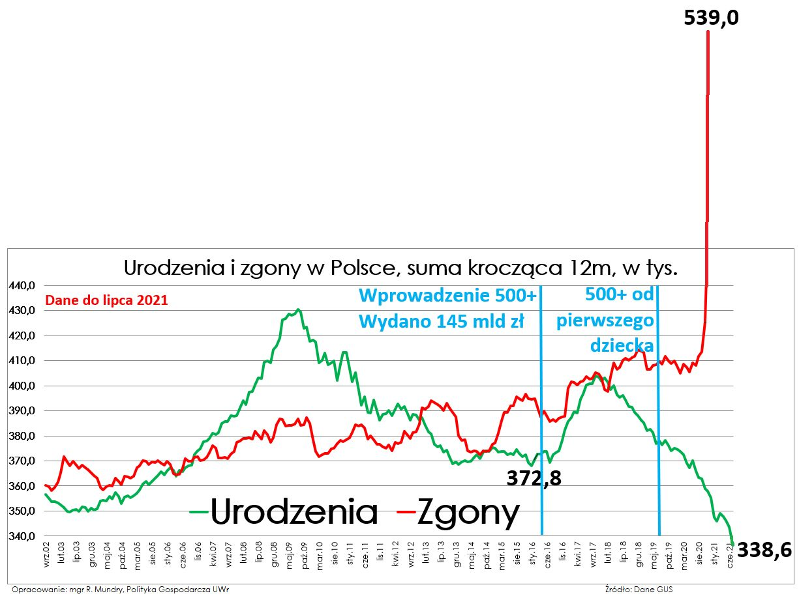
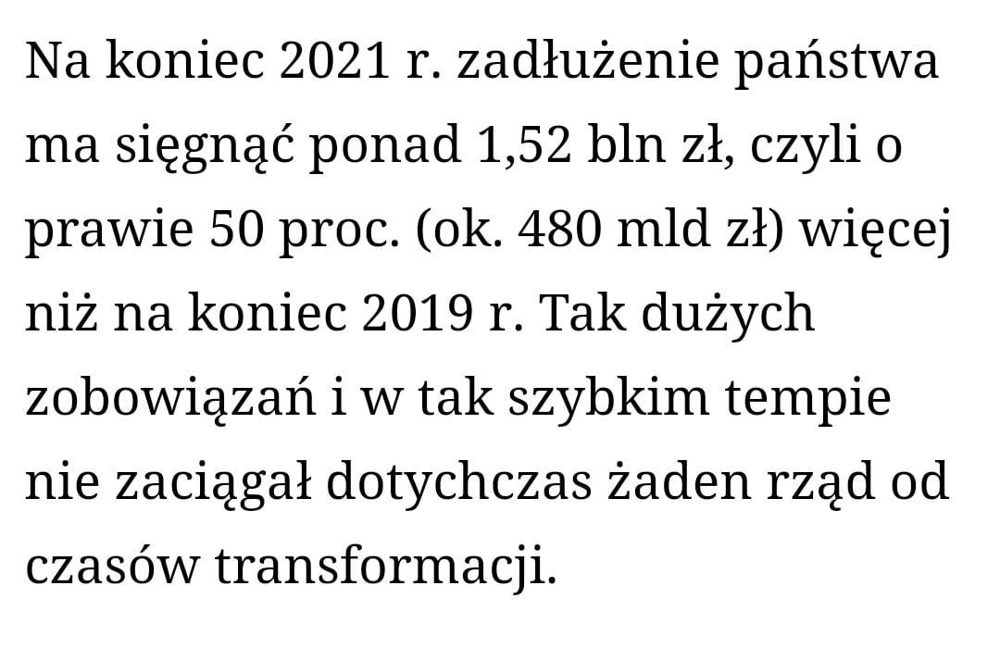
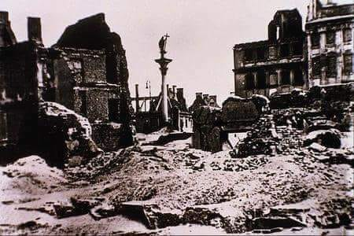

### 2023

<video width="640" height="480" controls>
<source src="https://resources.waszczyk.com/historia-waszczyk-com/Ha%C5%84ba!-Full.mp4" type="video/mp4">
Your browser does not support the video tag.
</video>

---

Mazowiecki i Warszawski Fundusz Filmowy dofinansował film Agnieszki Holland "Zielona granica" w wysokości 300 tys. zł — powiedział w piątek w TVN 24 wiceprzewodniczący PO, prezydent Warszawy Rafał Trzaskowski. Jak ocenił, jest to niewielka kwota.

---

### 2022

In the land of bitcoin payments, a bitcoin-based nation would be prone to recessions every time consumers wanted to HODL bitcoin, hence its a good thing bitcoin is not a means of payment; but rather a means for bitcoin speculation...

The changes in bitcoin value are correlatable to taking a speculative profit from the Hodlers by the same elite which exist in a fiat world...
While Hodlers exist bitcoin value is pure speculation, and rent extraction from the many by the few.

---

> Jamie Dimon: crypto tokens are "decentralized Ponzi schemes"

---

  

---

### 2021

  

### 2020

  

### 1954

<https://pl.wikipedia.org/wiki/Les%C5%82aw_Paga>

### 1950

Amerykański dziennikarz Edward Hunter w artykule opublikowanym w „Miami News” użył po raz pierwszy terminu „pranie mózgu”.

  

### 1939

Miała miejsce tak zwana "piekielna niedziela". Rozpoczęło się trwające nieprzrewanie przez trzy dni niemieckie bombardowanie Warszawy. Luftwaffe zrzuciło w tych dniach 560 ton bomb burzących, 72 tony bomb zapalających. W centrum zniszczone zostały wszystkie szlaki komunikacyjne. Ciekawostką jest fakt, że piloci niemieccy, na skutek dość niestarannie przeprowadzanej operacji, głównie ze względu na to, że do zrzucania bomb zapalających użyto nienadających się do tego samolotów JU-52, zbombardowali również część ... własnych oddziałów lądowych.
Jeden z anonimowych Warszawiaków tak opisywał ten dzień:
" Bomby zapalające lecą przed naszymi oknami, trzy bomby zapalające tlą się na strychu (...) Wszystkie szyby wylatują w całym domu (...) Już nam wszystko jedno, jesteśmy zobojętniali. Tak czy owak, bomba na pewno spadnie na nasz dom, co za różnica czy 5 minut wcześniej, czy później. Niech się już stanie! Niech już będzie koniec!"

  

---

,,Nigdy nie zapomnę 23 września, Dnia Pokuty w 1939 roku. Niemcy rozmyślnie wybrali to żydowskie święto na bombardowanie żydowskiej dzielnicy. W trakcie bombardowania miało miejsce dziwne zjawisko meteorologiczne: w samym środku jasnego, słonecznego dnia zaczął padać gęsty śnieg i grad. Na chwilę bombardowanie zostało przerwane, a Żydzi interpretowali ten śnieg jako specjalny akt boskiej interwencji; nawet najstarsi nie pamiętali czegoś podobnego. Ale później tego samego dnia wróg nadrabiał stracony czas ze zdwojoną siłą.''
(źródło: Mary Berg, Dziennik z getta warszawskiego)

---

### 1928

W kościele katolickim w Polsce wszedł w życie dekret papieża Piusa XI zmieniający treść przysięgi małżeńskiej dla kobiet. Usunięto z niej fragment zobowiązujący kobietę do posłuszeństwa mężowi. Zmiana ta miała na celu podkreślenie równości małżonków w prawach i obowiązkach.
Poprzednia wersja brzmiała: "biorę Cię za męża i ślubuję miłować Cię i szanować (…) być wierną i ULEGŁĄ, i nie opuszczać Cię aż do śmierci”.

### 1793

W czasie drugiego rozbioru Polski Sejm obradujący pod okiem carskiego generała Joachima von Rautenfelda dowodzącego oddziałem wojsk, które otoczyły zamek w Grodnie w milczeniu dokonał cesji terytorium Polski na korzyść Królestwa Prus. Otrzymało ono Gdańsk, Toruń, województwa gnieznieńskie, poznańskie, sieradzkie, kaliskie, płockie, brzeskokujawskie, inowrocławskie oraz część krakowskiego, rawskiego i mazowieckiego.

---

<a href="https://github.com/TomaszWaszczyk/historia.waszczyk.com/edit/master/src/content/september-24.md" target="_blank">Edytuj tę stronę dzieląc się własnymi notatkami!</a>
