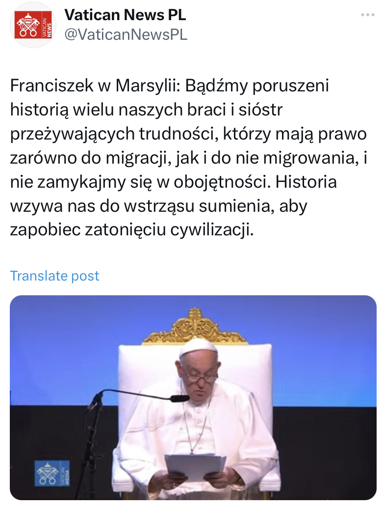
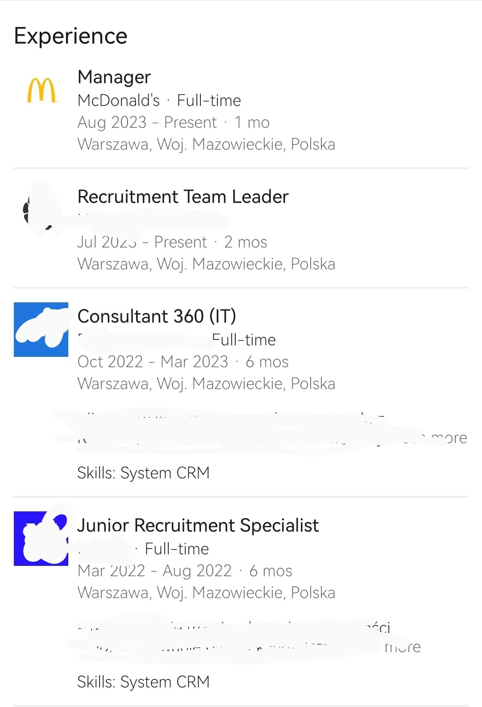
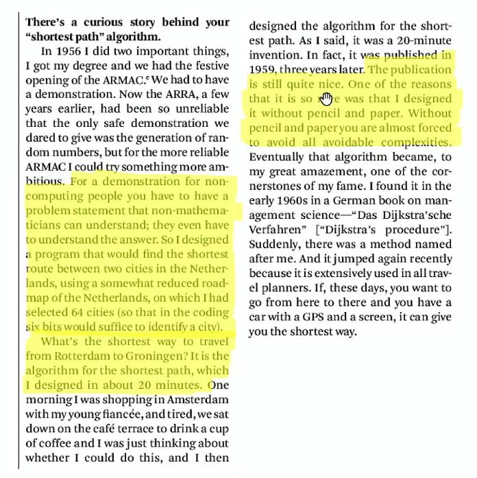
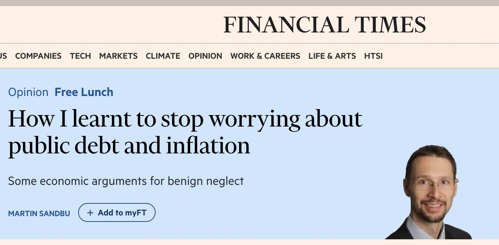
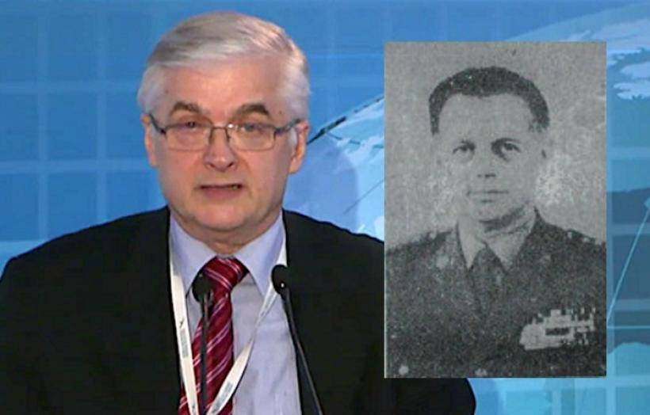
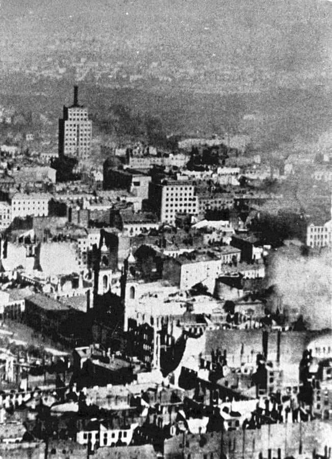

<!-- https://resources.waszczyk.com/historia-waszczyk-com/jaroszynski.mp4 -->

### 2023

👀 Novosibirsk Cryptographic Center

```
Dear participant of the Olympiad,

We are inviting you to take part in The Tenth International Olympiad in Cryptography Non-Stop University CRYPTO that will be held on October 15, 2023 (the First round) and during October 16 – October 23, 2023 (the Second round). Your login and password at the Olympiad website did not changed.If you forget login and/or password, please, use your email address to reset password at the website.Registration for both rounds of the Olympiad is open! In the attachment you can find the information letter about NSUCRYPTO’2023. Please, share it with your friends and colleagues!Recall that NSUCRYPTO is the unique cryptographic Olympiad containing scientific mathematical problems for professionals, school and university students from any country. Its aim is to involve young researchers in solving curious and tough scientific problems of modern cryptography. Every year there is about 800-1000 participants of NSUCRYPTO from more than 40 countries. Organizers and partners of the Olympiad are Cryptographic Center (Novosibirsk), Novosibirsk State University, Mathematical Center in Akademgorodok, Kovalevskaya North-West Center of Mathematical Research, KU Leuven, Southern Federal University, Demlabs, Belarusian State University, Tomsk State University, Kryptonite and Aktiv company.Good cryptographic problems and prizes are waiting for you!

Best regards,
NSUCRYPTO team
```

🧐 <a href="./documents/september/NSUCRYPTO-2023-Information-letter.pdf" target="_blank">NSUCRYPTO 2023</a>

---

<a href="./documents/september/Wybrakowany-potencjal-Deficyty-w-polskim-kapitale-spolecznym-i-patriotyzmie-gospodarczym-raport.pdf" target="_blank">Deficyt w Polsce</a>

---

<a href="./documents/september/credit-cycle.pdf" target="_blank">Credit Cycle</a>

<a href="./documents/september/_Figure17pdf.pdf" target="_blank">Cycle</a>

---

<br><br>

---

Cykl pracy "rekruterczyni":

<br><br>

---

<br><br>

<br><br>

<br><br>

---

### 2022

<br><br>

<br><br>

### 2021

<a href="./documents/september/Modern_Money_Mechanics.pdf" target="_blank">Modern Money Mechanics</a>

### 2020

Rosengren: USA grozi kryzys kredytowy

Eric Rosengren, szef Fed w Bostonie alarmuje, że jesienią i zimą w USA może nastąpić wzrost liczby zajęć nieruchomości i bankructw firm w przypadku nasilenia pandemii i braku fiskalnego wsparcia, co może skutkować utrudnionym dostępem do kredytu, pisze Reuters.
Rosengren uważa, że pod szczególną presją mogą znaleźć się mniejsze banki jeśli wzrośnie liczba opóźnionych spłat kredytów na nieruchomości komercyjne z powodu problemów firm z kontynuacją działalności.

---

Swiss to vote on whether to end free movement deal with EU

Sunday’s referendum with echoes of Brexit proposes limits on number of foreign workers

Switzerland will vote on Sunday whether to end its agreement with the EU on the free movement of people, in a referendum with echoes of the pro-Brexit campaign that led to Britain’s decision to leave the bloc.

The largest party in the Swiss parliament, the rightwing, anti-immigration Swiss People’s party (SVP), has called for the vote, arguing that the country must be allowed to set its own limit on the number of foreigners coming in to work.

However, polls forecast the SVP will not be successful, with one this week finding 63% of respondents opposed the party’s proposal – suggesting voters want stability at a time of economic uncertainty amid the coronavirus pandemic.

Non-nationals account for roughly a quarter of Switzerland’s 8.6 million inhabitants and continuing immigration is forecast to swell the population to about 10 million over the next 30 years.

“Migrants change our culture,” the SVP’s referendum campaign website says. “Public squares, trains and streets become less safe. In addition, practically half of all welfare recipients are foreigners.”

The party says unemployment among Swiss nationals will inevitably rise as young foreigners are recruited to replace older Swiss workers, housing costs will increase, and schools, transport and public services will be overwhelmed.

### 2019

Zostało otwarte Beijing Daxing International Airport w pekińskiej dzielnicy Daxing. Terminal w kształcie sześcioramiennej gwiazdy zaprojektowała firma brytyjskiej architekt irackiego pochodzenia Zahy Hadid, która zmarła w 2016 r. Budowa portu lotniczego trwała pięć lat i kosztowała 11,2 mld dolarów, zajmuje powierzchnię 0,7 mln m kw. Brytyjska gazeta „The Guardian" przyznała lotnisku pierwsze miejsce wśród siedmiu nowych cudów świata.Tą wielką inwestycję infrastrukturalną zasila energia odnawialna. Położony 46 km na południe od centralnego placu Tiananmen port lotniczy Pekin-Daxing, w skrócie PKX, ma odciążyć Stołeczne Międzynarodowe Lotnisko Pekin, gdzie ograniczona przestrzeń powoduje opóźnienia lotów. Władze oczekują, że do 2021 r. lotnisko będzie obsługiwało 45 mln pasażerów rocznie, a w dalszej przyszłości liczba ta wzrośnie do 100 mln i 4 mln ton towaru. Autorów projektu zainspirowała tradycyjna architektura chińska, w której sercem budynku jest centralnie położony dziedziniec, a pozostałe pomieszczenia zorganizowane są wokół niego. Przestrzeń lotniska dzięki wykorzystaniu dużej ilości bieli i przeszklonego dachu prezentuje się wyjątkowo przestronnie.

<br><br>

### 1980

Czerwone dynastie. Wszak pierwszym i najważniejszym miejscem kształtowania naszej osobowości, charakteru, skali wartości, nawyków - jest dom rodzinny. Syn Tomasz Cimoszewicz były poseł PO, ojciec Włodzimierz Cimoszewicz były premier, poseł, senator, marszałek m.in. z ramienia SLD, dziadek Marian Cimoszewicz zdeklarowany komunista, agent NKWD, oficer Informacji Wojskowej i WSW. 
Włodzimierz Cimoszewicz od 1971 r. należał do Polskiej Zjednoczonej Partii Robotniczej aż do jej rozwiązania w styczniu 1990 r. Był m.in. członkiem Związku Młodzieży Socjalistycznej w latach 1968–1973. W 1980 r. został wysłany na 3 miesiące do pracy w konsulacie w Malmö a we wrześniu tego roku wyjechał na stypendium Fulbrighta do USA dzięki decyzji władz PRL. W tym czasie był tajnym współpracownikiem wywiadu PRL - „Carex” (figuruje w archiwum Zarządu Wywiadu. Nr rejestr. 13613, data rejestr. 25.09.80. Organ rejestr. wydz. II dep. I Warszawa. Nr arch. J- 8938, data archiwizacji 24.08.84.) 
Marian Mikołaj Cimoszewicz ur. W 1917 r. w Uljanowsku. Zamieszkały w Endrychowce pow. Wołkowysk, komunista, agent NKWD. Robotnik drogowy, w 1939 r. nie powołany do wojska polskiego - był już wówczas agentem NKWD. Po napaści Sowietów na Polskę szybko awansował. Został poborcą dostaw obowiązkowych w Wołkowysku, czyli rekwirował płody rolne na rzecz bolszewików. W początkach roku 1940 został seksotem - tajnym donosicielem komisarza NKWD, później skierowano go do Armii Czerwonej, do Szkoły Podoficerów Radiotechnicznych w Rostowie nad Donem. W czasie wojny służbę pełnił w Jednostce Specjalnej NKWD Smiersz. W 1943 r. przeszedł kurs pracowników oświatowych, czyli politycznych i przeniesiony został do Armii Berlinga. Od zakończenia wojny do 1972 r. był oficerem w organach Informacji Wojskowej i WSW. W latach 1945-46 uczestniczył w likwidacji podziemia AK. Był szefem Informacji Wojskowej w Wojskowej Akademii Technicznej w latach 1951-54. Wzbudzał powszechny strach i grozę w WAT, był gorszy od sowieckiego Komendanta WATu gen. Leoszeni który wielu Polaków- jak zeznają świadkowie, wybronił z łap „Polaka” Cimoszewicza. Aresztował pierwszego komendanta i twórcę WATu gen. Grabczyńskiego. Z jego rozkazu aresztowano też kilkunastu oficerów WATu, którzy wcześniej byli w AK. Nakazał zbudować celę pod schodami o nieludzkich warunkach, w której więził m.in. kpt. Słowika (którego żona była wówczas w ciąży) przez 11 miesięcy, przesłuchiwał go z bronią w ręku - tzw. metodą konwejera - do utraty przytomności, niszcząc go fizycznie i psychicznie. Stosował powszechnie wprowadzane przez sowietów metody: wyrzucał AK-owców z pracy, zabierał domy prawowitym właścicielom i umieszczał w nich informatorów WSI. Sam również zamieszkał w takim domu. Nie można się dziwić, że tak oddany służbie towarzysz, stał się z czasem jednym z najbardziej zaufanych i wiernych funkcjonariuszy systemu. Dla wielu szlachetnych i wiernych ojczyźnie Polaków był po prostu katem.

<br><br>

### 1939

Poniższy tekst to relacja jednego ze świadków dalszego bombardowania Warszawy 25 września 1939 roku przez niemieckie lotnictwo. Obserwatorem był sam Adolf Hitler.
„Straszny był dzień 25-go września. Lotnicy niemieccy latali tak nisko, że zdawało się, że zaczepią o dachy. Trzysta bombowców bez przerwy waliło w miasto, a po wyczerpaniu ładunków wracało do bazy po nowy zapas. Cała Warszawa się paliła. Ludzie biegali z domu do domu, szukając możliwie spokojnego miejsca w tym morzu płomieni, przeskakując przez trupy i gruzy, z tobołkami w ręku. Przez cały dzień i noc 25-go września trwała ta wędrówka od schronu do schronu i z mieszkania do mieszkania. Jeszcze względnie najbezpieczniej było w mieszkaniach parterowych”

<br><br>

---

<a href="https://github.com/TomaszWaszczyk/historia.waszczyk.com/edit/master/src/content/september-25.md" target="_blank">Edytuj tę stronę dzieląc się własnymi notatkami!</a>
