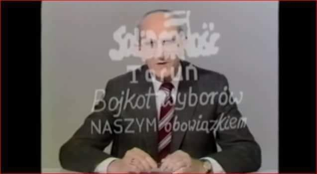

### 2022

Krótka nitka o mobilizacji zawodów medycznych w Rosji

Powołanie odbywa się na dwa sposoby:
1) w nocy przychodzą do domu i dają 10-30 minut na spakowanie się
2) przychodzą do pracy i biorą od ręki w kamasze

Nikogo nie interesuje czy osoby zmobilizowane mają dzieci pod opieką: znany jest przypadek zabrania w nocy, z domy matki  i ojca ( oboje lekarze) którzy mieli nastoletnie dzieci - nie jest to problem dla SZ RUS tylko problem dzieci. W kwestii zabierania z pracy, nikogo nie interesuje czy szpital, przychodnie etc będzie normalnie funkcjonować: zabierali z prosto z pracy:
dentystów, neurochirurgów, położne(!). W temacie funkcjonowania placówek medycznych:
znalazłem przypadek w którym zabrano 35 pracowników medycznych z jednego miejsca czy taki jak w miejscowości Czyta: 11 na 26 pracowników szpitala - powołane. W Koworowie natomiast - kardiochirurg i 3 lekarki.
Generalnie mobilizują najwięcej: specjalności ze słowem "chirurg" na końcu, anestezjologów, pielęgniarki i pielęgniarzy czy sanitariuszy ( prosto z karetki - dwa przypadki znalazłem).

Studenci mieli być zwolnienie z mobilizacji: biorą i wykładowców akademickich i studentów medycyny.
Biorą też pracowników fabryk leków np. Skilfie w Moskwie. Wiek powołanych? Od studentów 5 roku medycyny po chorego na raka 59 latka.
Najciekawsze jest to że głównie lekarzy biorą z Moskwy i Petersburga (przynajmniej taki obraz się wyłania z wpisów w social mediach).

---

> „od dziennikarzy głupsi są tylko aktorzy”

  

---

### 2021

> Przerwie pani ten program.

<video width="640" height="480" controls>
<source src="./movies/september/przerwiepanitenprogram.mp4" type="video/mp4">
Your browser does not support the video tag.
</video>

---

This one page document from the US government in 1918 on 'Spanish Flu' is more measured, more scientific, and more holistic than everything we have been fed for the past 2 years...

  

---

### 1985

Władze komunistyczne zatrzymały uczonych z toruńskiego Uniwersytetu Mikołaja Kopernika - Jana Hanasza, Grzegorza Drozdowskiego, Zygmunta Turło, Leszka Zaleskiego i Eugeniusza Pazderskiego. Mężczyźni byli odpowiedzialni za przeprowadzenie spektakularnego ataku hakerskiego. Wyczynu tego dokonali dzięki komputerowi ZX Spectrum. We wrześniu 1985, podczas trwania ,,Dziennika Telewizyjnego" i serialu ,,07 zgłoś się'' na ekranach widzów pojawiły się hasła: ,,Solidarność Toruń Dość podwyżek cen, kłamstw, represji'' oraz ,,Solidarność Toruń Bojkot wyborów NASZYM obowiązkiem''. Eugeniusz Pazderski został wypuszczony na wolność z braku dowodów. Pozostałym mężczyznom wymierzono karę od roku do półtora w zawieszeniu na trzy lata.

  

### 1946

Decyzją Tymczasowego Rządu Jedności Narodowej, na którego czele stał Edward Osóbka Morawski pozbawiono polskiego obywatelstwa generała Władyława Andersa. Tego samego dnia ten sam rząd zadecydował takim samym wyrokiem o losie 75 innych wysokich rangą oficerów Wojska Polskiego.

  

### ~1950

https://en.wikipedia.org/wiki/M65_atomic_cannon

### 1913

"Widziałem, jak ludzie zostali rozstrzelani, jak byli ustawieni w nocy Moje motywy nie były polityczne, były czysto humanitarne, moralne.” (...)To nie był anty-faszyzm, ani nie była odporność. Widzieliśmy od świtu do zmierzchu, tak blisko, jak mogłoby być, co się dzieje z Żydami w Borysławiu, gdy pojawi się matka trzymająca  dzieci... pada strzał, a ty sam masz dzieci, twoja reakcja musi być zupełnie inna.”
Autorem tych słów jest urodzony 26 września 1913 roku w Zemmin w Niemczech Berthold Beitz (zdjęcie), w czasie wojny dyrektor handlowy niemieckiego przedsiębiorstwa Karpathen-Öl AG, kontrolującego produkcję naftową w Zagłębiu Drohobycko-Borysławskim, odpowiedzialny za uratowanie życia około 250 Żydom.
W roku 1973 Instytut Yad Vashem uhonorował go medalem Sprawiedliwego Wśród Narodów Świata. W latach 1972-1988 był przewodniczącym Międzynarodowego Komitetu Olimpijskiego. Zmarł 30 lipca 2013 roku.

  

### 1908

Akcja pod Bezdanami

### 1878

W Nowy Rok uroczyście otworzono postępową Wielką Synagogę na Tłomackiem w Warszawie.
Udział w uroczystym otwarciu wziął, m.in. rosyjski generał-gubernator warszawski hrabia Paweł Eustachiewicz Kotzebue oraz rosyjski prezydent Warszawy generał - major Sokrates Starynkiewicz. Mimo że nasz kraj znajdował się wtedy pod zaborami to Izaak Cylkow, kaznodzieja synagogi, przemówił do zgromadzonych gości w języku polskim. W dniu inauguracji kaznodzieja rzekł: ,,Pokładamy nadzieję w Bogu, że już nigdy jako odrębna społeczność nie będziemy uważani i jako osobny lud traktowani, ale jako uprawnieni synowie naszego kraju, obywatele jednego państwa […] że światło się rozszerzy i rozproszy nareszcie ciężką mgłę uprzedzeń i przesądów, która tak długo wzajemne nasze stosunki zalegała […] Dopłyniemy do upragnionej przystani ludzkości, gdzie szczytem cywilizacji będą słowa: Kochaj bliźniego jak samego siebie, kochajcie obcego, bez względu na to, w jakiej świątyni Bogu cześć oddaje, do jakiego plemienia należy.'' Kazania wygłaszane były w języku polskim, co nie spodobało się szczególnie ortodoksyjnym Żydom. Synagoga była przyjaźnie nastawiona do wyznawców innych religii, w tym chrześcijan, którzy często odwiedzali synagogę, by przysłuchiwać się koncertom chóru synagogalnego. W rocznicę odzyskania przez Polskę niepodległości odprawiano w synagodze uroczyste modlitwy, a w dniu śmierci Marszałka Józefa Piłsudskiego odprawione zostało nabożeństwo żałobne. Synagoga była piękną utrzymaną w klasycyzującym stylu eklektycznym budowlą, którą zaprojektował Leandro Marconi. Mogła pomieścić 2400 osób. Budziła dumę wśród wyemancypowanych Żydów i stanowiła największą budowlę żydowską w Warszawie. W czasie okupacji hitlerowskiej, a dokładniej rzecz ujmując po upadku Powstania w Getcie warszawskim, Wielka Synagoga została osobiście zniszczona przez psychopatycznego zbrodniarza SS-Gruppenführera Jürgen Stroopa: ,,(...) 16 maja 1943 roku (...) krzyknąłem: Heil Hitler! – i nacisnąłem guzik. Ognisty wybuch uniósł się do chmur. Przeraźliwy huk. Feeria kolorów. Niezapomniana alegoria triumfu nad żydostwem. Getto warszawskie skończyło swój żywot. Bo tak chciał Adolf Hitler i Heinrich Himmler.''

  

---

<a href="https://github.com/TomaszWaszczyk/historia.waszczyk.com/edit/master/src/content/september-26.md" target="_blank">Edytuj tę stronę dzieląc się własnymi notatkami!</a>
