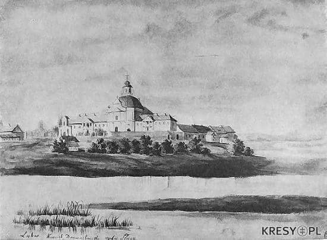

### 2020

  

### 1660

W czasie wojny polsko -rosyjskiej zakończyła się trwająca dwa tygodnie bitwa pod Lubarem (obecnie Ukraina).
Liczące 45 tysięcy żołnierzy wojska Rzeczypospolitej i Chanatu Krymskiego dowodzone przez hetmana wielkiego koronnego Stanisława Rewerę i marszałka wielkiego koronnego Jana Sebastiana Lubomirskiego pokonały liczące 50 tysięcy żołnierzy wojska rosyjsko- kozackie pod dowództwem naczelnego wodza armii rosyjskiej Wasilija Borysowicza Szeremietiewa.
W bitwie tej Polacy stracili tysiąc żołnierzy. Straty rosyjskie były dziesięć razy większe.
Grafika przedstawia zburzony po I wojnie światowej klasztor w Lubarze.

  

---

<a href="https://github.com/TomaszWaszczyk/historia.waszczyk.com/edit/master/src/content/september-27.md" target="_blank">Edytuj tę stronę dzieląc się własnymi notatkami!</a>
