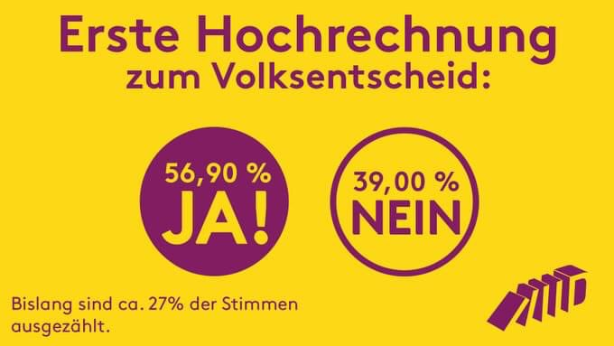
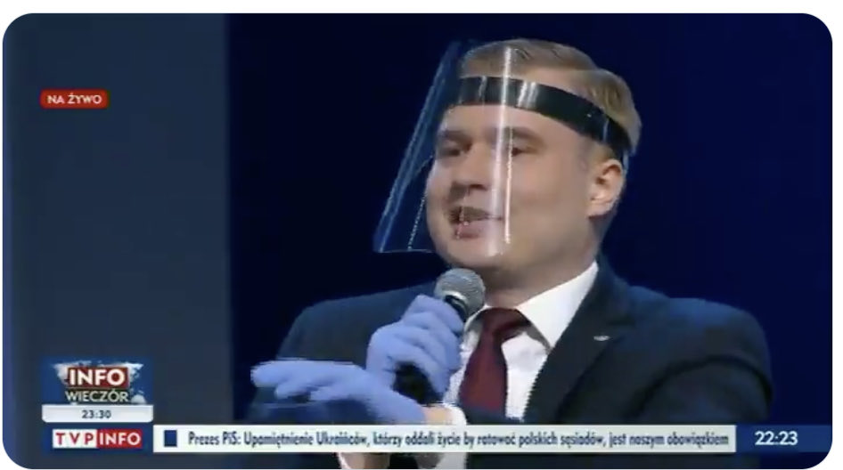

### 2023

> W sobotę 23 września przebywający z wizytą w Kanadzie prezydent Ukrainy Wołodymyr Zełenski spotkał się w Toronto z tamtejszą społecznością ukraińską. Towarzyszył mu premier Kanady Justin Trudeau i przedstawiciele kanadyjskich władz.

Uhonorowano i wiwatowano na cześć ukraińsko-kanadyjskiego zbrodniarza wojennego Jarosława Hunka służącego w 14 Dywizji Grenadierów Waffen SS-Galizien.

<br><br>

---

> Naukowcy wieszczą kolejną pandemię. Jakie skutki może nieść "choroba X"?
> Naukowcy nie mają dobrych wiadomości. Brytyjscy eksperci wieszczą, że kolejna — jeszcze groźniejsza — pandemia, jest naprawdę blisko. Co gorsza, przestrzegają, że nieznana jeszcze choroba może zabić nawet 50 mln osób.

---

> W uznaniu zasług w pogłębianiu stosunków między Polską a Ukrainą, za działalność na rzecz bezpieczeństwa, niezłomność w obronie praw człowieka prezydent Ukrainy Wołodymyr Zełenski został w środę odznaczony Orderem Orła Białego - poinformowała Kancelaria Prezydenta RP. (5 kwi 2023)

---

```text
Czy świat musi być podzielony na państwa? Trudno to sobie wyobrazić inaczej, gdyż nawet konferencje episkopatów są powoływane przez papieża w granicach wyznaczonych przez państwa. Zmiana granic państwowych pociąga za sobą zmianę granic episkopatów.  
Ale są także komisje, które wyłamują się z tego schematu. Jest Komisja Konferencji Biskupów Unii Europejskiej (COMECE), która składa się z biskupów delegowanych przez 25 konferencji poszczególnych krajów w Europie. 
Papież Franciszek proponuje jeszcze coś nowego. COMECE została utworzona po powstaniu UE. Tymczasem w Marsylii Franciszek rzucił pomysł, aby zastanowić się "nad stosownością utworzenia Konferencji Biskupów Śródziemnomorskich". Pomysł ten przekracza dotychczasowe polityczne rozwiązania.  
To dobry pomysł. Konferencje są po to, aby ułatwić pracę duszpasterską w granicach danego państwa, ale nie muszą istnieć w granicach wyznaczonych przez państwa. Kościół musi być czytelnym znakiem dla świata, że ma swoje cele, które nie ograniczają się do ziemskiego wymiaru.
"Pojadę do Marsylii, ale nie do Francji". Teraz te słowa Franciszka nabierają innego znaczenia. 
```

---

<br><br>

### 2022

> ECB chief Lagarde says she does not like to see a new period of "free banking" due to cryptocurrencies.

---

<video width="640" height="480" controls>
<source src="./movies/september/bajkaogeopolityce.mp4" type="video/mp4">
Your browser does not support the video tag.
</video>

---

<br><br>

---

### 2021

Wyniki z Berlina to historyczny przełom! Nie, nie chodzi o zwycięstwo SPD. Wczoraj berlińczycy głosowali w referendum w sprawie wywłaszczenia korporacji, które spekulacyjnie skupują mieszkania.

Wynik: 56,9% ZA

<br><br>

Czyli co? Podatnik niemiecki zapłaci fundoszom za mieszkania a później załamanie na rynku mieszkań? Może tak, może nie, zobaczymy.

---

Znakomita odpowiedź reportera Skynews z Australii skierowana do młodych ludzi, którzy demonstrują w obronie klimatu: „Jesteście pierwszym pokoleniem, które zażądało klimatyzacji w każdej klasie. Wszystkie wasze lekcje odbywają się przy komputerze. W każdym pokoju jest telewizor. Spędzacie cały dzień, korzystając ze środków elektronicznych. Zamiast chodzić pieszo do szkoły, jeździsz wszystkimi środkami transportu. Jesteście największymi konsumentami dóbr w całej dotychczasowej historii świata. Ciągle kupujecie najdroższe ubrania, aby być „modnymi”. Wasz protest ogłaszany jest za pomocą środków cyfrowych i elektronicznych. Zanim więc zaprotestujecie, wyłączcie klimatyzację, idźcie do szkoły pieszo, wyłączajcie telefony i poczytajcie książkę, zróbcie kanapkę i obiadek w domu zamiast kupować gotowe jedzenie. Niestety nic z tego się nie wydarzy, ponieważ jesteście samolubni, słabo wykształceni i manipulowani przez ludzi, którzy Was wykorzystują mówiąc ci, że macie szlachetny cel, bawiąc się w najbardziej szalonym zachodnim luksusie. Obudź się i zamknij się - Dowiedz się o faktach, zanim zaprotestujesz."

---

<br><br>

---

### 2020

<br><br>

### 1660

W czasie wojny polsko -rosyjskiej zakończyła się trwająca dwa tygodnie bitwa pod Lubarem (obecnie Ukraina).
Liczące 45 tysięcy żołnierzy wojska Rzeczypospolitej i Chanatu Krymskiego dowodzone przez hetmana wielkiego koronnego Stanisława Rewerę i marszałka wielkiego koronnego Jana Sebastiana Lubomirskiego pokonały liczące 50 tysięcy żołnierzy wojska rosyjsko- kozackie pod dowództwem naczelnego wodza armii rosyjskiej Wasilija Borysowicza Szeremietiewa.
W bitwie tej Polacy stracili tysiąc żołnierzy. Straty rosyjskie były dziesięć razy większe.
Grafika przedstawia zburzony po I wojnie światowej klasztor w Lubarze.

<br><br>

---

<a href="https://github.com/TomaszWaszczyk/historia.waszczyk.com/edit/master/src/content/september-27.md" target="_blank">Edytuj tę stronę dzieląc się własnymi notatkami!</a>
