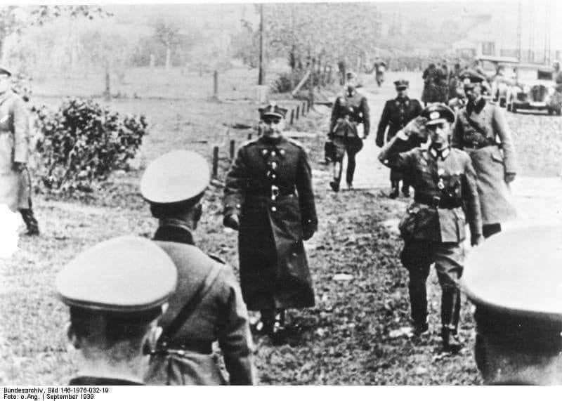
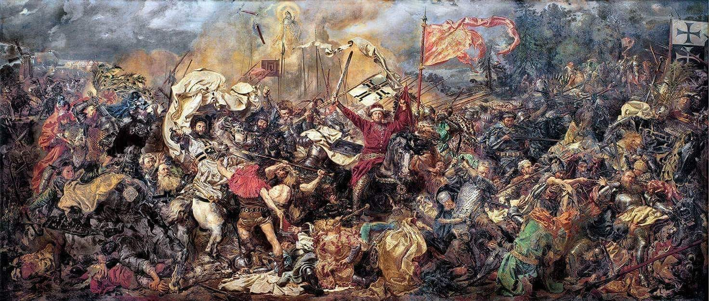

### 1939

Skapitulowała Warszawa. Akt kapitulacji stolicy został podpisany przez generała Tadeusza Kutrzebę i generała Johannesa Blaskowitza w budynku fabryki Skody na Rakowcu. W umowie ustalono, że do niewoli trafią tylko polscy oficerowie.
"Historia oceni należycie to poświęcenie, które nakazało nam trwać na posterunkach do ostatka"- mówił w wygłoszonym tego dnia przemówieniu prezydent Warszawy Stefan Starzyński.

  

### 1878

W jednej z sal krakowskiego Urzędu Miasta po raz pierwszy zaprezentowany został obraz Jana Matejki "Bitwa pod Grunwaldem".
Warto przypomnieć, że dzieło to powstawało przez przez 2,5 roku, a jego pierwszym właścicielm, który odkupił je od Matejki był warszawski finansista Dawid Rosenblum.
Obraz ma rozmiary 4, 26 m wysokości i 9,87 m długości.

  

### 480 p.n.e.

https://pl.wikipedia.org/wiki/Bitwa_pod_Salamin%C4%85

---

<a href="https://github.com/TomaszWaszczyk/historia.waszczyk.com/edit/master/src/content/september-28.md" target="_blank">Edytuj tę stronę dzieląc się własnymi notatkami!</a>
