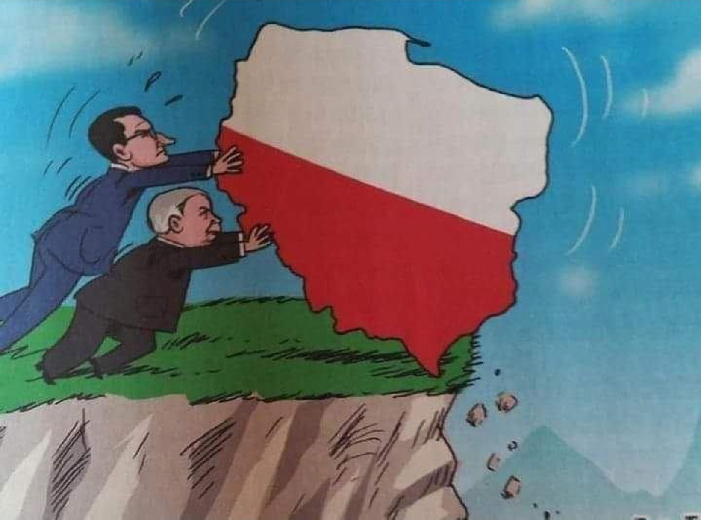
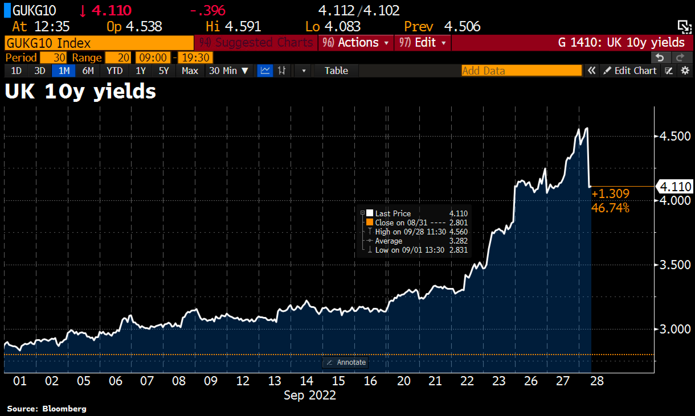
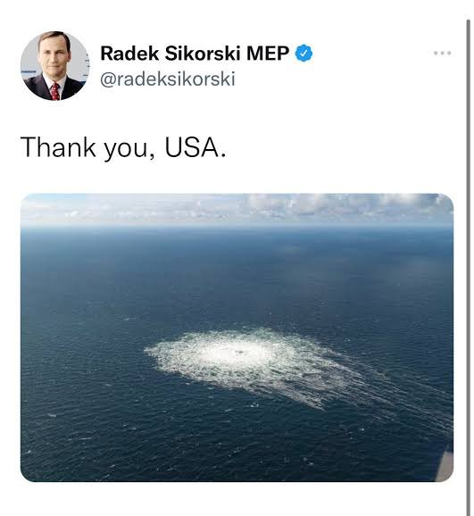
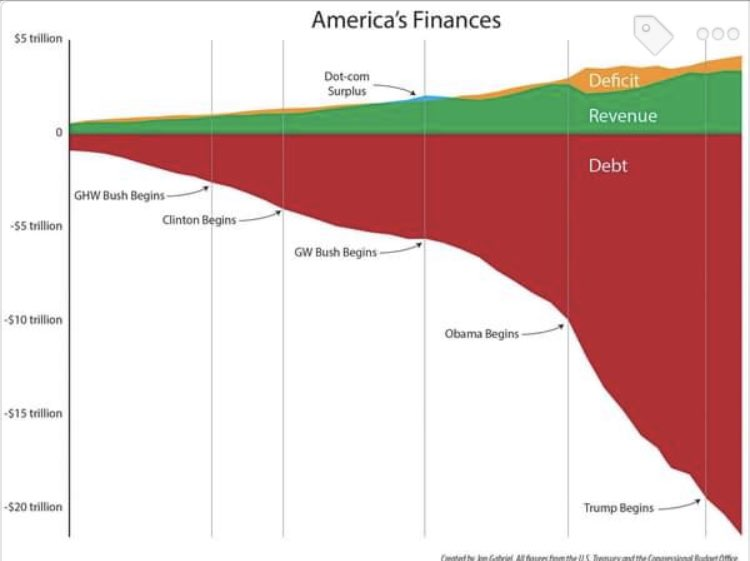
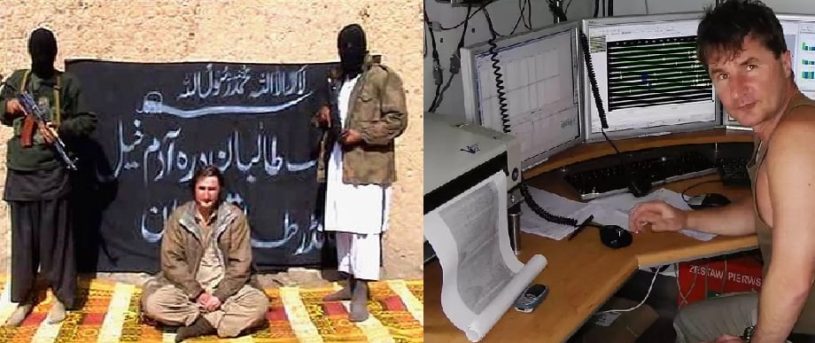
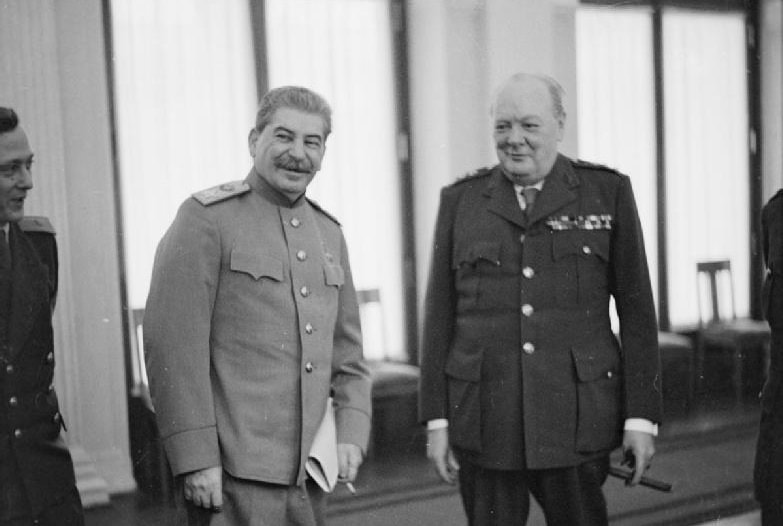

### 2023

体系对抗 is the modern battlefield of systems confrontation. Chew on this: Acquisition is a system. Winning on the battlefield requires comprehensive dominance across all of our interconnected systems, and that means dominating in acquiring and fielding the right technology at the right time.

When America's new Generals / Flag Officers report for their NDU CAPSTONE training in 2024 (mandated by the Goldwater-Nichols DoD Reorganization Act of 1986), they will be consuming this overview on Systems Destruction Warfare.

While it's required reading for them, it ought to be worthy reading for you.

You would be wise to get a head start on reading about 体系对抗 before it's too late to deploy this knowledge to propel America's own unfair advantage against our adversaries...

I'm glad that I've grown up recognizing patterns differently as a systems thinker, and I know where I'm doubling down when given the opportunity to dominate.

体系破击战

我们会做好准备

<a href="./documents/september/new-destruction-systems.pdf" target="_blank">体系对抗 </a>
<!--    -->
<!--    -->
---

<video width="640" height="480" controls>
<source src="./movies/september/VitalikButerinWhatWillETHBeLikein10Years.mp4" type="video/mp4">
Your browser does not support the video tag.
</video>

---

### 2022

Południową informacją dnia są doniesienia z Banku Anglii, który ogłosił, że będzie kupował długoterminowy dług rządowy, ponieważ stopy procentowe zbliżają się do 5%, co stanowi "istotne ryzyko dla stabilności finansowej Wielkiej Brytanii". Zakupy mają się rozpocząć dziś. W rentowności 10-letnich obligacji brytyjskich spadły o 40 pb.

  

---

  

---

### 2021

TVN:

> Pracownicy punktów informują, że z dnia na dzień widać coraz większe zainteresowanie szczepieniami dawką przypominającą.

---

WASHINGTON, Sept 28 (Reuters) - JPMorgan Chase & Co has begun preparing for the possibility of the United States hitting its debt limit, Chief Executive Jamie Dimon told Reuters on Tuesday, adding he nevertheless expected policymakers to find a solution to avoid that “potentially catastrophic” event.

The country’s largest lender has begun scenario-planning for how a potential U.S. credit default would affect the repo and money markets, client contracts, its capital ratios, and how ratings agencies would react, Dimon said in an interview.

“This is like the third time we’ve had to do this, it is a potentially catastrophic event,” he said.

“Every single time this comes up, it gets fixed, but we should never even get this close. I just think this whole thing is mistaken and one day we should just have a bipartisan bill and get rid of the debt ceiling. It’s all politics,” he added.

Congressional Democrats are scrambling to find a way to raise the government’s $28.4-trillion borrowing cap before the Treasury Department runs out of ways to service the nation’s debt. Treasury Secretary Janet Yellen has said the Treasury will likely exhaust extraordinary measures by Oct. 18.

<!-- https://wyborcza.pl/7,82983,27620414,partia-i-spolki-wielkie-sledztwo-wolnych-mediow-rozmowa-z.html -->

---

### 2019

  

### 2008

Został uprowadzony przez talibów Piotr Stańczak, polski geolog, który przebywał w Pakistanie jako pracownik firmy PGNiG Geofizyka Kraków, realizującej kontrakt „Soghri 3D” dla pakistańskiego przedsiębiorstwa Oil & Gas Development Company Limited. 7 lutego 2009 r. talibowie oświadczyli, że Piotr Stańczak został zabity poprzez dekapitację. W pierwszej połowie października 2008 r. porywacze wysłali nagranie video do redakcji pakistańskiego tygodnika Dawn. Na kilkuminutowym filmie Piotr Stańczak odczytywał oświadczenie po polsku i angielsku, prosząc o spełnienie żądań porywaczy, którzy domagali się uwolnienia 110 talibów z pakistańskich więzień. Na materiałach, którymi dysponowała redakcja, widać było wycelowaną w Polaka broń. Według relacjonującego nagranie dziennikarza, żądania były niemożliwe do spełnienia przez pakistański rząd. W wyniku obławy policyjnej w Pakistanie po 12 latach od porwania i 11 latach od śmierci Polaka porwanego w Rawalpindi udało się schwytać jego bezpośrednich egzekutorów. Okazało się, że było nimi dwóch terrorystów z ugrupowania Tahreek-i-Taliban (TTP): Kaleemullah Khan oraz Derra Adam Khel. Mężczyźni wskazali siebie na dawnym nagraniu ze Stańczakiem i potwierdzili, że to oni go zamordowali.

  

### 1944

Brytyjski premier Winston Churchill w wygłoszonym w Izbie Gmin przemówieniu stwierdził:
"Zmiany terytorialne na granicach Polski będą musiały nastąpić. Rosja ma prawo do naszego poparcia w tej dziedzinie, ponieważ jedynie armie rosyjskie mogą uwolnić Polskę ze szponów niemieckich oraz, ponieważ Rosjanie po wszystkim, co wycierpieli z rąk Niemiec, mają prawo do bezpiecznych granic i do tego, aby mieć przyjaznego sąsiada na Zachodzie".

  

### 1939

Skapitulowała Warszawa. Akt kapitulacji stolicy został podpisany przez generała Tadeusza Kutrzebę i generała Johannesa Blaskowitza w budynku fabryki Skody na Rakowcu. W umowie ustalono, że do niewoli trafią tylko polscy oficerowie.
"Historia oceni należycie to poświęcenie, które nakazało nam trwać na posterunkach do ostatka"- mówił w wygłoszonym tego dnia przemówieniu prezydent Warszawy Stefan Starzyński.

  

### 1878

W jednej z sal krakowskiego Urzędu Miasta po raz pierwszy zaprezentowany został obraz Jana Matejki "Bitwa pod Grunwaldem".
Warto przypomnieć, że dzieło to powstawało przez przez 2,5 roku, a jego pierwszym właścicielm, który odkupił je od Matejki był warszawski finansista Dawid Rosenblum.
Obraz ma rozmiary 4, 26 m wysokości i 9,87 m długości.

  

### 480 p.n.e.

https://pl.wikipedia.org/wiki/Bitwa_pod_Salamin%C4%85

---

<a href="https://github.com/TomaszWaszczyk/historia.waszczyk.com/edit/master/src/content/september-28.md" target="_blank">Edytuj tę stronę dzieląc się własnymi notatkami!</a>
