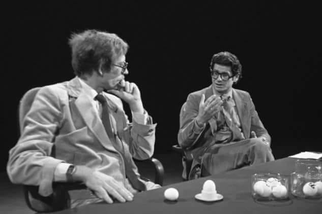
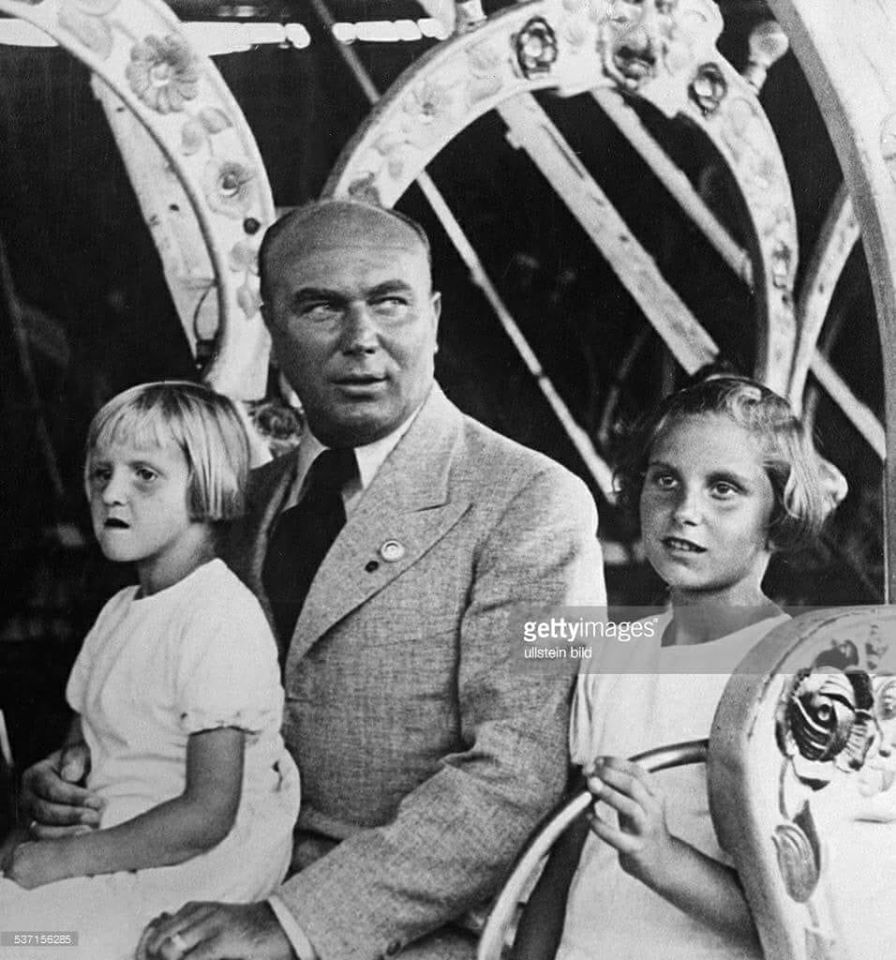

### 2019

Konferrencja Climate Action Summit.

### 1989

W wypadku samochodowym w okolicach Raciborza zginęli Andrzej Kurek i Zdzisław Kamiński (zdjęcie)- autorzy popularnego w latach 80-tych programu popularno- naukowego "Sonda".
Do wypadku doszło w drodze do Fabryki Kotłów RAFAKO, gdzie miał być przygotowywany materiał do kolejnego programu. Za kierownicą samochodu siedział Andrzej Gieysztor, były kierowca rajdowy, który również był ofiarą tej tragedii.
Peugeot, którym jechali autorzy "Sondy" wpadł w poślizg, a następnie zderzył się czołowo z nadjeżdżającym z przeciwnej strony samochodem ciężarowym Star.

  

### 1939

Gubernator Kraju Warty Artur Greiser wydał zarządzenie (zdjęcie), na mocy którego do polskich szkół została wprowadzona nauka języka niemieckiego w takim stopniu i wymiarze godzin, aby od 1 kwietnia 1940 roku młodzi Polacy mogli się uczyć wszystkich przedmiotów tylko w tym języku.
Tego samego dnia zarządził również zwolnienie wszystkich polskich nauczycieli.

  

---

<a href="https://github.com/TomaszWaszczyk/historia.waszczyk.com/edit/master/src/content/september-4.md" target="_blank">Edytuj tę stronę dzieląc się własnymi notatkami!</a>
