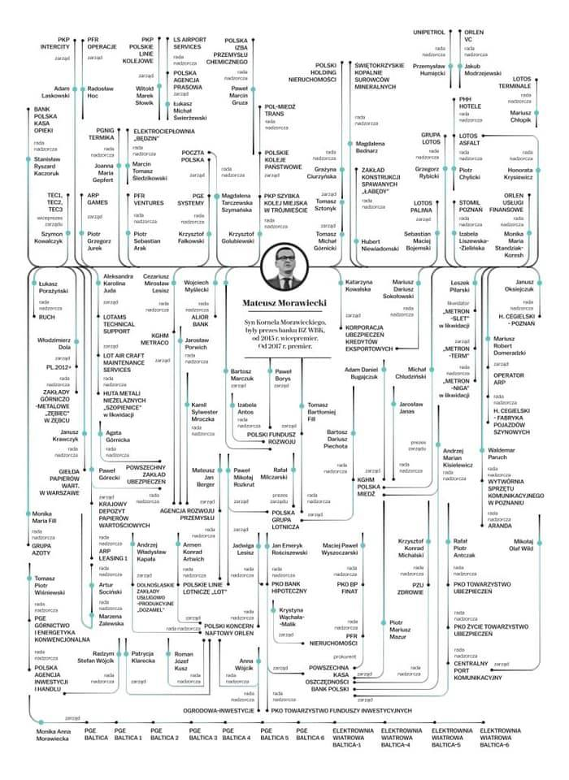
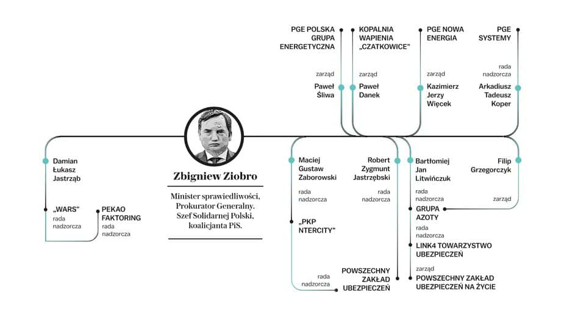
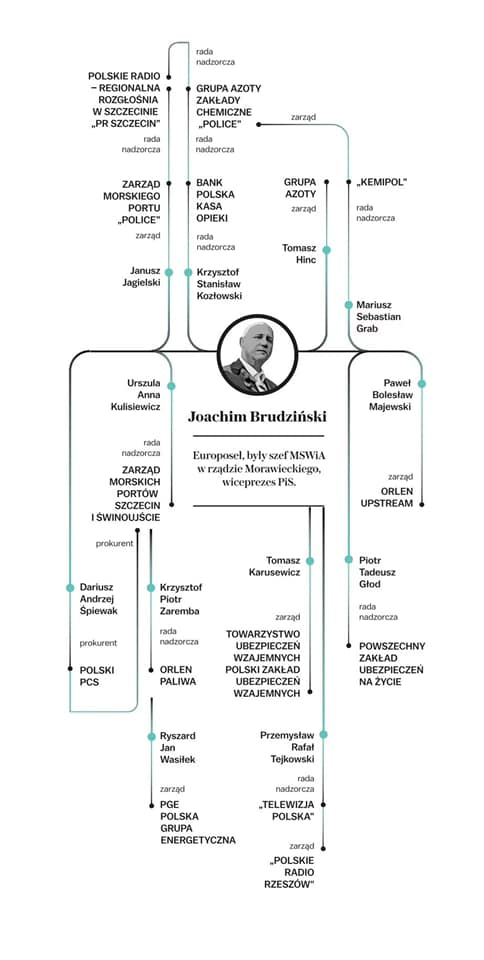
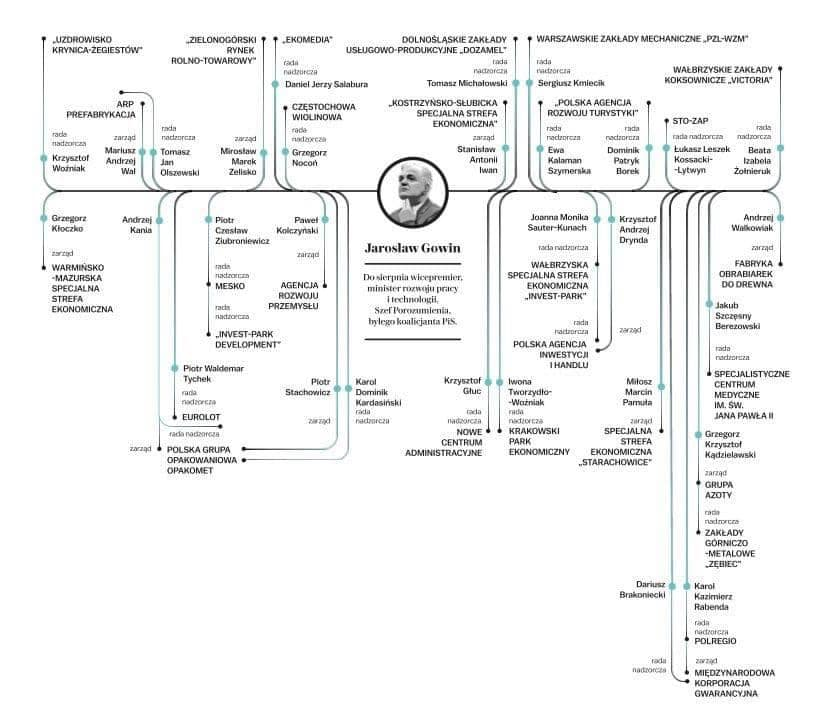

### 2021

  

  

  

  

### 2020

Mosbacher do Polaków: Jesteście po złej stronie historii

"Musicie wiedzieć, że w kwestii LGBT jesteście po złej stronie historii. Mówię o postępie, który się dokonuje bez względu na wszystko. Używanie tego typu retoryki wobec mniejszości seksualnych jedynie wyobcowuje Polskę" – mówi ambasador Georgette Mosbacher w rozmowie z Marcinem Makowskim.

  

### 2019

Konferrencja Climate Action Summit.

### 1989

W wypadku samochodowym w okolicach Raciborza zginęli Andrzej Kurek i Zdzisław Kamiński (zdjęcie)- autorzy popularnego w latach 80-tych programu popularno- naukowego "Sonda".
Do wypadku doszło w drodze do Fabryki Kotłów RAFAKO, gdzie miał być przygotowywany materiał do kolejnego programu. Za kierownicą samochodu siedział Andrzej Gieysztor, były kierowca rajdowy, który również był ofiarą tej tragedii.
Peugeot, którym jechali autorzy "Sondy" wpadł w poślizg, a następnie zderzył się czołowo z nadjeżdżającym z przeciwnej strony samochodem ciężarowym Star.

  

### 1986

Dziennik Telewizyjny w dniu 29.09.1986 poinformował, że Pan Andrzej Papuziński wygrał konkurs na pracę doktorską z zakresu marksistowskich nauk społecznych.

Posłuchajcie jego wypowiedzi🙈🙉

Dziś jest profesorem na UKW Bydgoszcz i kształci polską młodzież.

<video width="640" height="480" controls>
  <source src="./movies/september/marksizm.mp4" type="video/mp4">
  Your browser does not support the video tag.
</video>

### 1939

Gubernator Kraju Warty Artur Greiser wydał zarządzenie (zdjęcie), na mocy którego do polskich szkół została wprowadzona nauka języka niemieckiego w takim stopniu i wymiarze godzin, aby od 1 kwietnia 1940 roku młodzi Polacy mogli się uczyć wszystkich przedmiotów tylko w tym języku.
Tego samego dnia zarządził również zwolnienie wszystkich polskich nauczycieli.

  

### 1913

Mieszkali w Wiedniu jednocześnie: Adolf Hitler, Józef Stalin, Lew Trocki, Josip Broz Tito, Zygmunt Freud, Carl Jung, Ludwig Wittgenstein, Ludwig von Mises, Friedrich August von Hayek, Karl Popper, Erwin Schrödinger i Ferdinand Porsche.

---

<a href="https://github.com/TomaszWaszczyk/historia.waszczyk.com/edit/master/src/content/september-29.md" target="_blank">Edytuj tę stronę dzieląc się własnymi notatkami!</a>
