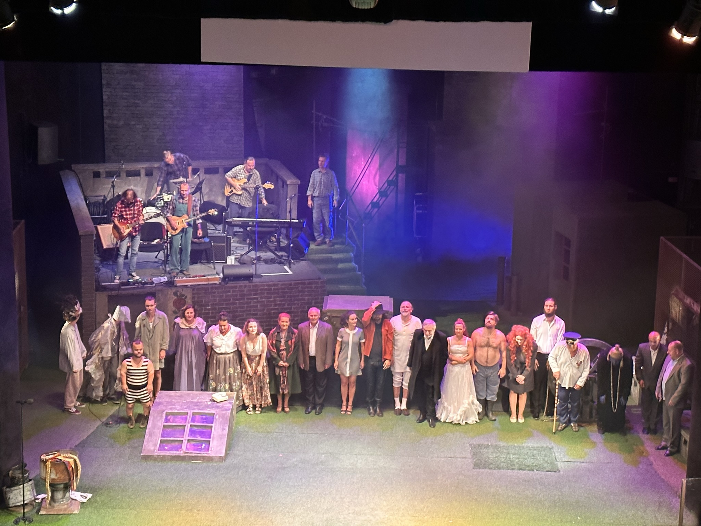

### 2023

<video width="640" height="480" controls>
<source src="./movies/september/nik.mp4" type="video/mp4">
Your browser does not support the video tag.
</video>

---

```text
Dzięki NBP Polska jest na dobrej drodze. Ceny nie rosną już od pięciu miesięcy, mimo wojny trwającej za wschodnią granicą i negatywnych wpływów z zagranicy. Główny Urząd Statystyczny podał, że w kwietniu 2023 r. wskaźnik cen towarów i usług konsumpcyjnych wyniósł 0,7 proc. w porównaniu do poprzedniego miesiąca, w maju i czerwcu nie zmienił się, w lipcu spadł o 0,2 proc., a w sierpniu – w porównaniu do poprzedniego miesiąca – ponownie utrzymał się na tym samym poziomie.

Mamy ogromny sukces, […] skończyliśmy z grozą inflacji – ogłosił prof. Adam Glapiński, Prezes NBP, podczas konferencji prasowej we wrześniu 2023 r.
```

<video width="640" height="480" controls>
<source src="./movies/september/Polska-jest-na-dobrej-drodze.mp4" type="video/mp4">
Your browser does not support the video tag.
</video>

---

<br><br>

---

<a href="./documents/september/Rok_1863_odczyt_wyg_oszony_d_20_I_1924_w_Warszawie.pdf" target="_blank">1863</a>

---

<br><br>

---

### 2022

> systemowo ważny

<br><br>

### 2020

> „Im bardziej państwo się zadłuża, tym mniej będą musieli się zadłużać obywatele.” - Woś

<br><br>

### 2019

Zmarł Kornel Morawiecki, fizyk, nauczyciel akademicki, działacz opozycji antykomunistycznej w czasach PRL, założyciel i przewodniczący Solidarności Walczącej, poseł i marszałek senior Sejmu VIII kadencji. Ojciec premiera Mateusza Morawieckiego miał 78 lat. Prezydent Andrzej Duda nadał Kornelowi Morawieckiemu Order Orła Białego 27 września 2019 r., w uznaniu znamienitych zasług na rzecz przemian demokratycznych w Polsce, za wybitne osiągnięcia w działalności publicznej i państwowej.

<br><br>

### 2010

<video width="640" height="480" controls>
<source src="./movies/september/jaroslaworosji.mp4" type="video/mp4">
Your browser does not support the video tag.
</video>

### 2006

Zlikwidowane zostały Wojskowe Służby Informacyjne- służba specjalna Rzeczposolitej Polskiej założona w roku 1991. Oficjalnie wykonywała ona zadania na rzecz Sił Zbrojnych RP z zakresu wywiadu oraz kontrwywiadu wojskowego. Nieofijalnie WSI, według opublikowanego przez Antoniego Macierewicza raporty były organizacją przestępczą działającą na szkodę Polski. Według zapisów tym samym dokumencie stwierdzono również, że WSI dopuszczały się bezprawnych działań w mediach, świecie polityki i biznesie.
WSI liczyły 10 tys. współpracowników w kraju i za granicą, z czego ponad 2,5 tys. agentów tych służb ulokowanych w różnych instytucjach i przedsiębiorstwach państwowych.

<br><br>

### 1994

Na poligonie w Drawsku podczas odbywającego się tam centralnego kursu metodyczno-szkoleniowego najwyższej kadry dowódczej Sił Zbrojnych RP, ówczesny prezydent Lech Wałęsa skrytykował cywilne kierownictwo Ministerstwa Obrony Narodowej, na czele którego stał emerytowany admirał Marynarki Wojennej Piotr Kołodziejczyk. Podczas spotkania, które miało miejsce wojskowym ośrodku wypoczynkowym w pałacu Brockhausenów w Karwicach nad jeziorem Lubie Wałęsa poddał również ostrej krytyce działania Sejmowej Komisji Obrony.
Poproszeni o szczere wypowiedzi na temat sytuacji w wojsku generałowie zarzucili winę za złą sytuację w armii szefostwo Ministra Obrony Narodowej. Wobec zaistniałej sytuacji, Wałęsa zarządził głosowanie w sprawie odwołania Kołodziejczyka z funkcji ministra obrony narodowej. Z wszystkich obecnych generałów tylko dwóch wstrzymało się od głosu.
Sprawa miała swój dalszy ciąg 12 października 1994 roku, kiedy Kołodziejczyk oskarżył prezydenta Lecha Wałęsę i szefa sztabu gen. Tadeusza Wileckiego o próbę pozakonstytucyjnego odwołania ze stanowiska podczas obiadu drawskiego. Miesiąc później ówczesny premier Waldemar Pawlak, ulegając naciskom Wałęsy i generalicji odwołał Kołodziejczyka.
Cała sprawa ujrzała światło dzienne dzięki "przeciekowi" z Wojskowych Służb Informacyjnych.
W spotkaniu udział wzięli między innymi minister Mieczysław Wachowski, Szef SG WP gen. Wilecki, dowódcy rodzajów sił zbrojnych i okręgów wojskowych: Edmund Bołociuch, Zbigniew Zalewski, Leon Komornicki, Jerzy Gotowała, Romuald Waga, Janusz Ornatowski, Tadeusz Bazydło, Julian Lewiński i Zenon Bryk oraz biskup polowy WP gen. Sławoj Leszek Głódź.

<br><br>

### 1989

Stanley Druckenmiller lub jak to kto woli "Geniusz z Pittsburgha". Obok Georga Sorosa jedna z największych legend spekulacji. Gdyby Stan był Polską to Trading Jam na jego mapie mógłby się lokalizować pomiędzy Radomiem, a Sosnowcem i naprawdę nikt tutaj nie przesadza.

Po błyskawicznej karierze i objawieniu się wszystkim jako naprawdę geniusz w swoim fachu od 1988 roku zaczął współpracę z Georgem Soroszem w jego funduszu Quantum Funds.

W 1989 upada mur berliński i na giełdach mamy podniecenie taką sytuacją jak dzisiaj Brexit lub Wojna Handlowa. Dla spekulantów jest to okazja dla wyciągnięcia swoich mitycznych stu milionów niczym Livermore w 1929. Stan uznaje, że trend spadkowy na marce niemieckiej sięga już dna i jest totalnie tani, najtańszy, upada mur berliński co oznacza zjednoczenie Niemiec oraz zbudowanie potężnej gospodarki.

Trzeba pamiętać, że "klimat" polityczny w USA panował wtedy taki, że Niemcy są buforem dla Związku Radzieckiego (który już chylił się ku końcowi, ale nic nie było pewne) i trzeba pakować tam naprawdę ogromne środki na rozwój, aby śladowe ilości komunizmy nigdy już nie zmąciły systemu politycznego doprowadzając ponownie do rewolucji lub stawania kraju na głowie.

Druckenmiller nie musiał specjalnie namawiać swojego mentora Sorosza do zajmowania pozycji długich na niemieckich markach. Pozycje wynosiły już miliardy, a wiatr odnowy, który wiał - cytując klasyka - przynosił ogromne zyski Quantum Funds.

To był pierwszy setup, a dopiero drugi setup, który znamy jako "łamanie banku Anglii" przyniósł ogromny rozgłos obu Panom.

<br><br>

### 1942

W Ostrowcu Świętokrzyskim Niemcy zamordowali 30 mieszkańców tego miasta. Egzezekucji przez powieszenie dokonano na tamtejszym rynku. Mord ten miał być zemstą za akcje dywersyjne i działalność konspiracyjną.
Jednym z zamordowanych był 50-letni Wojska Polskiego, mjr Straży Granicznej, żołnierz ZWZ-AK Leon Braziulewicz (zdjęcie).

<br><br>

---

W pierwszym numerze konspiracyjnego periodyku marksistowskiego "Przełom" ukazał się poemat "Sen nocy zimowej" autorstwa Mieczysława Jastruna (zdjęcie), poprzedzony takim oto wstępem.

"Kiedy wśród ruin stolicy snują się żywi, jak niestrudzone mrówki, pragnący zasklepić wyłomy w swych domostwach, kiedy w kabaretach i teatrzykach rozlega się śmiech tych, którzy tańczyć mogą nawet na grobie Ojczyzny-w Łazienkach co noc zbierają się duchy belwederczyków, duchy tych wszystkich, którzy polegli wierząc, że ich ciała są szczeblem do niepodległości. Co noc wpadają podchorążowie w bramy Belwederu z okrzykiem "Polacy, do broni!" Niebo odbija słaby odblask łuny nad Solcem, głucho dudni ziemia od wystrzałów Grochowa, słuchać skrzypienie kół ciągnionych w dali taborów. Sen duchów splata się z jawą żywych, nie widzących rozgrywającego się dramatu...Aż kiedyś ujrzą to powtarzające się misterium wszyscy. Żywi usłyszą dzwon alarmowy, a okrzyk "Do broni"! przeleci Alejami i Nowym Światem-iskrą obiegnie Polskę całą"

<br><br>

---

### 1939

W Kurierze Porannym prezydent Warszawy Stefan Starzyński (zdjęcie) potwierdził ważność zarządzenia w sprawie nauki w szkołach wydanego przez niemieckie władze okupacyjne. Dokument ten zawierał zapis o obowiązku powrotu do swoich miejsc pracy wszystkich obywateli polskich zatrudnionych przed wybuchem wojny w instytucjach publicznych i oświatowych.

<br><br>

---

### 1938

Minister spraw zagranicznych Józef Beck wystosował do władz Czechosłowacji dwugodzinne ultimatum z żądaniem zwrotu Zaolzia. Władze polskie wykorzystały fakt, iż tego samego dnia w Monachium odbywało się spotkanie przedstawicieli władz Wielkiej Brytanii, Francji, Włoch i Niemiec, którzy podpisali układ pozbawiający Czechosłowację części jej terytorium. Prezydent Benesz przystał na polskie żądania, ale bez sprecyzowania konkretnych warunków. Dwa dni później Wojsko Polskie zajęło 862 kilometry kwadratowe terenu Zaolzia.
Zajęcie Zaolzia - wkroczenie wojsk polskich do Karwiny. 1938 r. Fot. NAC

<br><br>

---

### 1917

Brytyjska propagandowa mapa przedstawia zasięg niemieckich dążeń terytorialnych w 1917 roku.

<br><br>

### 1655

W czasie potopu szwedzkiego zakończyła się trwająca 10 dni bitwa pod Nowym Dworem Mazowieckim. Wojska szwedzkie, dowodzone przez Gustawa Otto Stoenbecka pokonały wojska Rzeczpospolitej Obojga Narodów, na czele których stał wojewoda płocki Jan Kazimierz Krasiński.
Strary polskie wyniosły około 300 zabitych. Brak jest danych na temat strat szwedzkich.
Grafika; Erik Dahlbergh, Bitwa pod Nowym Dworem 1655.

<br><br>

---

<a href="https://github.com/TomaszWaszczyk/historia.waszczyk.com/edit/master/src/content/september-30.md" target="_blank">Edytuj tę stronę dzieląc się własnymi notatkami!</a>
