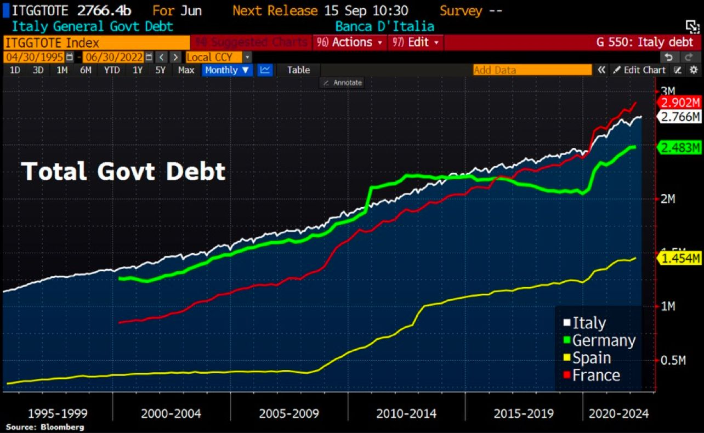
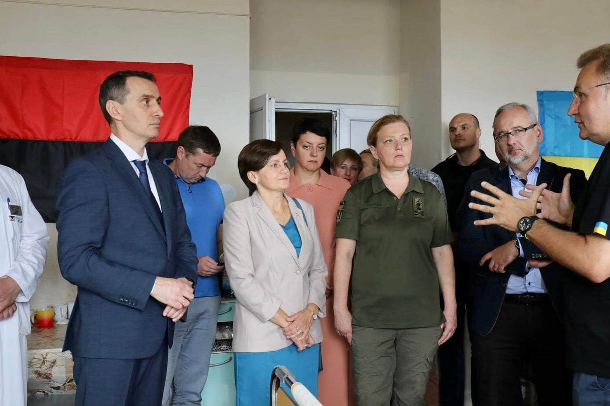
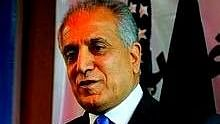
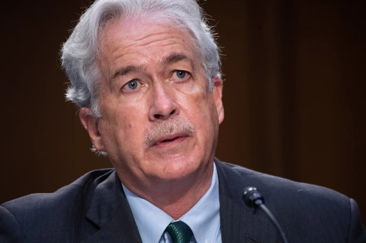
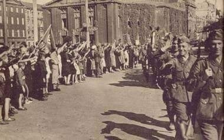

### 2022

Germany's ruling coalition has agreed to spend €65 billion on a new "inflation relief" package🚨

Reactionary bailouts are needed at this point after a failure to take proactive measures on energy independence in the past.

But when you read that headline twice, it makes you think.

Trillions of excessive money printing and fiscal spending caused inflation to sizzle in the first place, long before the war.

Now we are spending more money to fight inflation.

  

Printing more money is a short term solution that will win political kudos amongst the masses, however, it essentially is kicking the can down the road and ultimately erodes future value.

---

Wykuwa się nowa wrażliwość polska i ukraińska. Ministrowi rządu RP Niedzielski nie przeszkadza, że jest podejmowany w pomieszczeniu, w którym wisi flaga OUN (minister przekazuje dary). Ukraińcy nie wahają się do takiej sali zaprosić ministra rządu RP.

  

Przypomnę, że OUN odpowiedzialna jest nie tylko za ludobójstwo wołyńskie, ale także za zamordowanie ministra spraw wewnętrznych II RP Bronisława Pierackiego. Na zdjęciu jest także Konsul Generalna RP we Lwowie Eliza Dzwonkiewicz.

### 2021

[OPINIA] AFGAŃSKI TORT

Wszyscy wiecie co się ostatnio wydarzyło, internet zalały informacje o tym co dzieje się w Afganistanie. Ja natomiast pokażę Wam pewne zdarzenia, która jasno pokazują jaki to piękny teatr przygotowany przez elity dla mass. Afgański cyrk się nie skończy, a to dopiero początek nowych problemów, które czekają Bliski Wschód. W mediach wykreowano narrację jakoby USA sobie nie poradziło. To jest bzdura, oni od samego początku wszystko przemyślnie kontrolują i sterują Talibami jak chcą.
Na poniższym zdjęciu widzicie Sekretarza stanu Mike'a Pompeo, który spotykał się z mułłą Abdulem Ghanim Baradarem, szefem talibskiego zespołu negocjacji pokojowych, podczas rozmów między talibami a rządem afgańskim, 21 listopada 2020 r. w Doha w Katarze. Mike Pompeo oprócz tego, że był sekretarzem stanu także jest członkiem grupy Bilderberg, zaprzyjaźniony z Henrym Kissingerem (jedna z czołowych postaci w kreowaniu NWO).
Rozmowy pokojowe rozpoczęły się za prezydentury D. Trumpa, ale w tym momencie to jest już bez znaczenia. Prezydenci to tylko kukły. Ważne natomiast jest to kto uwolnił Abdul Ghani Baradar "Pakistan uwolnił współzałożyciela talibów Mullaha Abdula Ghaniego Baradara na prośbę USA, aby pomógł przyspieszyć afgańskie rozmowy pokojowe, powiedział specjalny wysłannik Waszyngtonu w Afganistanie Zalmay Khalilzad." Uwolnili go w październiku 2018 roku.

> Pakistan released Taliban co-founder Mullah Abdul Ghani Baradar at US’ request to help expedite the Afghan peace talks

  

Co z tego wynika? Amerykanie ustanowili rząd Afgański, stworzyli im armię, dali sprzęt i jednocześnie zaczęli uwalniać czołowych przywódców Talibów żeby zaprowadzić pokój w Afganistanie? Coś tu nie gra. 😉
Kolejną ciekawą informacją jest to, że Dyrektor CIA William Burns spotkał się z politycznym przywódcą talibów Abdulem Ghanim Baradarem potajemnie.

  

Inną ciekawą kwestią o której mało się mówi jest współpraca Chin z Talibami. Abdul Ghani Baradar spotkał się z Chińskim ministrem spraw zagranicznych Wang Yi.

Chiny zapowiedziały pomoc i ścisłą współpracę z Afganistanem pod rządami Talibów. Ważną sprawą dla Chińczyków jest tzw. "Korytarz Wachański". Jest to wąski pas terytorium, który ma około 300 km długości i kilkadziesiąt kilometrów szerokości i łączy Afganistan z Chinami. To może być dla Chin ważny szlak handlowy, ale też sam Afganistan odgrywa kluczową rolę jeśli chodzi o Iran. 
Ministrowie spraw zagranicznych Iranu i Chin, Dżawad Zarif i Wang Yi, 27 marca podpisali w Teheranie 25-letnią umowę o współpracy. Jest to konkretna umowa szacunkowo Chiny mają zainwestować w Iranie 400 miliardów dolarów. Mówi się głównie o infrastrukturze i surowcach (które potrzebne są Chinom), ale współpraca na pewno się na tym nie skończy i kwestie militarne też wejdą w grę. Dlatego m.in. Zachodnie państwa wolą dogadać się z Iranem niż słuchać Psów Wojny z Izraela by zaatakować Persów. Nowy Premier Izraela chce storpedować Porozumienie Nuklearne z Iranem, tym samym wywołać wojnę jakiej jeszcze ten świat nie widział. Co rusz większość mediów straszy nas ile to już Iran nie wyprodukował tego Uranu, ilu tam jest terrorystów i inne bzdety wymyślone na potrzeby propagandy skierowanej przeciwko Iranowi.

Deal Chin z Afganistanem pozwoli na lepszą współpracę z Iranem. Tylko po to Chinom potrzebni są Talibowie. Problem w tym, że globalne elity sterują od samego początku całym tym Afgańskim cyrkiem za pomocą służb jak choćby CIA i raczej nie czeka nas nic dobrego. Ktoś serio myśli, że amerykańska armia zostawiłaby od tak tony sprzętu? To ma czemuś służyć i myślę, że wkrótce przekonamy się jaki był ich zamiar.
Po za tym rozwożenie po całym świecie (ta ich tzw. ewakuacja) kolaborantów CIA, NSA i w tym także terrorystów może znowu doprowadzi do powrotu zamachów, Koronka się trochę nudzi, a strach wśród społeczeństwa trzeba podtrzymywać. Wmawia nam się, że na granicy Białorusko - Polskiej są biedne kobiety i dzieci z Afganistanu to bzdura, ci ludzie są z innych państw Arabskich.
I tak właśnie manipulują opinią publiczną, zapytajcie kogokolwiek czy ma jakieś pojęcie o tym co napisałem? Ludzie muszą sami zacząć łączyć kropki jak chcą zrozumieć o co tak na prawdę toczy się gra. Przez ich chorą walkę o władzę, znowu zginie mnóstwo ludzi. Tych wątków jest tutaj o wiele więcej, ale chciałem przedstawić ogólny zarys jak to realnie wygląda. Kto będzie chciał sam znajdzie więcej "smaczków" na ten temat. Za wszystkim zawsze stoją globalne elity, szczególnie ci, którzy sterują służbami i należą do nieoficjalnych grup jak choćby grupa Bilderberg. Tutaj mogę Wam polecić poszukać informacji z 1971 roku na temat wizyt Kissingera w Chinach. 😉

### 2020

Zbigniew Martyka

Pisząc o skutkach zainfekowania wirusem SARS-CoV-2 chciałbym przede wszystkim określić problem z medycznego, a nie politycznego punktu widzenia, jednakże w całej tej sytuacji elementy zdrowotne są pod pewnymi względami tak ściśle związane z elementami polityki, że nie sposób ich całkowicie rozdzielić.
Jak w dowcipie, który ostatnio przeczytałem:

> Pacjentka pyta lekarza, czy mamy się spodziewać nowej fali zachorowań. Lekarz odpowiada: „Nie wiem, proszę pani. Jestem lekarzem a nie politykiem”.

Na początku ogłoszenia epidemii (pandemii) nie bardzo było wiadomo, czy nie zbliża się kolejne zagrożenie masowym wymieraniem ludności, jak w czasie prawdziwych epidemii (dżuma Justyniana , 541-542r. – w samym Konstantynopolu umierało dziennie 5000 osób a populacja miasta zmniejszyła się o 40%; dżuma w Europie w XIV w – zmarła 1/3 ludności Europy;  „zaraza” w Londynie w 1665-1666r. – zmarło 20% mieszkańców Londynu; grypa hiszpanka – śmiertelność 10-20%). To były prawdziwe epidemie, nie takie jak sławetna świńska grypa. Oskarżono wówczas WHO o ogłaszanie sztucznej pandemii na potrzeby koncernów farmaceutycznych. Wykazano, że w grupie, która przygotowywała dokument w sprawie rekomendacji stosowania szczepionek, pracowało 3 naukowców, którzy otrzymywali wypłaty od firm farmaceutycznych. W 2010 r. opublikowano na ten temat krytyczne raporty - zarówno na łamach brytyjskiego pisma medycznego BMJ, jak również na posiedzeniu Zgromadzenia Parlamentarnego Rady Europy  (PACE). 
W przypadku Covid-19 okazało się, że śmiertelność średnio na świecie nie przekracza setnych części procent. W Polsce na Covid-19 zmarło kilkakrotnie mniej, niż w tym samym czasie na zapalenie płuc. Na HIV/AIDS rocznie umiera na świecie ok. 1 mln. osób. Liczba zakażeń jelitowych bakterią Clostridium difficile jest kilkakrotnie większa niż liczba osób, u których stwierdzono zainfekowanie wirusem SARS-CoV-2, a przebieg zakażenia jest często o wiele bardziej poważny.
W ciągu kilku ostatnich miesięcy pracy na oddziale zakaźnym spotykałem się z wieloma osobami, u których wykryto zainfekowanie Covid-19. Celowo nie piszę, że „były chore na Covid”, gdyż ponad 95 % miało albo lekkie objawy, ustępujące po 1-3 dniach, albo nie wykazywała w ogóle żadnych objawów. Zwyklej u tych lekko chorych obserwowaliśmy niewielkie podwyższenie temperatury ciała, przejściowe zaburzenia smaku lub węchu. Oczywiście, były także osoby, u których wystąpiły poważne objawy, wymagające hospitalizacji a niekiedy intensywnego leczenia. Zawsze istnieli ludzie ciężko chorzy i zawsze ludzie umierali. Nikt tego nie neguje. Na szczęście spośród osób, które do nas trafiały, był to naprawdę niewielki odsetek. Ci pacjenci oczywiście byli kierowani do szpitala jednoimiennego. 
Nie tylko z mojej obserwacji, ale także z wymiany doświadczeń z wieloma moimi kolegami – głównie lekarzami rodzinnymi – wynika, że w czasie zachorowań grypowych stan pacjentów był zdecydowanie bardziej poważny. Były to w większości osoby naprawdę chore, bardzo osłabione, wysoko gorączkujące, a ich normalna, codzienna aktywność, była wyłączona na kilka lub kilkanaście dni. 
Przez lata spotykaliśmy się z różnymi chorobami infekcyjnymi, przebiegającymi często z bardziej burzliwymi objawami, ale nikt z tego powodu nie wpadał w panikę, nie zarządzał kwarantanny, izolacji, nie zmuszał ludzi zdrowych do wykonywania testów, badań – tylko dlatego, że znaleźli się w pobliżu osoby zainfekowanej. Po prostu zachowywano się racjonalnie.
Pamiętam, jak zaczęły się zachorowania na HIV. Początkowo ludzie byli naprawdę przestraszeni. Obawiali się, że zakażą się jeśli dotkną klamki, którą przed chwilą dotykał pacjent z HIV. I co wówczas robiono? Nakręcano panikę? Zarządzano kwarantanny? Czy podawano w mediach, ile nowych przypadków wykryto każdego dnia? Czy wirusa nazywano „śmiertelnym wirusem”? Nie. I władze, i pracownicy medyczni zachowywali się wówczas zupełnie normalnie. Starano się ludzi uspokoić, wytłumaczyć, że jest to choroba infekcyjna jak wiele innych i oczywiście należy zachować pewną ostrożność, ale nie wolno wpadać w panikę. To były normalne czasy. Nie było „zapotrzebowania politycznego” na eskalowanie pandemii  strachu, zupełnie inaczej niż w chwili obecnej. 
Aktualnie śmiertelność z powodu innych chorób (w tym infekcyjnych) jest znacznie wyższa, niż śmiertelność wśród osób, które kwalifikuje się jako zmarłe w wyniku zakażenia Covid. Na inne choroby zakaźne umiera ponad 90% osób, a zakwalifikowanych jako Covid – poniżej 10%. Natomiast przekaz medialny jest taki, że mamy się bać tych kilku procent, a nie musimy się przejmować innymi zakażeniami, które są odpowiedzialne za ponad 90% zgonów spowodowanych chorobami zakaźnymi. Gdzie logika? Niezbędne jest w tym przypadku uświadomienie, że zakażenie Covid może być przysłowiowym „gwoździem do trumny” u osób schorowanych, ale praktycznie samo w sobie nie prowadzi do śmierci (tak jak to było początkowo w przypadku AIDS - teraz są terapie, które pozwalają zachować tych pacjentów przy życiu, lecz na początku rozpoznanie AIDS kojarzyło się z nieuchronnym zgonem).
Już słyszę adwersarzy, którzy mówią: „A gdyby to chodziło o twoją najbliższą osobę, schorowaną, w podeszłym wieku, to też uważasz, że nie powinno być obostrzeń, maseczek, izolacji, kwarantanny itp.? Powiedz to osobie, która utraciła kogoś bliskiego”.
Odpowiadam podwójnie:

1) To powiedz to trzem innym osobom, które utraciły swoich bliskich z powodu niemożności otrzymania właściwej pomocy lekarskiej z powodu restrykcji covidowych.
2) Mój Tato w wieku 81 lat zachorował na banalną infekcję wirusową (nie żaden Covid), która była tym przysłowiowym gwoździem do trumny. Zmarł. I wcale nie uważam, że powinniśmy w tamtym czasie paraliżować normalne życie, funkcjonowanie służby zdrowia, aby zredukować możliwość  przenoszenia   czynników zakaźnych. Podstawowe zasady – tak. Ale nadzwyczajne, przekraczające zasady zdrowego rozsądku – zdecydowanie NIE.
Mimo braku istotnych różnic pomiędzy infekcją Covid a innymi infekcjami wirusowymi (w tym – innymi koronawirusami, które występują w populacji w ilości 5 do 15%) – zarządzono wyolbrzymione, sprzeczne z logiką restrykcje. Sparaliżowano służbę zdrowia. Sparaliżowano gospodarkę. Zniszczono wiele firm (niezależnie od wypłat rekompensujących). Pozbawiono ludzi komfortu bycia wolnym człowiekiem. Zastraszono. 
Być może uchroniono (a właściwie – odwleczono w czasie) zakażenie jakiegoś procenta osób. W miejsce tego pozbawiono zdrowia, a niejednokrotnie życia, o wiele więcej ludzi. Terapia okazała się gorsza niż choroba. Na co dzień spotykam się z sytuacjami, że chorzy pacjenci nie mogą się dostać do lekarza, jeśli mają podwyższoną temperaturę ciała. Są odsyłani z kwitkiem w formie „teleporady”, bez badania fizykalnego, bez badań analitycznych, obrazowych (bo mogą mieć Covida). Ostatnio poruszający, znany mi osobiście przykład z innego miasta: starsza kobieta mieszkająca z mężem (także w podeszłym wieku) z nieco podwyższoną temp. ciała. Pobrano wymaz w kierunku Covid i pozostała w domu. Po kilku godzinach wzrost temp. ciała do ponad 40 st. C. Zasłabła. Mąż wezwał pogotowie. Ratownicy poinformowali, że w oddziale zakaźnym nie ma miejsc wolnych. Szpital jednoimienny jej nie przyjmie, bo nie ma stwierdzonego dodatniego Covida. Inne szpitale nie przyjmą, bo nie ma stwierdzonego ujemnego Covida. Pacjentkę pozostawiono w domu, tłumacząc, że gdyby pojawiła się silna duszność, to niech jeszcze raz wezwie pogotowie. Może w tym czasie będzie już wynik pobranego wcześniej wymazu w kierunku SARS-CoV-2.
Proszę mi wierzyć, to nie jest żadne wyolbrzymianie problemu. I ja i moi koledzy spotykamy się z takimi sytuacjami często. Kiedy na początku na wyniki testów czekaliśmy nawet kilka dni, to pamiętam, jak jeden pacjent po wypadku nie był zaopatrzony przez 3 dni (rany nie były zeszyte). Krążył między jednym szpitalem a drugim (w tym – jednoimiennym, gdzie też go nie zaopatrzono twierdząc, że powinien być zaopatrzony w miejscu zamieszkania).
Z pewnością każdy zna  liczne takie przypadki. To jeden z wielu aspektów pandemii strachu.
Inną, niezwykle przykrą konsekwencją koronapaniki jest pozostawianie starszych, lub młodych ale poważnie chorych osób wymagających hospitalizacji bez możliwości kontaktu z bliskimi. Tacy ludzie, często bardzo emocjonalnie związani z innymi członkami rodziny zostają osamotnieni, bez możliwości odwiedzin w momencie, kiedy wsparcie najbliższych jest im najbardziej potrzebne.
Warto tu wspomnieć o depresjach (koledzy psychiatrzy i psychologowie mają coraz więcej nowych pacjentów). 
Depresja idzie w parze także ze wzrostem bezrobocia. Jak wynika z wielu analiz – wzrost bezrobocia o 1% przyczynia się do wzrostu liczby samobójstw o ok. 1,1%.
Kilkakrotnie na moich oczach dochodziło do omdleń, kiedy pacjenci (nawet mężczyzna w sile wieku) z powodu założonej maseczki mieli utrudniony dopływ tlenu. Po zdjęciu maski wracali powoli do siebie. Wtedy mówiłem, żeby nie zakładali w tym dniu maseczki, niezależnie od zaleceń ministra.
A propos bezpieczeństwa maseczek. Znowu wielu adwersarzy przekonuje, że personel służby zdrowia, zwłaszcza zabiegowcy – używają na co dzień masek i nic się nie dzieje. Tak, to prawda, ale czy w przypadku zaostrzenia POChP lub w zaawansowanej ciąży stają za stołem operacyjnym? Chyba nie.
Ponadto - zdecydowana większość obserwowanych przeze mnie (i nie tylko) osób używa tej samej maski przez wiele tygodni. Jest ona zabrudzona, zainfekowana, a zdarza się, że jeden drugiemu pożycza przed wejściem do sklepu. Inni maja ją na samych ustach lub na brodzie, byleby się uchronić przed mandatem. Nawet gdyby taka maska rzeczywiście ograniczała transmisję wirusa, to w tych przypadkach nie tylko nie ogranicza, ale dodatkowo naraża na infekcje. 
Czy warto więc tak bardzo dezorganizować normalne życie, normalne funkcjonowanie służby zdrowia, aby osiągnąć wyimaginowaną korzyść zdrowotną w nielicznych, pojedynczych przypadkach, poświęcając pod wieloma względami dużo większe grupy ludzi?
O co więc chodzi? Bo ze zdrowym rozsądkiem, a zwłaszcza z medyczną zasadą „primum non nocere” (przede wszystkim nie szkodzić) - ma to niewiele wspólnego. 
Zastraszanie i wzbudzanie paniki szkodzi nam wszystkim. Proszę sobie wyobrazić pilota samolotu, który awaryjnie lądował. Po wylądowaniu informuje pasażerów: „proszę spokojnie podchodzić do wyjść awaryjnych. Na zewnątrz są już służby ratunkowe. Wszyscy bezpiecznie opuszczą samolot”. I nawet, jeśliby zagrażało większe niebezpieczeństwo, to takie rozważne podejście i uspokojenie ludzi zwiększa szansę ich uratowania. A gdyby pilot krzyczał: „Ludzie! Ratujcie się kto może, bo w każdej chwili mogą wybuchnąć zbiorniki z paliwem”. Jak można byłoby to ocenić?
Na naszych oczach odbywa się to drugie. Niestety. Nawet samo podawanie liczb nowo zakażonych lub zmarłych osób jest sposobem manipulacji i straszenia. Średnio w ciągu doby umiera w Polsce ok. 1100 osób. I o tym się nie mówi w mediach. Natomiast słyszymy, że zmarło 8 osób z powodu Covida (tak naprawdę nie wiadomo, czy rzeczywiście z powodu Covida, bo sekcji się u nas w tych przypadkach nie robi).
Ponadto, w zdecydowanej większości przypadków ludzie umierali na inne choroby, będąc „bezobjawowymi nosicielami wirusa” ale do informacji publicznej podaje się, że zmarli „z powodu” koronawirusa, co jest kolejnym elementem manipulacji zmierzającej do eskalowania strachu.
A gdyby tak informować, że dziś zginęło w wypadkach komunikacyjnych 8 osób w Polsce. I tak codziennie (tyle bowiem średnio ginie). I gdyby stwierdzić, że trzeba wobec tego podjąć nadzwyczajne działania – ograniczenie ilości pojazdów na jezdni (jeden pojazd od drugiego w odległości 100 m), ograniczenie ilości pieszych na przejściach (maksimum dwie osoby jednocześnie), konieczność noszenia przez pieszych czapeczek z migającym światełkiem (za brak czapeczki wysokie mandaty)? A najlepiej: „Zostań w domu, nie wychodź na ulicę – zachowaj się odpowiedzialnie”. I tu widać nonsens nieadekwatnych działań, z jakimi mamy do czynienia w związku z koronapaniką.
Jeżeli ktoś powie, że przykład jest chybiony, bo tu chodzi o chorobę zakaźną - to od razu odpowiadam: chodzi o to, by zmniejszyć ilość zgonów – niezależnie od przyczyny. 
Ktoś może powiedzieć, że łatwo mi ironizować na temat ofiar wypadków. Od razu odpowiadam: mój syn zginął w wypadku w wieku 19 lat. I nie uważam, że powinno się nosić dla bezpieczeństwa czapeczki z migającym światełkiem.
Dlaczego uważam, że straszenie jest częścią polityki?
Minęło kilka miesięcy. W niektórych krajach zrezygnowano z siania paniki i prowadzono w miarę normalne życie (poza nielicznymi ograniczeniami). Jaki skutek w porównaniu w tymi, gdzie wprowadzono obostrzenia
Kraj / procent zakażeń w całej populacji / procent zgonów w całej populacji
USA / 1,8% / 0,055%
Brazylia / 1,8% / 0,06%
Włochy / 0,45% / 0,06%
Polska / 0,18% / 0,005%
Białoruś / 0,75% / 0,007%
Szwecja / 0,84% / 0,06%
Jak widać – nie ma istotnej różnicy pomiędzy średnią liczbą zgonów na świecie a średnią liczbą zgonów w krajach bez obostrzeń (Szwecja, Białoruś).
A propos Białorusi – niezależnie od oceny politycznej i moralnej ich prezydenta, to warto zapoznać się z konferencją prasową, gdzie podał do publicznej wiadomości, w jaki sposób próbowano go nakłonić, by zastosował takie obostrzenia, jak w pozostałych krajach:
„Agencja Bełsat poinformowała o tym, że WHO czyli Światowa Organizacja Zdrowia, agenda ONZ zaproponowała prezydentowi Łukaszence 92 miliony dolarów za wprowadzenie w całym kraju restrykcji takich, jak we Włoszech”. Odmówił. Kilka tygodni później zgłosił się do niego Międzynarodowy Fundusz Walutowy (IMF) również agenda ONZ.  Oferta za to samo okazała się dziesięciokrotnie większa. Łukaszenko odmówił stwierdzając - “Nie będziemy tańczyć jak nam kto zagra”. - cytuje białoruska agencja powołując się na materiał filmowy.
Białoruś nie zamknęła swej gospodarki a 9 maja zorganizowała nawet (w przeciwieństwie do Rosji) defiladę w Dzień Zwycięstwa. Mimo to sytuacja epidemiczna jest na Białorusi lepsza niż w wielu innych krajach, które zastosowały tzw. lock down”.
Czy tak m.in. wygląda „pociąganie za sznurki”? A może jeszcze innych metod „perswazji” używano?
Przyszłość nie napawa optymizmem. Pomimo, że na początku minister zdrowia mówił jak lekarz („maseczki nic nie dają i nie wiem, po co je ludzie noszą”, oraz: „ja nie mam objawów chorobowych więc nie muszę ich nosić”), później zmienił zdanie na bardziej „poprawne politycznie”.   
Zastraszanie konsekwentnie postępuje.
Ale nie wszyscy boją się „śmiertelnego wirusa” (jak się go często określa w mediach). Coraz więcej osób porównuje go z innymi, znanymi chorobami i widzi cały absurd tego zastraszania. Podobnie większość moich kolegów – lekarzy. Boją się czegoś innego: kwarantanny. Wolą nie przyjmować pacjentów, odesłać ich bez badania zasłaniając się taką możliwością (teleporada), żeby przypadkiem nie natknąć się na pacjenta, u którego wykryje się  Covid-19.
Gdyby nie ta obawa, problem w służbie zdrowia w dużej mierze byłby rozwiązany.
Podobnie ze szpitalami jednoimiennymi, które przestają być wydolne.
Jeśliby ktoś chciał bardziej skutecznie dokonać destrukcji służby zdrowia to można by było wprowadzić kwarantannę, izolację, badania przesiewowe np. u osób z zakażeniami jelitowymi (w tym: Cl. difficile), z HIV/AIDS, z zapaleniem płuc (ok. 12 tys. zgonów rocznie w Polsce i także można się zarazić drogą kropelkową). Zróbmy w tych przypadkach również szpitale jednoimienne i dopiero wówczas pokażemy społeczeństwu, przed jakim straszliwym niebezpieczeństwem trzeba go chronić. A szpitale jednoimienne nie będą w stanie przyjąć wszystkich tam kierowanych.
Panika będzie jeszcze większa.
W prowadzonym przeze mnie oddziale zakaźnym już teraz nie jesteśmy w stanie obsłużyć wszystkich zgłaszających się pacjentów, którym odmówiono pomocy w innych placówkach służby zdrowia. Brak personelu, brak „mocy przerobowych”.
Z dziesiątków osób, które się zgłaszają, tylko u pojedynczych osób jest wykryty Covid. Cała reszta jest zdrowa. A nawet ci zainfekowani (zgłosili się, bo dostali takie polecenie) w zdecydowanej większości wykazują zdziwienie, że wykryto wirusa, bo nie mają ŻADNYCH objawów.
Tak więc izolujemy zdrowych (bo wykryto u nich materiał genetyczny jednego z całej rzeszy wirusów, które normalnie zasiedlają ludzki organizm i z którymi nasz układ odpornościowy doskonale sobie radzi), poddajemy ich badaniom, nie mając już pełnych możliwości zająć się chorymi na inne choroby.
A co będzie za kilka tygodni, gdy pojawią się typowe dla okresu jesiennego infekcje z podwyższoną temperaturą ciała? Zdecydowana większość tych osób nie będzie miała wykrytego tego „śmiertelnego” wirusa (przypomnę, że śmiertelność w skali świata to zaledwie 0,05%!), ale zostaną odesłani bez badania, żeby personel nie musiał poddać się kwarantannie.
Czy te wszystkie, nieadekwatne do rzeczywistego zagrożenia obostrzenia, mają na celu zdrowie ludzi? Wątpliwe. Gdyby istotne było zdrowie, to prowadzono by akcje uświadamiające, że należy dbać o naturalną odporność organizmu oraz podawano by sposoby jak można to osiągnąć. 
Byłem kilka lat temu na konferencji naukowej dla lekarzy rodzinnych (konferencja o stanie zdrowia Polaków, pod patronatem ministra zdrowia), gdzie podano ciekawe informacje: mamy coraz większe możliwości w medycynie stanów nagłych, ale jeśli chodzi o choroby przewlekłe, to sytuacja nie jest wesoła. Oczywiście stosujemy leczenie farmakologiczne, ale w tym przypadku możemy wpływać na zdrowie pacjentów zaledwie w ok. 10%. Natomiast 56% zależy od tego, jak pacjent traktuje swój organizm (używki, aktywność fizyczna, zdrowe odżywianie, uzupełnianie niedoborów witamin, mikroelementów, fitoskładników, eliminowanie toksyn itp.). W 24% na nasze zdrowie ma wpływ środowisko, w jakim żyjemy. W 10% - predyspozycje genetyczne, a jedynie w 10% - tzw. medycyna naprawcza.
Od lat mam możliwość obserwacji pacjentów, którzy w oparciu o powyższe informacje tak zmienili swój styl życia, tak zaczęli dbać o organizm, że praktycznie przestali zapadać na infekcje pomimo, że wcześniej często chorowali. Poprawa funkcji organizmu ma wpływ także na inne jego czynności, nie tylko na układ immunologiczny.
Dlaczego o tym się milczy? Dlaczego zaleca się maseczki, a nie mówi się, że można inaczej zadbać o zdrowie? Czy dlatego, że komuś zależy, by ludzie nie byli zbyt zdrowi? Komu?
Kto pociąga za sznurki „poprawności”? 
Sposobem wyjścia z zapaści, jaka czeka nas w nadchodzącym czasie zwiększenia zachorowań, jest zaprzestanie traktowania zakażenia Covid jak wyjątkowej choroby i traktowanie go tak, jak powiedział Premier Morawiecki przed wyborami prezydenckimi: „Nie ma się czego bać, widzę, że już większość z państwa nie nosi maseczek. Choroba, jak choroba, jak inne choroby infekcyjne”.
A więc potraktujmy ją tak, jak powinniśmy - róbmy masowe badania wymazów w takim stopniu jak to robimy w przypadku innych chorób infekcyjnych (czyli wcale), znieśmy kwarantanny, a wówczas zajmiemy się ludźmi naprawdę chorymi i wymagającymi leczenia a nie zdrowymi nosicielami. Szpitale jednoimienne będą mogły być normalnymi szpitalami, a pacjenci zainfekowani, ale wymagający hospitalizacji, będą mogli być przyjmowani w każdym innym szpitalu bez obawy, że trzeba będzie poddawać się kwarantannie, która paraliżuje normalne funkcjonowanie placówek służby zdrowia i każdego człowieka.

### 2012

Umiera Józef Szaniawski: https://pl.wikipedia.org/wiki/J%C3%B3zef_Szaniawski_(politolog)

### 2002

The full implementation of Agenda 21, the Programme for Further Implementation of Agenda 21 and the Commitments to the Rio principles, were strongly reaffirmed at the World Summit on Sustainable Development (WSSD) held in Johannesburg, South Africa from 26 August to 4 September 2002.

### 1939

Do Katowic weszli żołnierze Wermachtu. Sytuację ułatwiał fakt, że do tego czasu wycofały się z miasta prawie wszystkie kompanie Wojska Polskiego. Pozostali tylko nieliczni żołnierze.
Wkraczający Niemcy zostali powitani entuzjastycznie przez mieszkańców ,którzy za swoją ojczyznę uznawali Niemcy.

  

### 1937

większość rektorów szkół wyższych wprowadziła haniebne ,,getta ławkowe''.

Getta ławkowe - odrębne ławki dla młodzieży żydowskiej w salach wykładowych wyższych uczelni w Polsce w okresie międzywojennym, polskie nacjonalistyczne organizacje młodzieżowe dążyły do ograniczenia (numerus clausus) lub całkowitego wyeliminowania (numerus nullus) młodzieży żydowskiej z wyższych uczelni. Urządzano burdy, które dezorganizowały naukę, często kończyły się fizycznym poszkodowaniem uczestników, zwłaszcza Żydów, a niekiedy śmiercią. Oficjalny postulat stosowania getta ławkowego został wysunięty w 1933 r., a w 1937 wprowadzony przez większość rektorów wyższych uczelni za zgodą ministra wyznań religijnych i oświecenia publicznego W. Świętosławskiego. Przeciwko gettom ławkowym protestowało bezskutecznie wielu wybitnych uczonych polskich.

M. Natkowska Numerus clausus, getto ławkowe, numerus nullus, „paragraf aryjski”. Antysemityzm na Uniwersytecie Warszawskim 1931–1939, Warszawa 1999.

Foto: Indeks Marka Szapiry, studenta Uniwersytetu Warszawskiego narodowości żydowskiej, z 1934 z ostemplowanym miejscem w getcie ławkowym.

„Czy mi nie wolno uczynić ze swoim, co chcę?” (Mt 20, 15)

---

<a href="https://github.com/TomaszWaszczyk/historia.waszczyk.com/edit/master/src/content/september-4.md" target="_blank">Edytuj tę stronę dzieląc się własnymi notatkami!</a>
