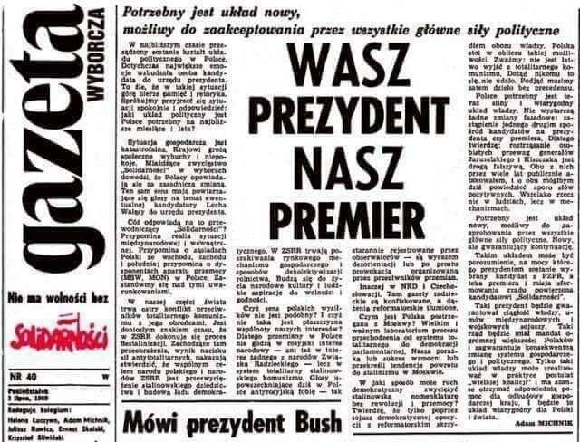
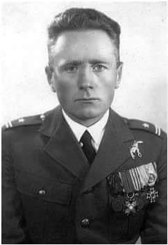
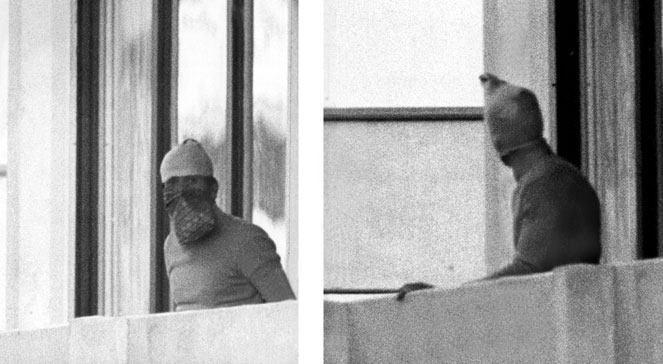

### 2021

Paweł Borys prognozuje, kiedy stopy procentowe pójdą w górę. 

> Raty kredytów mogą wzrosnąć o 200-300 zł.

Bankowcy się cieszą: w tym roku zaciągniemy najwyższy dług hipoteczny w historii. Przy najwyższych cenach mieszkań i tuż przed wzrostem rat.

---

Łączny koszt Polskiego Ładu do 2030 roku to 650 mld zł. 

"ludzie uwierzą we wszystko!" trzeba obiecywać, a potem stopniowo wygaszać oczekiwania!

✍️7% PKB na służbę zdrowia dopiero w 2027 roku - nie wystarczy, trochę późno ludzie potrzebują teraz! Btw, Składki zdrowotnej nie odliczymy od podatku czyli zapłacimy wyższy podatek. Tak czy Nie ? 
Bardziej potrzebna jest raczej reforma ZUS.

✍️ Możliwość budowy domów do 70 m kw. bez pozwolenia, bez księgi i bez kierownika budowy!

✍️ Kwota wolna od podatku wzrośnie do 30 tys. złotych. Drugi próg podatkowy od 120 tys. zł. (Pies pogrzebany w szczegółach). Dług będzie rósł jak w USA.... prwd nikt nie będzie tego spłacał.

✍️ mocny cios w osoby samozatrudnione.

✍️ liniowy 19% wzrośnie do 28%. Zatem przedsiębiorcy przerzuca koszty na klientów.

✍️ nie będzie podwyżek cen energii.Obecnie płacimy 9,5 % więcej niż rok temu (dane GUS).

✍️ Szykujmy się na 20 metrowe kawalerki za 500 tysięcy w kredycie na 40 lat. Banki zacierają już ręce. 

✍️ Przy galopującej inflacji każdy będzie klasą średnią🤸🏻‍♀️

Dla GPW do góry prawdopodobnie: deweloperka, firmy budowlane, spółki medyczne, banki, spółki surowcowe( stal/cynk)-> podparte kapitałem zagranicznym 📈 krótkoterminowo.

info-PAP: Bezzwrotny bon mieszkaniowy nawet do 185 tys. zł już od 2023 roku.

---

Papież Franciszek zaapelował w niedzielę o przyjmowanie uchodźców z Afganistanu i zapewnienie im ochrony. Zapewnił także o swej modlitwie o to, aby młodzi Afgańczycy mogli się uczyć, a wszyscy obywatele tego kraju żyli w pokoju i braterstwie.

Zwracając się do wiernych zgromadzonych na modlitwie Anioł Pański w Watykanie papież powiedział: „W tych burzliwych chwilach, w których Afgańczycy szukają schronienia, modlę się za tych najsłabszych wśród nich. Modlę się o to, aby wiele krajów przyjęło i chroniło tych, którzy szukają nowego życia”.

„Modlę się także za wewnętrznych uchodźców, aby otrzymali konieczną pomoc i ochronę. Niech młodzi Afgańczycy otrzymają edukację, niezbędne dobro dla rozwoju ludzkiego. Oby wszyscy Afgańczycy, zarówno ci w ojczyźnie, jak i w drodze i w krajach, które ich goszczą, mogli żyć w godności, w pokoju i braterstwie ze swoimi sąsiadami” – oznajmił Franciszek.

---

Średnia wieku chirurgów to 60 lat. "Polska chirurgia powoli umiera"

Średnia wieku chirurgów wynosi 60 lat, 25 proc. z nich przekroczyło wiek emerytalny, pracują w poradniach, na oddziałach, ale to wiek emerytalny, dziś są, jutro może ich nie być - alarmuje prof. Dawid Murawa.

---

<!-- "Chcesz być milionerem?  To nic trudnego. Wystarczy zaufać władzy.
Już przecież to przerabialiśmy. Kiedyś takie banknoty każdy nosił w swoim portfelu.
W 1970 r. średnie wynagrodzenie wynosiło 2 235 zł. Byliśmy wtedy biedni. Chleb kosztował 2,50 zł. 
W roku 1994 byliśmy już milionerami. Średnie wynagrodzenie wynosiło wtedy 5,3 mln zł. 
Tylko dlaczego znów byliśmy biedni? Ponieważ chleb kosztował już 7,4 tys. zł.
Potem była denominacja i historia zaczęła się od początku. 
Chleb kosztował już tylko 0,62 zł, ale nadal byliśmy biedni.
Dlaczego? Przecież ciężko pracowaliśmy.
Dlatego, że niewolnictwo nigdy nie zostało zniesione, ono przybrało tylko inną formę.
Dzisiaj jest najlepszy moment żeby to zrozumieć.
Ten post podzielę na dwie części. Jeśli ktoś próbując przebrnąć przez część I stwierdzi, że właśnie przepalają mu się zwoje w mózgu, niech od razu przejdzie do części II, zanim zrezygnuje z czytania całości.
Część I.
Rząd ogłosił, że w najbliższym czasie obdarzy polskie przedsiębiorstwa zawrotną kwotą 100 mld zł, w celu ratowania gospodarki.
Skąd rząd weźmie te pieniądze, skoro w budżecie ich nie ma?
Istnieją co najmniej trzy sposoby, żeby zdobyć pieniądze – można je zarobić, można je pożyczyć, albo można je ukraść. 
Rząd postanowił pójść tą trzecią drogą.
W tym celu Polski Fundusz Rozwoju wyemituje obligacje na kwotę 100 mld zł., gwarantowane przez państwo. Obligacje te zostaną skupione przez banki komercyjne, od których następnie odkupi je Narodowy Bank Polski.
Czyli ostatecznym wierzycielem PFR zostanie NBP, a banki komercyjne poprzez przepływ pieniądza zainkasują gwarantowane zyski. Tak więc wszystko zostanie w rodzinie i właściwie nikt nikomu nie będzie nic winien, bo kasa będzie się zgadzać.
Co prawda w księgach rachunkowych PFR powstanie zobowiązanie, ale wobec swoich, więc później się to umorzy.
Dlaczego tworzy się takie kombinacje i po prostu rząd nie pożyczy pieniędzy od NBP?
Dzieje się tak z dwóch powodów.  Pierwszy to art. 220 ust. 2 Konstytucji RP, który zabrania przewidywania w ustawie budżetowej pokrywania deficytu budżetowego poprzez zaciąganie zobowiązania w centralnym banku państwa.
Drugim powodem jest próba ukrycia rzeczywistego długu publicznego.
Ponieważ faktycznie pieniądze do przedsiębiorców popłyną z PFR a nie z budżetu. Wcześniej zostaną wykreowane przez banki komercyjne.
Po co się tak kombinuje? Po to, żeby premier Morawiecki nadal mógł się chwalić zrównoważonym budżetem pomimo kryzysu, co będzie fikcją, ale w kwitach wszystko będzie się zgadzać.
Odbywa się tutaj właśnie kreatywna księgowość na najwyższym poziomie. Czyli wszyscy kłamią zgodnie z prawem.
Gdzie tutaj jest kradzież, o której pisałem na początku, skoro wszystko jest zgodne z prawem?
O tym właśnie będzie część II.
Część II.
Jeśli zrozumiałeś część I to znaczy, że należysz do 1% społeczeństwa i jesteś ekonomistą, albo przynajmniej pasjonatem ekonomii.
Jeśli nie zrozumiałeś tego o czym jest część I, to znaczy że należysz do 99% społeczeństwa i jesteś zupełnie normalnym obywatelem, bo nie każdy musi mieć doktorat z ekonomii albo być głównym księgowym.
Żadnej władzy nie zależy na tym żeby obywatele rozumieli jej działalność finansową, ponieważ następnego dnia wszyscy by wyszli na ulice. Dlatego w szkołach nie uczy się podstaw ekonomii. 
W szkołach wychowuje się posłusznych obywateli.
Właśnie dlatego tak bardzo się to wszystko komplikuje, żebyś niczego z tego nie zrozumiał i wtedy przyjmiesz bezkrytycznie wszystko co ci wmówi władza.
Żeby pojąć co się obecnie dzieje w tym kraju, trzeba zrozumieć na czym polega funkcja pieniądza na przykładzie chłopa i krowy.
Jeśli chłop wykonał ciężką pracę, to za tę pracę mógł dostać krowę. Krowę mógł doić i mleko zamieniać na inne dobra.
Trudno jednak zamienić krowę na większą ilość mniej wartościowych dóbr, więc ludzie wymyślili pieniądze.
Za wykonaną pracę mógł więc chłop dostać pieniądze, za które mógł kupić albo krowę, albo mleko, albo inne dobra. 
Krowę trudno jest podrobić ale pieniądze znacznie łatwiej. Tak więc kiedy pojawiły się pieniądze, pojawili się też ich fałszerze.
Dotychczas, żeby posiadać określone dobra, trzeba było wykonać określoną pracę. Kiedy fałszerze zaczęli podrabiać pieniądze, mogli na tym samym rynku nabywać różne dobra nie wykonując żadnej pracy. Wystarczyło, że mieli fałszywe pieniądze. 
Kogoś takiego nazywamy dzisiaj pasożytem.
Czyli, jeśli ktoś się bogacił nie wykonując żadnej pracy, to oznaczało, że inni uczestnicy rynku musieli jeszcze ciężej pracować, żeby utrzymać fałszerzy pieniędzy, czyli pasożytów.
Jeśli fałszywych pieniędzy jest coraz więcej, to zaczynają wypierać pieniądze prawdziwe. To z kolei oznacza, że ludzie uczciwie pracujący muszą pracować coraz ciężej, ponieważ mają na utrzymaniu coraz większą liczbę pasożytów. Dlatego, że większość dóbr, które powstają dzięki ich pracy trafia do oszustów, natomiast im pozostaje tylko niewielka część.
Pieniądz fałszywy miesza się na rynku z pieniądzem realnym i dlatego w pewnym momencie nie można ich odróżnić i wszyscy są przekonani, że wszystkie są prawdziwe.
Jak to się ma do obecnej sytuacji w Polsce?
Polski Fundusz Rozwoju jest spółką akcyjną, której właścicielem jest skarb państwa, ale nie jest jednostką budżetową, czyli jej długi nie obciążają budżetu państwa.
PFN emituje obligacje wartości 100 mld zł, chociaż nie posiada majątku wartości 100 mld zł. 
Jeśli więc te obligacje sprzeda bankom, to znaczy że pieniądze, które otrzyma od banków są „pustymi” pieniędzmi, ponieważ nie stoi za nimi żadna realna wartość, żadna praca ani żaden realny majątek, który jest efektem wykonanej pracy.
Nazywając rzecz po imieniu są to fałszywe pieniądze, które trafią na polski rynek. Ponieważ nikt tych pieniędzy nie zarobił. 
Jeśli więc otrzymasz wypłatę, to część z tych pieniędzy będzie fałszywa.
Na przykład - jeśli na rynek trafia 20% fałszywych pieniędzy w stosunku do ilości, która jest w obiegu, to z 5 000 zł. wynagrodzenia, które otrzymasz, 1000 zł, będzie fałszywe.
Czyli za kwotę 5 000 zł. będziesz mógł nabyć dobra, za które dotychczas płaciłeś tylko 4 000 zł.
To zjawisko nazywa się inflacją.
Czyli jeśli ty podrobisz pieniądze, to będzie to fałszerstwo. Jeśli rząd sfałszuje pieniądze, nazywa się to inflacją.
Jedno i drugie jest jednak tym samym.
Większość ludzi się temu nie dziwi uznając, że takie są prawa ekonomii, której jednak nie znają.
Problem w tym, że rynek potrzebuje czasu, żeby uruchomić mechanizmy inflacyjne. To może potrwać kilka miesięcy albo dłużej. Kiedy zaczniesz zauważać, że potrzebujesz więcej pieniędzy, żeby żyć na poprzednim poziomie, twój umysł już wtedy nie będzie kojarzył skutku z przyczyną.
Wtedy pobiegniesz do pracodawcy po podwyżkę i będziesz się cieszył, że jesteś bogatszy gdy w rzeczywistości jest to tylko złudzenie, gdyż tak naprawdę, to tylko powróciłeś do poziomu materialnego, w którym już kiedyś byłeś.
Taka finansowa fatamorgana.
Weź kalkulator i policz. Kalkulator nie kłamie. Umysł tak.
Nie należy winić za to pracodawcy, bo to nie on sfałszował pieniądze. On również padł ofiarą oszusta.
To jest przestępstwo doskonałe, kiedy kradnie się dając. 
Takiej historii nikt nie przeczyta nawet w najlepszej powieści kryminalnej..
Co się dzieje dzisiaj? Dzisiaj niewolnicy biją pokłony swojemu panu, który rzuca im pieniądze, nie zdając sobie sprawy, że w rzeczywistości on ich w ten sposób okrada.
Co się stało z waszymi pieniędzmi? Wczoraj przecież jeszcze były. Dzisiaj zostaliście bez pieniędzy i bez możliwości ich zarabiania. Nikt się temu nie dziwi?
Ktoś wam zabrał realne pieniądza a w zamian dostaniecie fałszywe. Rachunek będzie się zgadzał a wy nadal niczego nie będziecie rozumieć.
To się właśnie teraz odbywa.
Niemcy w ciągu dwóch dni wypłacili pieniądze przedsiębiorcom. 
Dlatego, że je mieli. Realne pieniądze, które gromadzili w czasie koniunktury jako rezerwę na trudne czasy. To były pieniądze tych, którzy je otrzymali, ponieważ to oni je zarabiali i płacili podatki. To są prawdziwe pieniądze, które są efektem ich pracy.
Dlaczego nasz rząd tego nie zrobił? Bo musi je dopiero podrobić a to zajmuje trochę czasu.
Niemcy nie będą mieć inflacji, ponieważ ich pieniądze są prawdziwe.
Nasze dopiero się produkują, bo te które zarobiliśmy zostały przejedzone i przehulane.
Nikt nie pyta co rząd zrobił z pieniędzmi, które zabierał jako podatki?
Niedługo Morawiecki znów wyjdzie na mównicę i powie, że wszyscy będą musieli ponieść ciężar tego kryzysu. To znaczy, WY wszyscy. Nie ONI wszyscy.  Wmówi wam, że niedługo potem będziecie milionerami. Będzie miał rację. Zapomni tylko dodać, że będziecie jeszcze bardziej biedni.
Kto jest złodziejem?
Wystarczy sprawdzić, kto się będzie bogacił wtedy, kiedy inni będą biednieć.
Zajrzyjcie do majątków banksterów, polityków i ich rodzin i innych cwaniaków w nimi powiązanych.
Może wtedy ktoś zrozumie, że milioner nigdy nie będzie dbał o majątek biedaka, bo gdyby tak było, to by się z nim podzielił i wtedy nie byłby już milionerem.
Znów bogaci będą tanio kupować działki i inne nieruchomości, które będą im sprzedawać biedni. Następnie za 10 lat biedni odkupią je od bogatych po znacznie wyższych cenach i historia się powtórzy. Wtedy zacznie się kolejny kryzys."  -->

### 2020

"Bitcoin is a remarkable cryptographic achievement, and the ability to create something that is not duplicable in the digital world has enormous value"
—Eric Schmidt, CEO of Google

---

Stefanik: Największa afera szpiegowska od lat. Francuski oficer NATO współpracował z rosyjskim GRU

---

### 1990

Komisja Krajowa NSZZ "Solidarność" odebrała Gazecie Wyborczej prawo do posługiwania się na stronie tytułowej logiem Solidarności oraz hasłem "Nie ma wolności bez Solidarności". Decyzję tę motywowano tym, iż GW jest wydawnictwem, które dyskredytuje i ośmiesza przewodniczącego Solidarności Lecha Wałęsę.
Jednak prawdziwym powodem tego stanu rzeczy był konflikt pomiędzy wpływowymi zwolennikami Lecha Wałęsy i Tadeusza Mazowieckiego. "Gazeta" krytykowała dyktatorski styl Wałęsy i jego populistyczne "przyspieszenie" w walce z rządem Mazowieckiego. W wyborach prezydenckich poparła Mazowieckiego

  

### 1985

W londyńskim Ealing Hospital zmarł Mieczysław Mümler, pułkownik-pilot Polskich Sił Powietrznych, Obrońca Lwowa, as lotnictwa polskiego zajmujący 34 pozycję według Listy Bajana z wynikiem  5 i 1/2 zestrzelonych samolotów wroga i 1 i 1/2 uszkodzonych. W czasie polskiej wojny obronnej dowódca III/3 dywizjonu przydzielonego do Armii "Poznań" generała Tadeusza Kutrzeby (6 września 1939 roku pilotując samolot  PZL P 11c. zestrzelił  samolot niemiecki He 111, 12 września He 111 i 13 września Hs 126. Łącznie Dywizjon Mümlera zestrzelił 34 samoloty wroga). W 1940 roku dowódca 302 Dywizjonu Myśliwskiego "Poznański'' w Wielkiej Brytanii. W sezonie 1942/43 dowódca RAF Station Northolt. 24 października 1943 roku mianowany oficerem łącznikowym - Senior Polish Liaison Officer w HQ 84 Group Main (dowództwo operacyjne). Dwukrotnie odznaczony Krzyżem Walecznych, Srebrnym Krzyżem Virtuti Militari, Orderem brytyjskim Commander of the British Empire, francuskim Medaillon Militaire. Zdemobilizowany w grudniu 1946 roku. Po zdemobilizowaniu zarabiał na życie pracując jako piekarz. Zmarł w wieku 86 lat. Spoczął na cmentarzu Gunnersbury, Acton w pobliżu Pomnika Katyńskiego w kwaterze M (grób nr 25).

  

### 1972

Masakra w Monachium: podczas XX Letnich Igrzysk Olimpijskich w Monachium palestyńska organizacja terrorystyczna „Czarny Wrzesień” wzięła w wiosce olimpijskiej 9 izraelskich sportowców jako zakładników. W czasie ataku zginęli stawiający opór napastnikom trener zapasów Mosze Weinberg i sztangista Josef Romano.
5 września 1972 roku zapisał się bardzo krwawo w pamięci Izraela i Niemiec. Był 11. dzień olimpiady w Monachium. Wtedy to terroryści z Czarnego Września wzięli 9 izraelskich sportowców za zakładników. Później okazało się, że był to jeden z najtragiczniejszych ataków terrorystycznych w historii. Do zwiększenia koszmaru przyczyniła się nieudolność niemieckich sił specjalnych.
Akcja palestyńskich terrorystów została przeprowadzona precyzyjnie i zakończyła się sukcesem. W ręce napastników wpadło 9 izraelskich sportowców. Dwie osoby zostały zamordowane na miejscu. W ciągu kilkunastu minut budynek przy Connollystrasse otoczyły setki niemieckich policjantów.
Terroryści zażądali od Izraela, by wypuścił 250 palestyńskich więźniów. Po kilku godzinach państwo żydowskie zerwało rozmowy. Wieczorem terroryści helikopterami przewożą izraelskich zakładników na lotnisko wojskowe: Kiedy dwa helikoptery wylądowały na lotnisku było bardzo ciemno - to była pierwsza przeszkoda; wtedy terroryści wzięli pilotów śmigłowców za zakładników i wyciągnęli ich na pas startowy; i jeden z terrorystów dostrzegł nasze przygotowania - więc nie mogliśmy czekać dłużej i policja spróbowała strzelać do oprawców - mówił przedstawiciel niemieckich władz.
Potyczka trwała prawie półtorej godziny. Lotnisko Furstenfeldbruck wyglądało jak po przejściu tornada. Zginęło 16 osób: 9 zakładników, 5 porywaczy, policjant i pilot helikoptera. Rannych zostało kilkanaście osób. Do akcji na monachijskim lotnisku Furstenfeldbruck nie użyto niemieckich komandosów z sił federalnych. Władze Bawarii chciały, by odbicia zakładników dokonały bawarskie siły specjalne. Nie zgodzono się także na wzięcie udziału w operacji izraelskich sił szybkiego reagowania, które były doświadczone w tego typu operacjach.
W kilka miesięcy po masakrze rząd Izraela powołał specjalną grupę o nazwie "Komitet-X". Jej celem było wyeliminowanie wszystkich terrorystów odpowiedzialnych za masakrę w Monachium. W skład jednostki weszli najlepsi agenci Mossadu. W ciągu dwóch lat żmudnych działań członkom "Komitetu-X" udało się zlikwidować 8 wysoko postawionych palestyńskich terrorystów, którzy brali udział w przygotowaniach do olimpijskiej operacji. Rząd Izraela do początku lat 90. negował istnienie tej specjalnej i tajemniczej superjednostki.

  

### 1924

Wypowiedź Józefa Piłsudskiego o nagrywaniu głosu ludzkiego z dnia 5 września 1924 roku.
"Stoję przed jakąś dziwną trąbą i myślę, że
głos mój ma się oddzielić ode mnie i pójść
w świat beze mnie, jego właściciela.
Doprawdy, trudno się nie śmiać z tej
dziwnej sytuacji, w której nagle głos
pana Piłsudskiego się znajdzie"

  

### 1812

Pod Borodino Wielka Armia Napoleona starła się z rosyjską, dowodzoną przez gen. Michaiła Kutuzowa. Zwycięstwo otworzyło francuskiemu cesarzowi drogę do Moskwy, ale jednocześnie stało się przyczyną późniejszej klęski.

---

<a href="https://github.com/TomaszWaszczyk/historia.waszczyk.com/edit/master/src/content/september-5.md" target="_blank">Edytuj tę stronę dzieląc się własnymi notatkami!</a>
