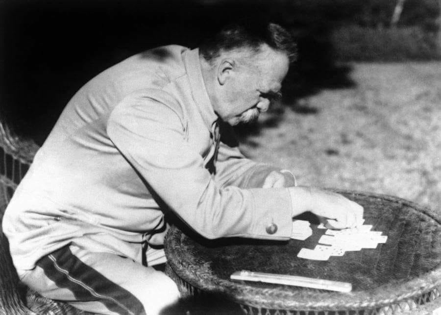

### 1924

Wypowiedź Józefa Piłsudskiego o nagrywaniu głosu ludzkiego z dnia 5 września 1924 roku.
"Stoję przed jakąś dziwną trąbą i myślę, że
głos mój ma się oddzielić ode mnie i pójść
w świat beze mnie, jego właściciela.
Doprawdy, trudno się nie śmiać z tej
dziwnej sytuacji, w której nagle głos
pana Piłsudskiego się znajdzie"

  

---

<a href="https://github.com/TomaszWaszczyk/historia.waszczyk.com/edit/master/src/content/september-4.md" target="_blank">Edytuj tę stronę dzieląc się własnymi notatkami!</a>
