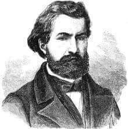
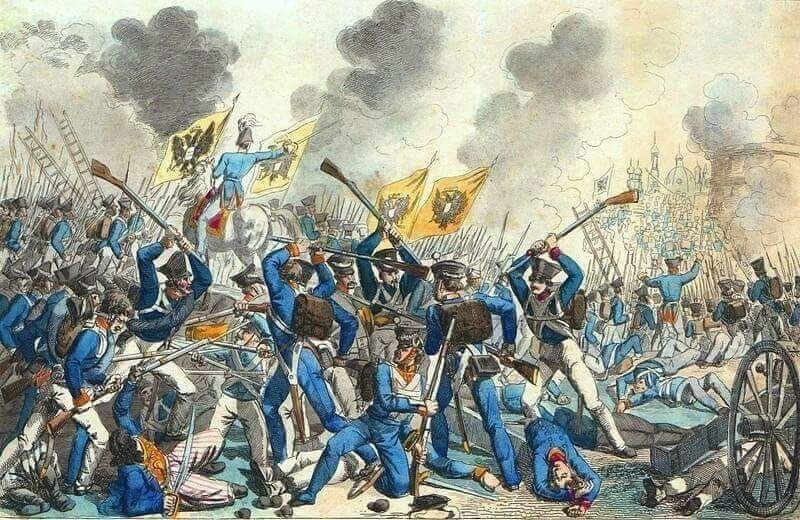

### 2020

    List napisany przez Prof. dr hab. Ryszarda Rutkowskiego 07.05.2020 Uniwersytet Medyczny w Białymstoku

"List otwarty do:

- Ministra Zdrowia, prof. dr hab. med. Łukasza Szumowskiego

- Prezesa Naczelnej Izby Lekarskiej, prof. dr. hab. med. Andrzeja Matyji

- lekarzy i pracowników naukowych Uniwersytetów Medycznych posłów i senatorów lekarzy, dziennikarzy

W roku 2020 po raz pierwszy w dziejach świata i medycyny obligatoryjnie uznano i politycznie zadekretowano, że każdy mieszkaniec naszej planety musi ulec zakażeniu COVID-19, stać się jego utajonym nosicielem, a w przypadku zachorowania, umrzeć. Takie komunikaty medialne, wsparte opresją policyjną wbijane są codziennie do głów zdezorientowanych Polaków. Każdego dnia w mediach ogólnopolskich podawana jest liczba osób, które zmarły i miały dodatni test na COVID-19.

Nie podawana jest zaś ogólna liczba zgonów do których doszło w tym samym dniu z przyczyn naturalnych (choroby), w wyniku samobójstw czy różnego rodzaju wypadków. W naszym coraz bardziej odrealnionym społeczeństwie, przekonanym że ludzie żyją wiecznie i nie umierają z innych przyczyn niż COVID-19 rozwija się psychoza strachu i paranoiczne przekonanie, że maska chroni przed chorobą. Kłamstwo powtórzone tysiąc razy staje się prawdą.

Taka dezinformacja rządowa wymaga dyskusji z medialnymi i ministerialnymi prawdami objawionymi i publicznego zadania kilku podstawowych pytań:

1. W oparciu o jakie fakty naukowe uznano, że każdy ZDROWY człowiek, ze sprawnym układem odpornościowym musi ulec zakażeniu koronawirusem COVID-19?

2. W oparciu o jakie fakty medyczne i epidemiologiczne uznano, że ZDROWY człowiek MUSI być nosicielem i zarażać inne osoby ?

3. W oparciu o jakie wyniki polskich i/lub zagranicznych badań naukowych przyjęto, że dzieci, KTÓRE W OLBRZYMIEJ WIĘKSZOŚCI NIE CHORUJĄ, CZYLI NIE ULEGAJĄ ZAKAŽENIU WIRUSEM COVID-19 lub go błyskawicznie zwalczają, są nosicielami tego wirusa i stanowią zagrożenie zdrowotne dla otoczenia i swoich rodzin?

4. Na podstawie jakich polskich i zagranicznych badan anatomo-, histo- i cytologicznych podtrzymywane jest twierdzenie, że wyłącznie wirus

SARS-cov-2, a nie inne, poważne schorzenia współwystępujące u zmarłych doprowadziły do śmierci osób zakażonych COVID-19 ?

5. W oparciu o jakie medyczne i naukowe dane ( poza sugestią WHO ) uznano, że dzieci do 4 roku życia NIE SĄ ZAGROŽONE wirusem COVID-19 i NIE MUSZĄ NOSIĆ MASECZEK, a po 4 roku życia już tej RESTRYKCJI ustawowo PODLEGAJĄ, że są UTAJONYM NOSICIELEM tego wirusa i stanowią zagrożenie dla członków ich rodzin? Dlaczego rząd uznaje iż niezależnie od wieku, dzieci w przedszkolu są ZDROWE i mogą przebywać bez maseczek, a tuż po wyjściu z przedszkola STAJĄ SIĘ CHORE, zagrażają otoczeniu i muszą nakładać maseczki ?

6. Skąd przekonanie Ministra Zdrowia i Premiera rządu, że długotrwałe (wg ministra Łukasza Szumowskiego trwające nawet dwa lata) przymusowe noszenia masek zakrywających usta i nos oraz istotne ograniczenie niezbędnej dla prawidłowego rozwoju psychomotorycznego dzieci, zdrowia młodzieży i seniorów aktywności fizycznej nie wywoła bardzo szkodliwych następstw zdrowotnych, a zwłaszcza znacznego upośledzenia ich naturalnej odporności immunologicznej? Czy pan minister Ł. Szumowski ma pełną świadomość następstw zdrowotnych zakazu wstępu dla ZDROWYCH DZIECI na place zabaw, do siłowni na świeżym powietrzu, na baseny, zmuszenia ich aby godzinami ślęczeli przed ekranami komputerów itd.?

7.Skąd godna podziwu, jaskrawo sprzeczna z powszechną wiedzą medyczną wiara kardiologa, Ministra Zdrowia, że przewlekle, wielogodzinne noszenie maseczek w przestrzeni publicznej oraz miejscu pracy (lekarze, pielęgniarki, ratownicy medyczni, nauczyciele, policjanci, Straż Miejska itd.) nie spowoduje:

- szeregu poważnych schorzeń dermatologicznych w obrębie skóry twarzy i dłoni,

- nie upośledzi niezbędnej dla prawidłowej odporności immunologicznej i wielu innych ważnych dla człowieka funkcji biologicznych, indukowanej przez promienie słoneczne syntezy witaminy D.

- nie przyczyni się do zaostrzenia różnorodnych dolegliwości krążeniowo oddechowych (włącznie z ryzykiem nagłej śmierci kordialnej) w kilkumilionowej grupie chorych kardiologicznych, pulmonologicznych, endokrynologicznych i onkologicznych?

8. Dlaczego podczas konferencji Ministra Zdrowia i Premiera rządu na temat sensu lub bezsensu wprowadzanych ograniczeń i restrykcji nie wypowiadają się NIEZALEŻNI EKSPERCI - lekarze i naukowcy,

9.Dlaczego w mediach rządowych brakuje rzetelnych informacji naukowych na temat COVID-19 oraz NIE INFORMUJE SIĘ OSÓB MAJĄCYCH PROBLEMY ZDROWOTNE że NIE MUSZĄ CHODZIĆ W MASECZKACH* i policja nie ma najmniejszego prawa, aby straszyć ich mandatami ?"

    Prof. dr hab. Ryszard Rutkowski Białystok 07.05.2020 
    Uniwersytet Medyczny w Białymstoku

1.List napisany w maju 2020 roku, czy ktoś słyszał aby, adresaci listu raczyli odpowiedzieć na te proste pytania?

2. Czy ktoś z Państwa słyszał o tym liście w mediach mainstreamowych?

3. Który z dziennikarzy, zainteresował się tym listem napisanym przez Profesora do Profesorów, lekarzy, ale także dziennikarzy?

jest jednak jeden niewątpliwy plus...dzieci nie musiały siedzieć w szkole.. i za to Panie Ministrze Panu dziękuję...

### 2018

Georgette Mosbacher zostaje ambasadorem USA w Polsce: https://pl.wikipedia.org/wiki/Georgette_Mosbacher

### 1943

Przy okazji otwarcia Muzeum Polaków Ratujących Żydów im. Rodziny Ulmów w Markowej k. Łańcuta, prezydent Polski Andrzej Duda odznaczył kilkadziesiąt osób. Uhonorował w ten sposób mieszkańców naszego regionu, którzy podczas II wojny światowej, narażając własne życie, ukrywali Żydów.

W zdecydowanej większości odznaczenia zostały przyznane pośmiertnie. W tej grupie był Michał Kruk, odznaczony Krzyżem Komandorskim Orderu Odrodzenia Polski. Za pomoc Żydom 6 września 1943 r. został przez Niemców powieszony.

Z rąk prezydenta Dudy odznaczenie odebrał Jan Hołówka, zasłużony przemyski lekarz. Michał Kruk był jego wujkiem.

Wyrok na Kruku był pierwszą, publiczną egzekucją w regionie, a być może również w Polsce, osób skazanych za pomoc Żydom. Hitlerowcy postanowili zrobić większe widowisko. Oprawcy ściągnęli sporo ciekawskich mieszkańców. Kpili sobie, najpierw powiesili psa. Dopiero później Kruka.

Rodzinie nie chcieli wydać zwłok, udało się dopiero po wielu staraniach. Polskiemu podziemiu udało się zdobyć zdjęcie szubienicy i wiszących na niej ludzi. Dokument zbrodni. To jedna z najbardziej znanych fotografii, znajduje się w licznych podręcznikach historii oraz w wielu muzeach na całym świecie, m.in. w Nowym Jorku.

Niestety, do tej pory przemyskie władze nie zdobyły się na żaden gest, aby uhonorować Michała Kruka.

Miejsce egzekucji, w prawie niezmienionej formie, przetrwało do dzisiaj. Jest mur domu z kominem, widoczny na fotografii. Jednak nie jest w żaden sposób oznaczone, choćby pamiątkową tablicą. Jedynie Jan Hołówka, w rocznicę śmierci zapala znicze, przynosi kwiaty.

### 1901

W Buffalo zamordowany został 25 prezydent USA William McKinley.
Fakt ten może nie ma wiele wspólnego z polską historią, ale jest w nim polski akcent. Zamachowcem był anarchista polskiego pochodzenia Leon Frank Czołgosz (zdjęcie). Ten syn polskich emigrantów już od wczesnej młodości interesował się anarchizmem, prowadził działalność strajkową i lewicową. Nie był jednak traktowany przez swoich amerykańskich kompanów zbyt poważnie, a nawet żywił wśród nich nieufność, co doprowadzało go do wściekłości. By udowonić, że jest coś wart, postanowił dokonać czegoś spektakularnego.
5 września zameldował się w hotelu w Bufflo, by wybrać się na Wystawę Panamerykańską. Dowiedziawszy się, że następnego dnia ma tu być też prezydent McKinley postanowił wykorzystać okazję.
Gdy ten kończył przemówienie otwierające wystawę zszedł do tłumu, w którym znajdował się Czołgosz. Anarchista miał rękę owiniętą bandażem, co zwróciło uwagę ochroniarza prezydenta, który kazał iść mu do lekarza. Czołgosz odparł mu, że zrobi to po spotkaniu z prezydentem. Chwilę pózniej oddał dwa strzały z bliskiej odległości.
Prezydent upadł, ale resztkami świadomości zapytał czy został postrzelony i poprosił, by pierwszą damę poinformować o tym w delikatny sposób.

  

### 1831

W czasie powstania listopadowego rozpoczął się rosyjski szturm na Warszawę.
54 tysiące żołnierzy piechoty, 17 tysięcy jazdy i 360 dział to liczebność sił rosyjskich przeciw którym stanęło 40 tysięcy polskich żołnierzy piechoty, 3 tysiące jazdy i 200 dział.
Po całodniowych, ciężkich walkach Rosjanie zdobyli pierwszą linię umocnień stolicy. Broniący reduty wolskiej nr 56 gen. bryg. Józef Sowiński zginął. Warszawa szturmowana kolejnego dnia przez oddziały rosyjskie, wieczorem 7 września skapitulowała, a wojska polskie opuściły stolicę i udały się w kierunku Modlina z zamiarem kontynuacji walki.

  

### 1790

Podczas Sejmu Czteroletniego posłowie przyjęli ustawę o niepodzielności ziem Rzeczypopolitej.
Dokument ten prawnie regulował, a właściwie ograniczał i zakazywał cesji obszaru Polski,oddawania go w lenno czy zapisów testamentowych.

---

<a href="https://github.com/TomaszWaszczyk/historia.waszczyk.com/edit/master/src/content/september-6.md" target="_blank">Edytuj tę stronę dzieląc się własnymi notatkami!</a>
