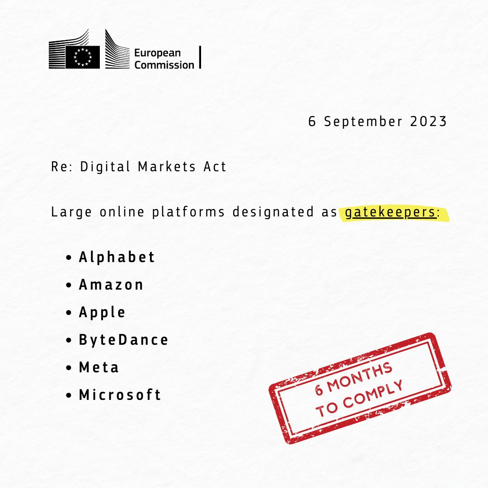
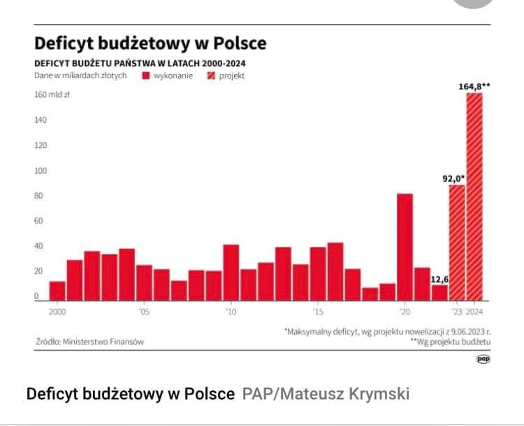

### 2023

Alphabet, Amazon, Apple, ByteDance, Meta, Microsoft. These are the first six companies designated as ‘gatekeepers’ under the Digital Markets Act.

This status will prevent them from imposing unfair conditions on businesses and end users, and ensure the openness of crucial digital services. From social networks to operating systems, they have six months to ensure their core platform services comply with the Digital Markets Act, including:

✔ Allowing users to unsubscribe and remove pre-installed services
✔ Allowing users to download alternative app stores

❌ Banning tracking outside of their services without consent
❌ Banning ranking their products and services more favourably

  

---

> Birmingham, drugie co do wielkości miasto w Wielkiej Brytanii, ogłosiło we wtorek faktyczne bankructwo. Władze miasta poinformowały, że wszystkie wydatki, z wyjątkiem tych najbardziej podstawowych, muszą zostać wstrzymane z powodu braku środków.

Docelowo: bankructwo "publicznych" instytucji/usług, w międzyczasie stopniowa degradacja jakości

---

  

---

> dej samotnym madkom na bombelki

  

---

### 2022

We're about to experience a sovereign debt crisis caused by the Europe energy crisis, all a capstone on the 100 year fiat expirement.

  

Here's how I think the next 6-8 months go down:

Putin strongarms Europe by shutting off Energy pipelines, causing a spike in prices. This causes energy prices to skyrocket in Europe which is a major component of CPI - This causes inflation to explode higher. As CPI explodes higher, electricity prices get passed onto consumers. Eventually, at the risk of civil unrest/revolution over refusal to pay this, Euro government has two options:

1. Give into Putin and let him have Ukraine and stop the sanctions to get energy flowing again

2. Decide to deploy price caps on energy for consumers and print the difference. To achieve this I believe ECB needs to instill yield curve control to keep sovereign bond yields in tact and avoid fragmentation of EU sovereign bonds.

The game theory I've ascribed to this makes me think that the West is too far deep into this mess to give into Putin and would rather print the difference. The saying goes no government ever willingly went broke through austerity. They will always resort to printing.

Printing the difference through YCC is going to cause DXY to explode higher because 58% of DXY is the Euro. DXY to $150 dollar milkshake theory type shit. This dollar wrecking ball will cause emerging markets to begin potentially defaulting on their debt, forcing them to sell their US bonds to buy US dollars to defend their currencies. As EM's sell US bonds to amass dollars to defend their currencies, US bond yields will explode higher causing systemic risks in US markets as everything is priced off US treasuries. Something will break.

The Fed then has two options to fix this which I believe they will explore both.

- Swap lines with ECB and BOJ (they launched a standing swap line facility in July 2021 to make this easy.

This allows them to easily lend dollars via central bank reserves to these central banks which will help bring down DXY and stabilize sovereign FX markets. They can then also use their new standing repo facility to provide overnight loans to stabilize funding/treasury markets on short duration bonds. (they're making sure the NY fed staff knows how to do this)

The usage of this swap line facility and repo facility is net stimulative and will cause DXY to come down and markets to stabilize (though I believe everything will be nuking during this time as correlations go to 1 as insties unload risk to get their VaR's in line).

In conclusion, I think we're at the end of a major sovereign bond bubble and this energy crisis is the catalyst. The Fed will be forced to stimulate or risk full implosion of the monetary system.

What will be unique about this time Oil will still be going higher, not lower.

<!-- As the game theory plays out, our goal is to find the optimal moment to long the fuck out of our favourite crypto ponzis. I see many takes from people who think QE is never coming again but it will, just under other names. Get ready to max long after this coming flush. -->

(I see a non zero chance the US also has to employ yield curve control to keep yields in tact.)

### 2021

Biznes nie zostawia na rządowym pomyśle wprowadzenia przymusowych urlopów bezpłatnych dla niezaszczepionych pracowników suchej nitki. "Nie po to zatrudniamy pracowników, by ich zwalniać z obowiązku świadczenia pracy" - mówią zgodnie pracodawcy.

---

Dane o śmiertelności w Polsce.

> Ukazały się dane o śmiertelności w Polsce do połowy sierpnia 2021 i warto się nad nimi pochylić, bo w letnich tygodniach śmiertelność spadła poniżej średniej z lat poprzednich. Bez danych o strukturze wieku, a te nie są podawane na bieżąco, trudno o głębsze analizy, ale z wykresu widać, że przedwczesna śmierć ponad 133 tysięcy osób w ostatnim sezonie musiała zaważyć na statystykach w miesiącach następnych. Lapidarnie możemy ten koszmarny proces podsumować zdaniem, że przyspieszając śmierć wielu ludzi w miesiącach poprzednich teraz będziemy mieć „lepsze wyniki”, bo po ludzku nie ma komu umierać...

  

Przypominam, że przed reorganizacją służby zdrowia w 2020 w Polsce normą było 1250 zgonów na dobę do czego obecnie wracamy. Latem też zawsze notowano zgony na choroby układu oddechowego, ale w mniejszym nasileniu i jest to w Polsce około 200 zgonów dobowych na różne schorzenia układu oddechowego. Na covid-19 w ostatnich miesiącach mieliśmy kilka a nawet jeden zgon dobowo, patrz wykres 2. Nie wchodzę w ogóle w dyskusję o szczepieniach nieprzetestowanym  preparatem, bo jest to dyskusja idiotyczna w obliczu ww. faktów, tj. danych rządowych.

## Wirus czy zamordyzm?

Zgony na choroby układu oddechowego mogą występować po długim okresie braku aktywności na świeżym powietrzu, noszenia brudnej maseczki przez długi okres wiele godzin dziennie, braku odporności po długiej izolacji, długotrwałemu stresowi, itp. itd. W skali masowej za czynnik podwyższonej śmiertelności należy też uznać umieszczanie osób starszych z typowymi infekcjami dróg oddechowych w szpitalach zakaźnych, co robiono od wiosny 2020 we Włoszech, Hiszpanii i wielu innych krajach, a od jesieni 2020 także w Polsce. Jak widać z danych i podejmowanych działań rządu mamy wiele przyczyn podwyższonej śmiertelności w sezonie grypowym 2020/2021. Udział covid -19 oficjalnie to tylko 1/8 wzrostu śmiertelności. Jednak w obliczu potężnej ilości relacji o przypisywaniu covid-19 jako przyczyny śmierci osobom poważnie chorym na zupełnie inne choroby możemy te dane podzielić wielokrotnie.

  

Oficjalny poziom  zgonów na covid-19 latem 2021 jest wielokrotnie niższy niż rok temu, gdy był też marginesem jako przyczyna śmierci. Naciskanie w tej sytuacji, aby szczepić dzieci, które nie chorują lub przechodzą lekko tę infekcję jest pozornie idiotyczne i wskazuje na niemedyczny aspekt całego przedsięwzięcia.

  

Jak ktoś rok temu słusznie zauważył covid-19 jest to test na inteligencję,  a dokładnie na poziom możliwego przymusu, na jakie sobie władza może pozwolić. W Sejmie czeka na głosowanie ustawa 1449, która daje władzy już pełną swobodę w kierowaniu opornych ludzi do wariatkowa i wprowadza przepisy, zupełnie analogiczne do sowieckiej praktyki w najgorszym stalinowskim okresie. https://legaartis.pl/blog/2021/08/21/druk-1449-najnowsze-informacje/ 

Dlatego w środę, 15 września 2021 o 16:00, bez względu na sympatie polityczne, musimy pod sejmem pokazać co o tym myślimy. Wiatr historii wieje mocno, wszystkie ręce na pokład!

Źródło: https://pawelklimczewski.pl/2021/09/05/czwarta-fala-panowie-ministrowie-nie-bylo-pierwszej-a-wy-zdrowych-ludzi-do-psychiatryka-chcecie-wysylac-sami-tam-sie-ustabilizujcie/

---

BEIJING, Sept 6 (Reuters) - Germany's ambassador to China, Jan Hecker, who was a former foreign policy adviser to Chancellor Angela Merkel, has died suddenly, less than two weeks after taking up his post.

Hecker, 54, had presented his credentials at China's foreign ministry on Aug. 24, the embassy in Beijing told Reuters by social media. The cause of death has yet to be confirmed.

---

### 2020

List napisany przez Prof. dr hab. Ryszarda Rutkowskiego 07.05.2020 Uniwersytet Medyczny w Białymstoku

"List otwarty do:

- Ministra Zdrowia, prof. dr hab. med. Łukasza Szumowskiego

- Prezesa Naczelnej Izby Lekarskiej, prof. dr. hab. med. Andrzeja Matyji

- lekarzy i pracowników naukowych Uniwersytetów Medycznych posłów i senatorów lekarzy, dziennikarzy

W roku 2020 po raz pierwszy w dziejach świata i medycyny obligatoryjnie uznano i politycznie zadekretowano, że każdy mieszkaniec naszej planety musi ulec zakażeniu COVID-19, stać się jego utajonym nosicielem, a w przypadku zachorowania, umrzeć. Takie komunikaty medialne, wsparte opresją policyjną wbijane są codziennie do głów zdezorientowanych Polaków. Każdego dnia w mediach ogólnopolskich podawana jest liczba osób, które zmarły i miały dodatni test na COVID-19.

Nie podawana jest zaś ogólna liczba zgonów do których doszło w tym samym dniu z przyczyn naturalnych (choroby), w wyniku samobójstw czy różnego rodzaju wypadków. W naszym coraz bardziej odrealnionym społeczeństwie, przekonanym że ludzie żyją wiecznie i nie umierają z innych przyczyn niż COVID-19 rozwija się psychoza strachu i paranoiczne przekonanie, że maska chroni przed chorobą. Kłamstwo powtórzone tysiąc razy staje się prawdą.

Taka dezinformacja rządowa wymaga dyskusji z medialnymi i ministerialnymi prawdami objawionymi i publicznego zadania kilku podstawowych pytań:

1. W oparciu o jakie fakty naukowe uznano, że każdy ZDROWY człowiek, ze sprawnym układem odpornościowym musi ulec zakażeniu koronawirusem COVID-19?

2. W oparciu o jakie fakty medyczne i epidemiologiczne uznano, że ZDROWY człowiek MUSI być nosicielem i zarażać inne osoby ?

3. W oparciu o jakie wyniki polskich i/lub zagranicznych badań naukowych przyjęto, że dzieci, KTÓRE W OLBRZYMIEJ WIĘKSZOŚCI NIE CHORUJĄ, CZYLI NIE ULEGAJĄ ZAKAŽENIU WIRUSEM COVID-19 lub go błyskawicznie zwalczają, są nosicielami tego wirusa i stanowią zagrożenie zdrowotne dla otoczenia i swoich rodzin?

4. Na podstawie jakich polskich i zagranicznych badan anatomo-, histo- i cytologicznych podtrzymywane jest twierdzenie, że wyłącznie wirus

SARS-cov-2, a nie inne, poważne schorzenia współwystępujące u zmarłych doprowadziły do śmierci osób zakażonych COVID-19 ?

5. W oparciu o jakie medyczne i naukowe dane ( poza sugestią WHO ) uznano, że dzieci do 4 roku życia NIE SĄ ZAGROŽONE wirusem COVID-19 i NIE MUSZĄ NOSIĆ MASECZEK, a po 4 roku życia już tej RESTRYKCJI ustawowo PODLEGAJĄ, że są UTAJONYM NOSICIELEM tego wirusa i stanowią zagrożenie dla członków ich rodzin? Dlaczego rząd uznaje iż niezależnie od wieku, dzieci w przedszkolu są ZDROWE i mogą przebywać bez maseczek, a tuż po wyjściu z przedszkola STAJĄ SIĘ CHORE, zagrażają otoczeniu i muszą nakładać maseczki ?

6. Skąd przekonanie Ministra Zdrowia i Premiera rządu, że długotrwałe (wg ministra Łukasza Szumowskiego trwające nawet dwa lata) przymusowe noszenia masek zakrywających usta i nos oraz istotne ograniczenie niezbędnej dla prawidłowego rozwoju psychomotorycznego dzieci, zdrowia młodzieży i seniorów aktywności fizycznej nie wywoła bardzo szkodliwych następstw zdrowotnych, a zwłaszcza znacznego upośledzenia ich naturalnej odporności immunologicznej? Czy pan minister Ł. Szumowski ma pełną świadomość następstw zdrowotnych zakazu wstępu dla ZDROWYCH DZIECI na place zabaw, do siłowni na świeżym powietrzu, na baseny, zmuszenia ich aby godzinami ślęczeli przed ekranami komputerów itd.?

7. Skąd godna podziwu, jaskrawo sprzeczna z powszechną wiedzą medyczną wiara kardiologa, Ministra Zdrowia, że przewlekle, wielogodzinne noszenie maseczek w przestrzeni publicznej oraz miejscu pracy (lekarze, pielęgniarki, ratownicy medyczni, nauczyciele, policjanci, Straż Miejska itd.) nie spowoduje:

- szeregu poważnych schorzeń dermatologicznych w obrębie skóry twarzy i dłoni,

- nie upośledzi niezbędnej dla prawidłowej odporności immunologicznej i wielu innych ważnych dla człowieka funkcji biologicznych, indukowanej przez promienie słoneczne syntezy witaminy D.

- nie przyczyni się do zaostrzenia różnorodnych dolegliwości krążeniowo oddechowych (włącznie z ryzykiem nagłej śmierci kordialnej) w kilkumilionowej grupie chorych kardiologicznych, pulmonologicznych, endokrynologicznych i onkologicznych?

8. Dlaczego podczas konferencji Ministra Zdrowia i Premiera rządu na temat sensu lub bezsensu wprowadzanych ograniczeń i restrykcji nie wypowiadają się NIEZALEŻNI EKSPERCI - lekarze i naukowcy,

9. Dlaczego w mediach rządowych brakuje rzetelnych informacji naukowych na temat COVID-19 oraz NIE INFORMUJE SIĘ OSÓB MAJĄCYCH PROBLEMY ZDROWOTNE że NIE MUSZĄ CHODZIĆ W MASECZKACH* i policja nie ma najmniejszego prawa, aby straszyć ich mandatami ?"

Prof. dr hab. Ryszard Rutkowski Białystok 07.05.2020, Uniwersytet Medyczny w Białymstoku

1.List napisany w maju 2020 roku, czy ktoś słyszał aby, adresaci listu raczyli odpowiedzieć na te proste pytania?

1. Czy ktoś z Państwa słyszał o tym liście w mediach mainstreamowych?

2. Który z dziennikarzy, zainteresował się tym listem napisanym przez Profesora do Profesorów, lekarzy, ale także dziennikarzy?

jest jednak jeden niewątpliwy plus...dzieci nie musiały siedzieć w szkole.. i za to Panie Ministrze Panu dziękuję...

### 2018

Georgette Mosbacher zostaje ambasadorem USA w Polsce: https://pl.wikipedia.org/wiki/Georgette_Mosbacher

### 2016

Konstanty Radziwiłł: Lepszy lekarz zmęczony niż żaden

### 1943

Przy okazji otwarcia Muzeum Polaków Ratujących Żydów im. Rodziny Ulmów w Markowej k. Łańcuta, prezydent Polski Andrzej Duda odznaczył kilkadziesiąt osób. Uhonorował w ten sposób mieszkańców naszego regionu, którzy podczas II wojny światowej, narażając własne życie, ukrywali Żydów.

W zdecydowanej większości odznaczenia zostały przyznane pośmiertnie. W tej grupie był Michał Kruk, odznaczony Krzyżem Komandorskim Orderu Odrodzenia Polski. Za pomoc Żydom 6 września 1943 r. został przez Niemców powieszony.

Z rąk prezydenta Dudy odznaczenie odebrał Jan Hołówka, zasłużony przemyski lekarz. Michał Kruk był jego wujkiem.

Wyrok na Kruku był pierwszą, publiczną egzekucją w regionie, a być może również w Polsce, osób skazanych za pomoc Żydom. Hitlerowcy postanowili zrobić większe widowisko. Oprawcy ściągnęli sporo ciekawskich mieszkańców. Kpili sobie, najpierw powiesili psa. Dopiero później Kruka.

Rodzinie nie chcieli wydać zwłok, udało się dopiero po wielu staraniach. Polskiemu podziemiu udało się zdobyć zdjęcie szubienicy i wiszących na niej ludzi. Dokument zbrodni. To jedna z najbardziej znanych fotografii, znajduje się w licznych podręcznikach historii oraz w wielu muzeach na całym świecie, m.in. w Nowym Jorku.

Niestety, do tej pory przemyskie władze nie zdobyły się na żaden gest, aby uhonorować Michała Kruka.

Miejsce egzekucji, w prawie niezmienionej formie, przetrwało do dzisiaj. Jest mur domu z kominem, widoczny na fotografii. Jednak nie jest w żaden sposób oznaczone, choćby pamiątkową tablicą. Jedynie Jan Hołówka, w rocznicę śmierci zapala znicze, przynosi kwiaty.

### 1901

W Buffalo zamordowany został 25 prezydent USA William McKinley.
Fakt ten może nie ma wiele wspólnego z polską historią, ale jest w nim polski akcent. Zamachowcem był anarchista polskiego pochodzenia Leon Frank Czołgosz (zdjęcie). Ten syn polskich emigrantów już od wczesnej młodości interesował się anarchizmem, prowadził działalność strajkową i lewicową. Nie był jednak traktowany przez swoich amerykańskich kompanów zbyt poważnie, a nawet żywił wśród nich nieufność, co doprowadzało go do wściekłości. By udowonić, że jest coś wart, postanowił dokonać czegoś spektakularnego.
5 września zameldował się w hotelu w Bufflo, by wybrać się na Wystawę Panamerykańską. Dowiedziawszy się, że następnego dnia ma tu być też prezydent McKinley postanowił wykorzystać okazję.
Gdy ten kończył przemówienie otwierające wystawę zszedł do tłumu, w którym znajdował się Czołgosz. Anarchista miał rękę owiniętą bandażem, co zwróciło uwagę ochroniarza prezydenta, który kazał iść mu do lekarza. Czołgosz odparł mu, że zrobi to po spotkaniu z prezydentem. Chwilę pózniej oddał dwa strzały z bliskiej odległości.
Prezydent upadł, ale resztkami świadomości zapytał czy został postrzelony i poprosił, by pierwszą damę poinformować o tym w delikatny sposób.

  

### 1831

W czasie powstania listopadowego rozpoczął się rosyjski szturm na Warszawę.
54 tysiące żołnierzy piechoty, 17 tysięcy jazdy i 360 dział to liczebność sił rosyjskich przeciw którym stanęło 40 tysięcy polskich żołnierzy piechoty, 3 tysiące jazdy i 200 dział.
Po całodniowych, ciężkich walkach Rosjanie zdobyli pierwszą linię umocnień stolicy. Broniący reduty wolskiej nr 56 gen. bryg. Józef Sowiński zginął. Warszawa szturmowana kolejnego dnia przez oddziały rosyjskie, wieczorem 7 września skapitulowała, a wojska polskie opuściły stolicę i udały się w kierunku Modlina z zamiarem kontynuacji walki.

  

### 1790

Podczas Sejmu Czteroletniego posłowie przyjęli ustawę o niepodzielności ziem Rzeczypopolitej.
Dokument ten prawnie regulował, a właściwie ograniczał i zakazywał cesji obszaru Polski,oddawania go w lenno czy zapisów testamentowych.

---

<a href="https://github.com/TomaszWaszczyk/historia.waszczyk.com/edit/master/src/content/september-6.md" target="_blank">Edytuj tę stronę dzieląc się własnymi notatkami!</a>
