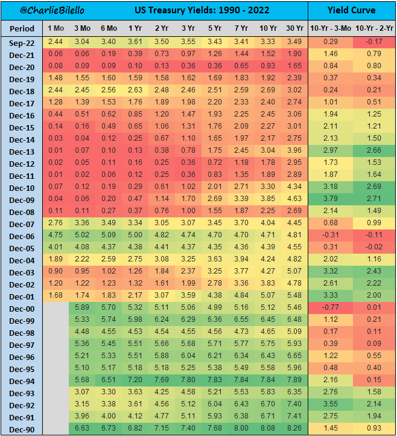

### 2022

Energy bill increase of a German bakery. From 720€ to 2850€.

  

  

### 2021

  

---

  

  

---

Adam Glapiński na 2 dni przed decyzyjnym posiedzeniem RPP, udzielił PAP Biznes wywiadu mającego wpływ na rynek.
W związku ze złamaniem przez prezesa NBP, przewodniczacego RPP, zawartego w kodeksie dobrych praktyk, zakazu publicznych wypowiedzi członków RPP na 7 dni przed decyzyjnym posiedzeniem Rady i 2 dni po nim (blackout period), defensywny głos wydał z siebie NBP. Każdy kto chciał mógł tam zaś przeczytać:

> Wypowiedzi Prezesa NBP w wywiadzie dla PAP traktować należy jako wypowiedzi Przewodniczącego Zarządu NBP i Prezesa NBP, a nie Przewodniczącego Rady Polityki Pieniężnej.

No, to mamy problem. Oto bowiem, co o obecności na posiedzeniach Rady stanowi (w tej niezmienionej jeszcze dotąd części) Regulamin RPP:

"§5. 1. W posiedzeniach Rady uczestniczą wiceprezesi NBP bez prawa udziału w głosowaniu.
2. Na posiedzenia Rady, za jej zgodą, mogą zostać zaproszeni przez Przewodniczącego Rady inni członkowie Zarządu NBP oraz pracownicy NBP właściwi w sprawach objętych porządkiem obrad posiedzenia.
3. Na posiedzenia Rady, za jej zgodą, mogą zostać zaproszeni przez Przewodniczącego Rady eksperci zewnętrzni celem przedstawienia opinii."

Ani słowa o obecności na posiedzeniu PREZESA NBP. SĄ TYLKO WICEPREZESI.
Prezes, w funkcji oddzielonej od przewodniczącego Rady, a więc wyłącznie w swej prezesowskiej capacity, jest więc na posiedzeniach RPP NIELEGALNIE.

Jak ktoś upiera się, by siekierą rozdzielać funkcje prezesa od przewodniczącego, to może zafundować bankowi niezły pasztet. Nie lepiej po prostu przeprosić i obiecać, że więcej łamania blackoutu nie będzie?

---

  

---

### 1942

W miejscowości Zdziłowice w województwie lubelskim hitlerowcy dokonali masakry 72 osób narodowości żydowskiej. w wieku od 14 do 40 lat. Zaczęło się od łapanki,w której schwytano 150 osób. Wspomniane 72 rozstrzelano na miejscu,resztę wywieziono do obozu w Majdanku.

### 1939

https://pl.wikipedia.org/wiki/Obrona_Westerplatte

https://pl.wikipedia.org/wiki/Stanis%C5%82aw_Pietrow

  

---

Na wieść o tym, że jest wojna amerykański fotograf, filmowiec i podróżnik Julien Bryan ostatnim pociągiem przyjechał do Polski, żeby dokumentować i pokazywać Warszawę, miasto walczące z niemiecką agresją. Chciał zrobić kilka zdjęć zza linii frontu i bezpiecznie wrócić, nim wojska niemieckie dotrą w głąb kraju. Pozostał jednak w oblężonym mieście przez dwa tygodnie. Był jedynym zagranicznym fotoreporterem i czuł się zobowiązany pokazać światu tragiczny los jego mieszkańców. Swoimi zdjęciami chciał przemówić do prezydenta USA i do całego świata, aby wspierali Polaków.

  

  

  

### 1812

Inwazja na Rosję: zwycięstwem wojsk napoleońskich zakończyła się bitwa pod Borodino.
Bitwa ta, jedna z najkrwawszych w dziejach ludzkości, odbyła się 7 września 1812 roku w pobliżu wsi Borodino. Kutuzow nie chciał tego starcia - w głębi ducha całkowicie zgadzał się z taktyką Barclaya. Ale "noblesse oblige" - zastąpiono nim Barclaya właśnie po to, by walczył.
Dlatego wydał bitwę niepotrzebną strategicznie, a konieczną prestiżowo, wiedząc, że nie darowano by mu oddania Moskwy bez oporu.
Pod Borodino siły już się wyrównały. Wielu Francuzów ciężko chorowało, co tak uzasadniał adiutant Napoleona, hrabia Segur: "Sprawozdania lekarzy brzmiały ponuro: w Rosji zamiast wina i koniaku używana jest powszechnie wódka z ziarna pędzona, z domieszką mniej lub więcej odurzających ziół. Owóż młodzi żołnierze nasi, zmożeni głodem i trudami, sądzili, iż zdradziecki ten napój doda im sił; wkrótce jednak, gdy opadło chwilowe podniecenie, wielu spośród nich ciężko zaniemogło". Każda ze stron dysponowała około stu dwudziestu - stu trzydziestu tysiącami żołnierzy, lecz Rosjanie mieli więcej dział, gdyż francuskie konie pociągowe padały masowo i armaty trzeba było wrzucać do rowów.
W przeddzień hekatomby, 6 września, panował względny spokój. Kutuzow w otoczeniu popów i archimandrytów upomniał wojska, by broniły ojczyzny i religii, pokazując im obraz Matki Boskiej Smoleńskiej, cudem rzekomo ocalony z rąk najeźdźcy. Napoleon pokazał żołnierzom francuskim dopiero co przysłany z Paryża portret swego syna, króla Rzymu, pędzla Gerarda, rozniecając widokiem oseska olbrzymi entuzjazm. Z "bogiem wojny" nie mogli przegrać, tym bardziej, że on na widok słońca podnoszącego się rankiem 7 września krzyknął:

- Oto słońce spod Austerlitz!

Po czym opadł na fotel, trzęsąc się jak w febrze. I już nie mogli liczyć na swego idola. Nocą z 6 na 7 września Bonaparte dostał bardzo silnej gorączki i całą bitwę przesiedział w fotelu, otoczony przez gwardię, półprzytomny, momentami niemal omdlewając, udzielając zachrypniętym do szeptu głosem niezrozumiałych odpowiedzi bądź dając nieprecyzyjne rozkazy. W tej sytuacji cały ciężar bitwy wziął na siebie Michał Ney. On stał się w tym szkarłatnym dniu "bogiem" i on stanął naprzeciw Michała Kutuzowa jako spiritus movens Wielkiej Armii.
Albowiem w tym dniu nie trzeba było mądrości - potrzebna była szalona odwaga, a nią właśnie dysponował syn bednarza, którego nawet Anglicy nazywali "najdzielniejszym ze wszystkich wodzów Napoleona" (sir C.W.C. Oman). On poprowadził pierwszy atak i dziesiątki następnych, siedząc na białym koniu, który był jak sztandar armii francuskiej i stanowił wyśmienity cel dla przeważającej artylerii Rosjan. Lecz kiedy działa nieprzyjaciela szerzyły spustoszenie we francuskich szeregach, Michał Ney, stojąc na czele, żuł i wypluwał z kamiennym spokojem kolejne prymki tytoniu, magnetyzując tym dziesiątkowane szeregi.
Borodino było kilkugodzinną wymianą potwornych ciosów na wprost, bez żadnych "boskich" manewrów, bez strategii i taktycznego wyrafinowania. Bonaparte był zbyt chory, aby móc zagrać swym geniuszem militarnego szachisty. Okrzyk: "Oto słońce spod Austerlitz!" nie był okrzykiem "boga wojny", lecz chorego awanturnika, słońce bowiem świeciło zza pleców Rosjan, prosto w oczy Francuzów, oślepiając zwłaszcza artylerzystów.
Centralnym punktem bitwy, kluczem pola i furtką do zwycięstwa, był wielki szaniec usypany przez Rosjan, tzw. Wielka Reduta lub Reduta Rajewskiego, powiązana z szańcami Bagrationa. Historycy nie są w stanie obliczyć i nie uczynią już tego nigdy - ile razy owa reduta przechodziła z rąk do rąk. Co najmniej dziesięć, może dwa razy tyle. Obie strony opanowała taka furia bojowa w walce o ten szaniec, że najstarsi weterani nie pamiętali czegoś podobnego. Rosjanie i Francuzi wybijali się tu do ostatniego człowieka nie ustępując o krok, padając tysiącami, ze straszliwą, milczącą zaciekłością. Jeden po drugim ginęli na Reducie Rajewskiego najlepsi dowódcy obu armii - oddało tam życie kilkunastu generałów! Konający Bagration krzyczał resztką sił na widok grenadierów francuskich pędzących do ataku pod gradem kuł, z wysuniętymi do przodu bagnetami:

- Brawo, brawo!

W chwilę później rosyjski kontratak na bagnety wydarł redutę z rąk Francuzów. I tak bez przerwy, jak w diabelskim kalejdoskopie. Wielką Redutę otaczała wielka fosa. Ten wąwóz już po trzech godzinach wypełnił się po brzegi, przestał istnieć, został całkowicie zasypany trupami koni i ludzi do wsokości ośmiu warstw! Ney raz po raz prowadził w kierunku Reduty Rajewskiego i innych szańców tak mordercze ataki i kontrataki, że w końcu zaczęło mu brakować żołnierzy. Wysłał do Napoleona posłańca z żądaniem, by gwardia została rzucona do decydującego ataku. Bonaparte odmówił. Wówczas marszałek Michał Ney, zawsze wierny i milczący, nigdy nie spiskujący i nie pyskujący przeciw cesarzowi Ney, po raz pierwszy w swym życiu wybuchnął potokiem przekleństw:

- Do diabła, co on tam robi z tyłu?! Nie ma go tu i nic nie widzi! Jeśli już nie jest wodzem, to niech wraca do Tuileries, a ja będę dowodził za niego!!!
I dowodził, wspomagany przez szalejącego na czele kawalerii Murata, wiodącego zażartych Polaków Poniatowskiego i zawsze opanowanego fenomena strategii Davouta. Dopiero po trzeciej Francuzi rzucili do szarży swą ciężką kawalerię - kirasjerów generała Augusta Caulaincourta, brata zdrajcy. O wpół do czwartej lawina zakutych w stal jeźdźców wdarła się z potwornym impetem w trzewia Reduty Rajewskiego od szyi, podczas gdy piechurzy generała Lanabere'a szturmowali stok po drabinach.
Obaj generałowie padli zabici (o Caulaincourcie Kukiel napisał: "Krwią własną zmazał winę brata"), lecz Wielka Reduta stała się ostatecznie łupem armii francuskiej.
Kutuzow cofał się i można go było wówczas dobić za pomocą świeżej gwardii. Marszałkowie błagali Napoleona:
- Na miłość boską, przyślij nam gwardię, a przetrącimy im kręgosłup!
Lecz w chwili rozpaczliwego wahania stojący obok Bonapartego dowódca gwardii, Bessieres, szepnął:
- Znajdujesz się o tysiące kilometrów od Paryża, Najjaśniejszy Panie!
I to zadecydowało. Tych osiemnaście tysięcy ludzi było ostatnią rezerwą na niewiadome jutro i Korsykanin ich nie ruszył. Był to kolejny straszliwy błąd, armia rosyjska została bowiem pokonana, lecz nie unicestwiona.
Trzy lata później, gdy ostatecznie ważyły się losy Napoleona w bitwie pod Waterloo i gdy stojąc przed progiem klęski rozpaczliwie rzucił on do decydującego (bezskutecznego w efekcie) ataku elitę gwardyjską, Ney przypomniał mu błąd borodiński:
- Gdybyś użył gwardii pod Borodino, Sire, nie musiałbyś używać jej dzisiaj.
Chociaż Rosjanie stracili pięćdziesiąt procent stanu (sześćdziesiąt tysięcy ludzi!) i dwudziestu pięciu dowódców w stopniu generała, to przecież trzydzieści tysięcy leżących na placu boju Francuzów i około pięćdziesięciu zabitych i rannych francuskich generałów świadczyło niezbicie, że słońce tego dnia nie było słońcem spod Austerlitz. "Bóg wojny" rozumiał to i wiedział, że to jego wina, toteż objeżdżał pobojowisko straszliwie rozdrażniony, milcząc ponuro. Dopiero gdy koń któregoś z członków świty trącił kopytem rannego, Napoleon odezwał się po raz pierwszy, nakazując otoczyć żołnierza opieką. Któryś z oficerów nieopatrznie bąknął, że przecież to Rosjanin, i wtedy cała złość wydarła się cesarzowi z gardła w ryku:
- Po bitwie nie ma wrogów, są tylko ludzie!
Po tej bitwie dwaj ludzie noszący imię Michał otrzymali nagrody: Michał Kutuzow został mianowany przez cara feldmarszałkiem, Michał Ney przez Napoleona księciem Moskwy.
W sześć dni po Borodino Wielka Armia ujrzała z wysokości Wróblich Gór zielone, błękitne i złote kopuły dwóch tysięcy cerkwi Moskwy. Chateaubriand poczuł się poetą malując to spotkanie: "Moskwa wydała się im jakby jakąś księżną, która przybyła z niezmierzonych rubieży swego państwa, strojna w całe bogactwo Azji, by poślubić Napoleona".

  

---

<a href="https://github.com/TomaszWaszczyk/historia.waszczyk.com/edit/master/src/content/september-7.md" target="_blank">Edytuj tę stronę dzieląc się własnymi notatkami!</a>
