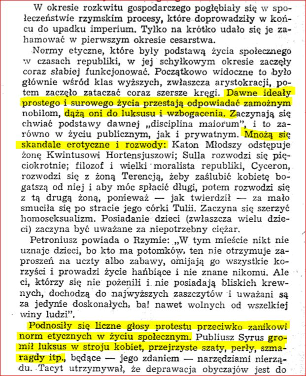
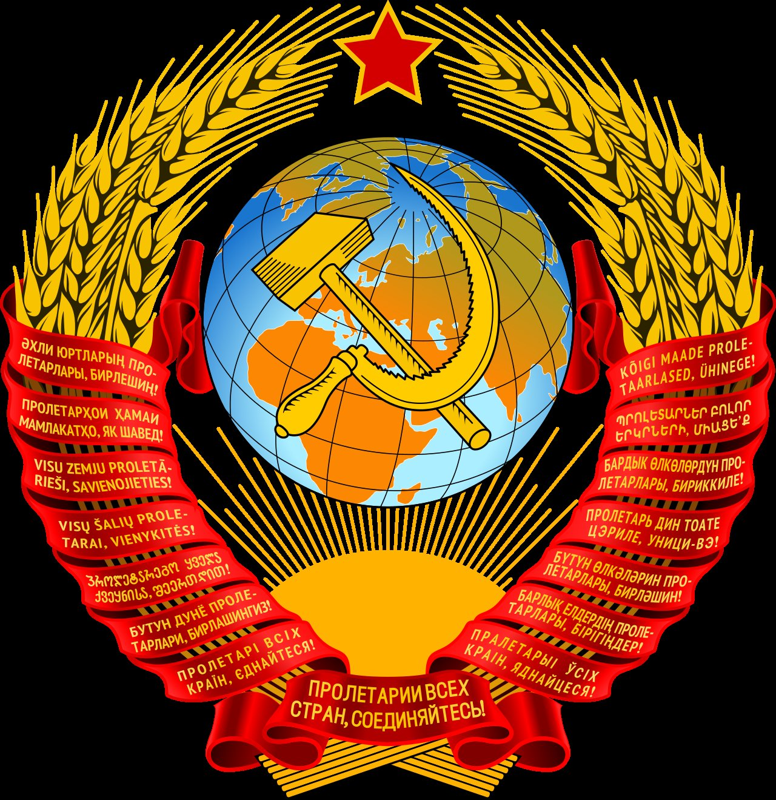
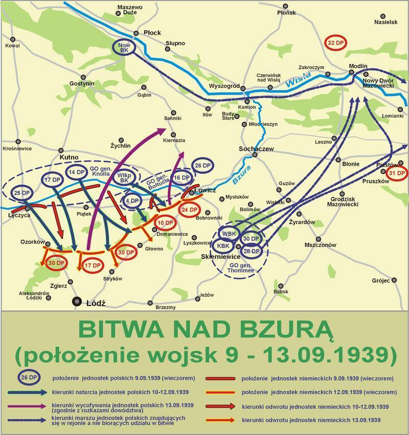
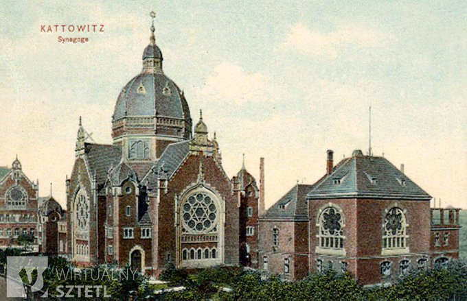

### 2020

Upadek norm etycznych elit w Starożytnym Rzymie doprowadził do upadku cywilizacji. Czy obecne wydarzenia w Polsce są zapowiedzią powtórki z historii?

  

---

Eurostat: PKB w strefie euro w drugim kwartale w dół o prawie 12 proc.

PKB w strefie euro spadł w drugim kwartale tego roku o 11,8 proc., a zatrudnienie o 2,9 proc. - wynika z opublikowanych we wtorek danych Eurostatu.
W całej UE wyniki te wynosiły odpowiednio 11,4 i 2,7 proc. To największe załamanie odnotowane w historii prowadzonych od 1995 r. pomiarów.
Wśród krajów członkowskich największy spadek Produktu Krajowego Brutto w drugim kwartale odnotowała Hiszpania. W porównaniu do pierwszych trzech miesięcy tego roku gospodarka tego kraju zmniejszyła się o 18,5 proc.

---

### 1948

Chyba rzadko się o tym wspomina, ale FAKTY są takie, że proklamowana 8 września 1948 roku, Koreańska Republika Ludowo-Demokratyczna (KRLD) jest najdłużej egzystującym komunistycznym państwem świata i istnieje już ponad 71 lat.

Przeżyła tym samym ZSRR (1922-1991) o dwa lata.

  

### 1939

Już w pierwszych dniach września udało się Niemcom przełamać polskie linie obronne i zająć Kujawy, część Wielkopolski i Śląsk. Na północy główne siły polskie, skoncentrowane w rejonie Mławy i na Pomorzu, zostały 1–3 września rozbite, a Armia Modlin, atakowana przez niemiecką 3 Armię podczas bitwy pod Mławą, zmuszona była wycofać się na linię rzek Wisły i Narwi.

Broniły się Westerplatte, Gdynia, Kępa Oksywska i Hel – aż do 2 października. Warszawa skapitulowała 28 września.

Również Armia Poznań pod dowództwem gen. Tadeusza Kutrzeby i Armia Pomorze pod dowództwem gen. Władysława Bortnowskiego cofnęły się aż za linię Warty i tam w okolicy Kutna nad rzeką Bzurą w dniach 9-18 września stoczyły jedną z największych bitew kampanii wrześniowej. Starły się z niemiecką 8 Armią dowodzoną przez gen. Johannesa Blaskowitza i 10 Armią gen. Waltera von Reichenau z Grupy Armii Południe. Gen. Kutrzeba postanowił wykorzystać to, że Wehrmacht zachowywał się dość biernie wobec wojsk Armii Poznań i zaatakował skrzydło 8 Armii niemieckiej. Planował on atak na pozycje niemieckie już parę dni wcześniej – 4 i 5 września podczas rozwinięcia natarcia 8 Armii na linię rzek Warta i Widawka na pozycje Armii Łódź. Nie zgadzał się na to Naczelny Wódz, ale pozycja obronna Armii Łódź została przełamana, zaś gen. Kutrzeba podtrzymał swoją propozycję zwrotu zaczepnego wobec wojsk niemieckich zmierzających bez istotnej osłony z lewej flanki w kierunku Warszawy. Do powodzenia operacji w początkowej fazie ataku według planów gen. Kutrzeby miał się przyczynić także czynnik psychologiczny, czyli chęć do walki z wrogiem żołnierzy Armii Poznań, która dotychczas tylko się wycofywała nie biorąc udziału w walkach na froncie.

  

8 września gen. Wacław Stachiewicz przekazał gen. Kutrzebie zgodę na rozpoczęcie operacji ofensywnej na skrzydło 8 armii niemieckiej siłami Armii Poznań i Pomorze, ale nie ustanowił jednolitego dowództwa w rejonie operacyjnym. Tak więc brak koordynacji pomiędzy siłami Armii Poznań, Pomorze oraz wycofującej się poprzez Skierniewice północnej grupy Armii Łódź i załogą obrony Warszawy, na którą 8 września uderzyły z marszu oddziały 1 i 4 Dywizji Pancernej Wehrmachtu – i zostały na Woli i Ochocie odparte przez Wojsko Polskie, zaciążyła na szansach rozstrzygnięcia bitwy nad Bzurą.

9 września wieczorem Grupa Operacyjna Koło pod dowództwem gen. Edmunda Knolla-Kownackiego, wraz z 14, 17 i 25 Dywizjami Piechoty rozpoczęły uderzenie na Łęczycę i Piątek. Na miasto Łowicz uderzyły jednostki Grupy Operacyjnej Wschód dowodzone przez gen. Mikołaja Bołtucia, wraz z 4 i 16 Dywizją Piechoty oraz Wielkopolską Brygadą Kawalerii gen. Romana Abrahama. Początkowo atak przyniósł sukces, nacierające na Warszawę siły niemieckie zostały zaskoczone i wstrzymały działania zmierzające do zaatakowania stolicy.

Uderzenie zgrupowania polskiego zaskoczyło Niemców i zmusiło ich dowództwo do rewizji planów ofensywnych w centralnej Polsce, odwołania nad Bzurę wszystkich dostępnych jednostek pancernych i lekkich oraz sił Luftwaffe. Umożliwiło to w konsekwencji wycofanie pozostałych wojsk polskich do południowo-wschodniej części Rzeczypospolitej, zgodnie z koncepcją Sztabu Głównego przewidującą zorganizowanie nowego obszaru obrony w oparciu o granicę z ZSRR i Rumunią, tzw. przedmościa rumuńskiego.

Ale nad Bzurą przewaga niemiecka spowodowała wyczerpanie impetu polskiego kontruderzenia już pomiędzy 12 a 13 września. Polska armia zdobyła wprawdzie Łowicz, toczyła także dalsze walki o Ozorków i Stryków.

Jednak brak koordynacji natarcia z siłami Armii Warszawa i Armii Modlin, brak jednolitego dowództwa operacyjnego pomiędzy Armiami Poznań i Pomorze, znaczne wyczerpanie żołnierzy, którzy prowadzili kilkudniowe walki bez odpoczynku i coraz większe straty w obliczu kontrataku przez Luftwaffe i jednostki pancerne Wehrmachtu, spowodowały, iż Naczelny Wódz i gen. Tadeusz Kutrzeba podjęli decyzję o wstrzymaniu ofensywy polskiej i wycofaniu wojsk w kierunku Warszawy. 17 września armie „Poznań” i „Pomorze” zrezygnowały z natarcia w okolicach Sochaczewa i Łowicza i rozpoczęły siłami jednostek kawaleryjskich przebicie do Warszawy poprzez Puszczę Kampinoską, Łomianki i Palmiry. Większość jednostek Armii Poznań i Pomorze znalazło się w okrążeniu na zachód od Bzury i zostało zmuszonych do poddania się. Do okolic Puszczy Kampinoskiej udało się przebić 50 tys. żołnierzom, do niewoli dostało się ok. 100 tys.

Bitwa nad Bzurą była jedyną przeprowadzoną na tak wielką skalę operacją zaczepną przeciwko III Rzeszy aż do 1941 roku.

Jednym z wielu oddziałów, które wzięły udział w bitwie nad Bzurą był m.in. 15 Pułk Ułanów Poznańskich pod dowództwem ppłk. Tadeusza Mikke wchodzący w skład Wielkopolskiej Brygady Kawalerii gen. Romana Abrahama. Pułk liczył 41 oficerów, ponad 900 podoficerów i ułanów, w tym szwadron kolarzy oraz 850 koni. W pełnej gotowości bojowej Pułk był już 30 sierpnia i miał za zadanie osłonić mobilizację powszechną i koncentrację wojsk stawiając opór na przedpolu pozycji głównej na rzece Warta na odcinku Mosina – Śrem – Nowe Miasto n/Wartą oraz opóźniać nieprzyjaciela na przedpolu i utrzymywać łączność z sąsiadami na prawym i lewym skrzydle – były to dwie dywizje piechoty. Po kilku potyczkach bez strat dostał rozkaz wycofania się przez Turek w kierunku Uniejowa i nad Bzurę. W dniach 9 – 18 września znajdował na wschodnim skrzydle Armii Poznań tocząc ciężkie walki pod Brochowem i Walewicami. We wsi Boczki Domaradzkie 12 września w południe poległ dowódca Pułku ppłk Tadeusz Mikke.

Tego dnia nieprzyjaciel uderzył ze zdwojona siłą. Żołnierze byli wprawdzie przygotowani i na pozycjach w miejscowości Ziewanice, ale natarcie nastąpiło na tyły pułku z kierunku Władysławów – Antoniew – Popów oraz z kierunku Wola Zbrożkowa. Dowódca w jednym z budynków studiował mapy i naradzał się ze swoimi oficerami nad dalszymi posunięciami. Usłyszawszy strzały wybiegł, by zobaczyć co się dzieje i w tym samym momencie został trafiony trzema pociskami w głowę. Razem z nim poległo dwóch gońców i jeden z trębaczy. Z całej grupy ocalał jedynie zastępca dowódcy pułku major Kazimierz Chłapowski i jego adiutant. Dzięki karabinom maszynowym, które natychmiast otworzyły ogień natarcie zostało powstrzymane, co pozwoliło majorowi opanować sytuację i wydać pierwsze rozkazy. Szwadron z plutonem ckm otrzymał rozkaz natarcia na bezpośrednie zagrożenie, a w razie potrzeby miał szturmować na bagnety. Wróg znajdował się na wyciągnięcie ręki.

Niestety ostrzał nieprzyjacielski nie ustawał, pułk dostał się w kleszcze, zginęło dwóch oficerów, trzech podoficerów i ok. 20 ułanów.

Wielkopolska Brygada Kawalerii podczas przedwojennych manewrów
Wielkopolska Brygada Kawalerii podczas przedwojennych manewrów
Po pewnym czasie nadjechał konno sam dowódca brygady gen. Abraham, zastał pułk w stadium porządkowania się i zajmowania kolejnych stanowisk. Mianował dowódcą majora Kazimierza Chłapowskiego i nakazał w oparciu o obecne stanowiska obronne przegrupować pułk, uporządkować pododdziały i następnie łącznie z baonem majora Hrycka nacierać na miasteczko Główno. Część jednego ze szwadronów dozorowała przedpole.

Po południu ruszyło natarcie na Główno. Wieczorem na naradzie w leśniczówce Zgoda pułk otrzymał nowe rozkazy. Padło po raz pierwszy określenie „obrona bezpośrednia Warszawy”, co zrobiło na żołnierzach przygnębiające wrażenie, gdyż nikt nie zdawał sobie sprawy w jak ciężkim położeniu znajdowała się całość wojsk polskich i jak daleko dotarły już kleszcze ofensywy niemieckiej. Generał Abraham zawiadomił też wtedy, że cała Wielkopolska Brygada Kawalerii przejdzie pod rozkazy Armii Pomorze.

Major Kazimierz Chłapowski został mianowany oficjalnie dowódcą 15 Pułku Ułanów Poznańskich i otrzymał też rozkaz specjalny z poleceniem odczytania go przed frontem Pułku. W rozkazie znajdowały się słowa pochwały za odwagę oraz hołd dla poległego ppłk Tadeusza Mikke.

W nocy żołnierze wyruszyli w dalszą drogę pożegnawszy uprzednio poległych kolegów oraz dowódcę, którzy zostali pochowani przy głównej drodze nad rzeczką w miejscowości Bielawy. Po dniu odpoczynku Pułk wymaszerował w kierunku Sochaczewa i Warszawy. 17 i 18 września nacierano na Kampinos, Izabelin osłaniając odwrót Armii Poznań i resztek Armii Pomorze spieszących na pomoc Warszawie. Mimo ciężkich walk, jakie toczyli ułani przez te kilka dni pułk trzymał się doskonale i zrobił wrażenie na niedobitkach innych armii przedzierających się do Warszawy.

19 września Pułk dotarł na Młociny, a potem do centrum miasta. 27 września została ogłoszona kapitulacja Warszawy, a następnego dnia odbyła się ostatnia zbiórka, odznaczenia żołnierzy i pożegnanie z pułkiem.

Rokrocznie w miejscowości Walewice odbywają się uroczystości upamiętniające te wydarzenia i bohaterską walkę żołnierzy. W samych Walewicach stoi pomnik w postaci wielkiego głazu upamiętniający żołnierzy XVII Pułku Ułanów Wielkopolskich oraz żołnierzy innych jednostek walczących we wrześniu 1939 r. w tym rejonie. W uroczystościach biorą udział okoliczni mieszkańcy, uczniowie szkół z najbliższych miejscowości, władze samorządowe, odbywa się uroczysta msza polowa i apel poległych. W tym roku w uroczystościach wzięli udział także ułani zrzeszeni w Towarzystwie Byłych Żołnierzy i Przyjaciół 15 Pułku Ułanów Poznańskich oraz 17 Pułku Ułanów Wielkopolskich. Ubrani w historyczne mundury z okresu II wojny światowej zaprezentowali swoje umiejętności jeździeckie, walkę z szablą i lancą oraz z karabinem maszynowym. Jeden z dowódców oddziału opowiedział zgromadzonym gościom, jak wyglądała taka walka z wrogiem i jakie były zadania kawalerii w kampanii wrześniowej.

Wielu poległych w tej okolicy żołnierzy, w tym ppłk Tadeusz Mikke spoczywa w osobnej kwaterze na cmentarzu w Walewicach, gdzie po zakończeniu walk przeniesiono ich groby. Natomiast w miejscowości Ziewanice, w miejscu gdzie pułkownik poniósł śmierć, stanął pomnik, również w postaci głazu, upamiętniający to wydarzenie.

Aby uczcić pamięć bohaterskiego dowódcy żołnierze z 15 batalionu Ułanów Poznańskich, który wchodzi w skład 17 Wielkopolskiej Brygady Zmechanizowanej, odbywają swoistą pielgrzymkę do miejsca, w którym zginął. Z miejsca zakwaterowania w okolicach Poznania wyruszają 3 września, czyli w dniu, kiedy pułk otrzymał rozkaz wymarszu na zachód i docierają do Ziewanic w południe 12 września i pod jego pomnikiem składają kwiaty i zapalają znicze.

Walki żołnierza polskiego nad Bzurą zostały upamiętnione na Grobie Nieznanego Żołnierza w Warszawie napisem na jednej z tablic, po 1945 r. „KUTNO 10 – 17 IX 1939”, a po 1990 r. „BZURA 9 – 22 IX 1939”, oraz napisem „KUTNO” na zniczu Grobu Nieznanego Żołnierza w Krakowie.

Małgorzata Korwin-Mikke

Bibliografia:

Dzieje 15 Pułku Ułanów Poznańskich 1918-1962 – opracowanie zbiorowe pod red. Pawła Zaremby, wydane w Londynie 1962 r.

---

Rozpoczęła się bitwa nad Bzurą.
"Gdy przyszłe roczniki Wyższej Szkoły Wojennej Polski dla studiów taktycznych wyjeżdżać będą na pole bitwy nad Bzurą niech nie przeoczą, że formy działań wojennych ulegają zmianom i zależą od techniki uzbrojenia, ale że prawa wojny pozostają niezmienne. Spośród wielu tych praw najbardziej zasadnicza jest tak prosta, a tak trudna do zrealizowania prawda, że nie ma zwycięstwa bez bitwy. A przechodząc koło grobów poległych nad Bzurą żołnierzy polskich, niech ci, którzy kształcą się na przyszłych dowódców, wspomną, że leżą tu żołnierze, którzy starali się wykonać niewykonalny wówczas obowiązek obrony Polski". (gen. T. Kutrzeba "Wojna bez walnej bitwy").
Armie "Poznań" i "Pomorze" broniły, zgodnie z planem, terenu Poznańskiego i Pomorza. W dniach 1-3 IX armia "Pomorze" poniosła porażkę w Borach Tucholskich i wycofała się na pd. brzeg Wisły. Niemcy nie podjęli pościgu, ruszyli wojskami szybkimi na wsch. (w pasie na pn. od Wisły). Armia "Poznań", nie atakowana większymi siłami, pozostawała w obronie na terenie Wielkopolski. 5 IX, wobec odniesionych przez Niemców sukcesów na obu skrzydłach frontu pol., Nacz. Wódz zarządził ogólny odwrót na linię rzek: Narew, Wisła i San. Armie "Poznań" i "Pomorze", wysunięte w stosunku do pozostałych sił pol. bardziej na zach., znalazły się w odosobnieniu. Otrzymały one w ramach odwrotu na nową linię obrony rozkaz odejścia na Warszawę. Odwrót dokonany nocami zapobiegł wykryciu wycofujących się wojsk przez lotnictwo niem. 8 IX armie "Pomorze" i "Poznań" osiągnęły obszar Kutno, Włocławek, Koło. Równolegle do kierunku odwrotu obu armii pol. zdążały niem. 8 i 10 Armia, które dysponując wojskami szybkimi wyprzedziły siły polskie.
8 IX gen. Kutrzeba przedstawił Naczelnemu. Dowództwu propozycję przeciwuderzenia w odsłonięte pn. skrzydło maszerującej ku Warszawie niem. 8 A, uzyskania szerszego korytarza oper., dla ułatwienia odwrotu zabezpieczonego od pn. linią Wisły, a od pd. uchwyconą rubieżą obrony na pd. od Bzury i linii kol. Głowno-Warszawa. W tym czasie na pozostałym froncie Niemcy rozwijali działania zaczepne: na pn. osiągnęli Narew, na kier. Toruń, Warszawa posuwali się wzdłuż Wisły, w centrum (na kier. warszawskim) 8 A wyszła na linię Łęczyca Łódź; wojska szybkie 10 A (4 DPanc z 6 KPanc) usiłowały uchwycić z marszu Warszawę. Dowództwo niem. zakładając, że siły pol. z Pomorza i Poznańskiego wycofały się na wsch., dążyło do jak najszybszego opanowania stolicy i przekroczenia środk. Wisły.
Armia "Poznań" tymczasem przerwała odwrót i koncentrowała się w myśl decyzji gen. Kutrzeby do uderzenia w ogólnym kier. na Łódź, na skrzydło i tyły niem. 8 A. Armia "Pomorze" oddalona była jeszcze o 3-4 dni marszu od podstaw wyjściowych do natarcia. Dowództwo pol., mając dość dokładne informacje o ugrupowaniu niem., planowało wykonanie manewru zaczepnego przez uderzenie armii "Poznań" na 30 DP osłaniającą skrzydło niem. 8 A, rozbicie jej, następnie pobicie rozśrodkowanych sił 8 A we współdziałaniu z nadciągającą armią "Pomorze".
Otrzymawszy zgodę Nacz. Wodza, armia "Poznań" rozpoczęła 9IX przeciwuderzenie z rej. na pn. od Bzury na niem. 30 i 24 DP, rozciągnięte w marszu między Łęczycą a Łowiczem. Natarcie w ogólnym kier. na Stryków prowadziła grupa oper. gen. Knolla (14, 17 i 25 DP). Prawe skrzydło natarcia ubezpieczała w rej. Dąbie Podolska BK, działająca w kierunku na Uniejów, lewe skrzydło - Wielkopolska BK, nacierająca z rej. Soboty przez Bielawy na Głowno. Siły pol. mimo kilkakrotnej przewagi liczebnej, jaką miały początkowo nad Niemcami, oraz czynnika zaskoczenia (uderzenie pol. zaskoczyło dowództwo 8 A niem ) nie zdołały osiągnąć zasadniczego celu, zadały jednak duże straty 30 DP (straciła ok. 1500 ludzi i znaczne ilości sprzętu) i odrzuciły ją ok. 20 km na pd.; zdobyły Górę Św. Małgorzaty, Ryski, Łęczycę i Piątek; znaczne straty w ludziach i sprzęcie zadały również dalszym podchodzącym do walki dywizjom 8 A.
10 IX po południu, w czasie pościgu, pol. 17 DP stoczyła z 17 DP niem. ciężki bój spotkaniowy w Małachowicach. 11 IX armia "Poznań", kontynuując natarcie siłami Podolskiej BK i 25 DP, walczyła w rejonie na pd.-zach. od Łęczycy z nadchodzącą 221 DP niem.; 17 DP wyparła z Grabiszewa, Małachowic i dworu Sokolniki oddziały 17 DP niem., a 14 DP osiągnęła Mąkolicę i Koźlę. Na lewym skrzydle natarcia weszła do walki grupa oper. gen. Bołtucia z armii "Pomorze", zdobywając siłami 4 DP Sobotę i las pomiędzy Bielawami a Głownem, a 16 DP Łowicz. Reszta sił armii "Pomorze" znajdowała się w obronie w rej. Włocławek, Brześć Kujawski, Koło, frontem na zach. i pn.-zach., wiążąc walką niem. 3 K.
Już od 11.IX zaczęli Niemcy kierować nad B. nowe siły, głównie z 10 A, także z 4 A (3 KA i 3 DP) oraz z odwodów GA "Sud". Siły te początkowo podlegały dowódcy 8 A, od 15 IX ponownie przeszły pod dowództwo 10 A. l2 IX dowódca GA "Sud" skierował nad B. lotnictwo grupy lotn. gen. W. Richthofena, później także część sił z 4 Floty Powietrznej. 12 IX wieczorem wykonująca główne natarcie grupa gen. Knolla osiągnęła linię Stryków-Ozorków. W tym samym dniu gen. Kutrzeba otrzymawszy wiadomości o wycofaniu się do Modlina dywizji armii "Łódź", z którymi nie było dotychczas łączności, wydał rozkaz przerwania bitwy.
Nowy plan przewidywał uderzenie siłami armii "Pomorze" przez Łowicz na lasy skierniewickie. W nocy na 13 IX grupa gen. Knolla wycofała się na pn. brzeg rzeki. Nie wiedząc o tym, Niemcy w obawie ponownego natarcia sił pol. odeszli na pd. W tej fazie bitwy inicjatywa pozostawała nadal w rękach dowództwa pol. Na mocy decyzji gen. Kutrzeby 4, 16 i 26 DP oraz Wielkopolska BK pod dowództwem gen. Bortnowskiego miały w nocy na 14 IX uderzyć z pn. brzegu B. przez Łowicz na Skierniewice oraz uchwycić Sochaczew i Puszczę Kampinoską. Grupa oper. gen. Knolla miała wycofać się nad B. i przebić do Warszawy. Dla osłony od pn. i zach. utworzono grupy oper.: pod dowództwem gen. M. Karaszewicza-Tokarzewskiego (skład: 15 27 DP i 19 pp) i pod dowództwem gen. S. Grzmota-Skotnickiego (skład: 70 pp, Wielkopolska Brygada ON, 8 baon strzelców 5 baon ckm, Podolska BK i resztki Pomorskiej BK). Rano 14 IX zgrupowanie gen. Bortnowskiego rozpoczęło natarcie; 26 DP mimo silnego oporu niem. sforsowała B.; 16 DP również sforsowała B. i toczyła ciężkie walki o Łowicz; 4 DP osiągnęła szosę Łowicz-Głowno. O godz. 10 gen. Bortnowski otrzymał meldunek lotn. donoszący o licznych kolumnach panc. na drogach między Błoniem a Sochaczewem, maszerującej spod Warszawy niem. 4 DPanc. W obawie, że dywizja niem. jeszcze tego samego dnia może przekroczyć słabo bronioną B. i wyjść na tyły pol. 26 DP nacierającej w kier. na Skierniewice, gen. Bortnowski wydał 26 DP rozkaz odwrotu za B.; dywizja poniosła duże straty. Gdy do odwrotu przeszła także część 16 DP, gen. Bołtuć wycofał swoją grupę za B. 15 i 16 IX armia "Pomorze" broniła się na pn. brzegu B. (26 i 16 DP) i na rz. Słudwi (4 DP), grupa gen. Skotnickiego na pozycji między Kutnem a Żychlinem; grupa gen. Tokarzewskiego w rej. Gąbina. Dywizje armii "Poznań" zajmowały podstawy wyjściowe przez B. w rej. Sochaczewa. Wielkopolska BK po przejściu przez B. w Witkowicach weszła do Puszczy Kampinoskiej.
Początkowo dowództwo niem. nie rozszyfrowało zamiarów dowództwa pol. Dopiero 14 IX rozpoczęło przygotowania mające na celu okrążenie i zniszczenie odosobnionych armii pol. Plan niem. przewidywał skierowanie do bitwy nad B. gros sił 10 A, w tym dwóch dywizji panc., trzech lekkich i jednej zmot. (ok. 800 czołgów) i koncentryczne rozbicie sił polskich.
16 IX przy wsparciu potężnego lotnictwa boj. Niemcy rozpoczęli atak na okrążone armie polskie. 1 DPanc, ściągnięta spod Góry Kalwarii, przeprawiła się przez B. w Kozłowie Szlacheckim, uderzyła na 57 pp z 14 DP, rozbiła go i wdarła się w głąb ugrupowania i na tyły obu armii polskich. 4 DPanc przeprawiła się przez B. pomiędzy Sochaczewem a Brochowem, uderzyła w kierunku pd.-zach. zadając duże straty 25 DP w rej. Adamowej Góry, i opanowała Ruszki. Dalsze natarcie 4 DPanc niem. zostało zatrzymane.
W nocy na 17 1X siły główne armii "Poznań" rozpoczęły bitwę o przełamanie niem. okrążenia pomiędzy Witkowicami a Sochaczewem. 1S DP i Podolska BK przeszły B. w Witkowicach, 25 DP w Brochowie; 17 DP maszerowała w kier. przeprawy do Brochowa; 14 DP koncentrowała się w Łaziskach. Armia "Pomorze" przesunęła się w rej. Osmolin, Kiernozia, Osiek. Grupa gen. Skotnickiego przeszła w rejon na zach. od Kiernozi, a 27 DP z Gąbina na Iłów.
17 IX rano Niemcy wznowili natarcie, kierując je na pn. wzdłuż obu brzegów Bzury. Wspierające natarcie lotnictwo niem. (ok. 300-330 samolotów) bombardowało od godz. 9 do zmroku obszar, na którym okrążone zostały armie pol., wyrządzając ogromne straty w ludziach i sprzęcie. Artyleria niem. ogniem od Brochowa i od strony Wyszogrodu z prawego dominującego brzegu Wisły uniemożliwiała przeprawę; po dwudniowych krwawych walkach niem. związki panc. odcięły większość sił pol. na zach. brzegu Bzury. Okrążone w rej. Wyszogrodu, Starych Bud, Iłowa resztki rozbitych jednostek pol. były systematycznie bombardowane i ostrzeliwane przez lotnictwo niem. i artylerię. Po bohaterskim oporze i wyczerpaniu amunicji i żywności zaprzestały walki. Tylko nielicznym grupom piechoty bez broni ciężkiej udało się wyrwać z okrążenia i przebić przez Puszczę Kampinoską do Warszawy (do 22 IX) i Modlina. Do Warszawy przedostali się gen. Kutrzeba ze sztabem, gen. Knoil i gen. Tokarzewski, obie brygady kaw. po krwawych walkach w Sierakowie, 15 DP po walkach w Laskach oraz 25 DP po walkach pod Młocinami. Zreorganizowane, wzięły one udział w końcowej fazie obrony Warszawy. Reszta oddziałów z gen. Bortnowskim dostała się w okresie 18-22 IX do niewoli.
Bitwa nad Bzurą, mimo że w końcowym rezultacie zakończyła się klęską armii "Pomorze" i "Poznań", spełniła ważne zadanie operacyjno-strategiczne: zmusiła dowództwo niem. do zmiany planu działań, opóźniła kapitulację Warszawy i uniemożliwiła wykorzystanie niem. wojsk szybkich do przegrupowania na pd. skrzydło GA "Sud" w celu przyspieszenia działań na Lubelszczyźnie.

  

---

Niemieccy kaci spalili Wielką Synagogę w Katowicach

  

---

### 1929

> Przewrót bolszewicki za niemieckie pieniądze. - Karol Jaroszynski

Zmarł Karol Jaroszyński - Карл Иосифович Ярошински

Karol Jaroszyński był jednym z najbogatszych Polaków w historii, geniuszem ówczesnego biznesu i bankowości. Po odziedziczeniu, na początku XX wieku, majątku po ojcu, traci niemal wszystkie pieniądze w kasynie w Monte Carlo. Ale w końcu rozbija bank i wygrywa ogromną fortunę. Zaczyna inwestować w przemysł i w krótkim czasie staje się finansowym potentatem. Po wybuchu I wojny światowej w 1914 roku, mając poparcie kół rządowych, zaczął organizować w Rosji przemysł wojenny i uzyskał na ten cel kredyt w Banku Państwa do 400 milionów rubli. W 1917 roku stał na czele wielkiego koncernu, w skład którego wchodziły kopalnie, huty, fabryki, banki, cukrownie, towarzystwa ubezpieczeniowe, towarzystwa kolejowe, lasy, a nawet towarzystwa łowieckie i duże hotele. Wszystko stracił po dojściu do władzy bolszewików. Doradca cara Mikołaja II i Józefa Piłsudskiego. Urodzony i wychowany w Rosji nigdy nie przestał być polskim patriotą. Współzałożyciel Katolickiego Uniwersytetu Lubelskiego. Odznaczony Wielką Wstęgą Orderu Świętego Grzegorza Wielkiego, największym odznaczeniem papieskim, nadawanym osobom świeckim za szczególne zasługi dla Kościoła.

<a href="./documents/september/jaroszynski.pdf" target="_blank">Karol Jaroszyński</a>

---

<a href="https://github.com/TomaszWaszczyk/historia.waszczyk.com/edit/master/src/content/september-8.md" target="_blank">Edytuj tę stronę dzieląc się własnymi notatkami!</a>
