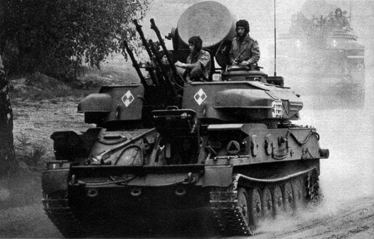
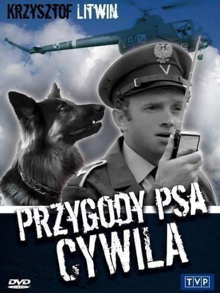

### 2021

🇨🇳 Komunistyczna Partia Chin ma ponad 90 milionów członków, więc w naturalny sposób są tam różni ludzie, różne frakcje. Szczególnie niezadowoloną jest frakcja najstarsza, czyli osoby, które osobiście doświadczyły Rewolucji Kulturalnej. Im zdecydowanie nie podoba się fakt, że Xi Jinping rozmontował „kolektywnego cesarza” i wrócił do rządów jednoosobowych – mówi prof. Bogdan Góralczyk.

🇨🇳 Wygląda na to, że Chiny znowu dotknął, jak to opisywał Francis Fukuyama, „syndrom cesarza”. Chińczycy mieli wypracowany system, w którym przywódca owszem był primus inter pares, ale nie rządził sam. Starannie to opisałem w tomie „Wielki renesans. Chińska transformacja i jej konsekwencje”, do którego lektury serdecznie zachęcam. Niestety, wróciły poprzednie tryby. Znowu mamy „syna niebios” z nadania Komunistycznej Partii Chin. Ile będzie rządził Xi Jinping? Prawdopodobnie tyle, na ile mu partia i koledzy w najbliższym otoczeniu pozwolą. Jak będą sukcesy, to dożywotnio, natomiast jeśli straciłby „mandat niebios”, to nieco krócej.

🇨🇳 W tej chwili rozmawianie na temat sukcesji władzy w Chinach jest bezsensowne, bo Xi Jinping ma zagwarantowane długie rządy. Myślę prywatnie, chociaż mówię to publicznie, że będzie rządził przynajmniej do 2035 roku, kiedy to zgodnie z jego wizją Chiny mają stać się państwem i społeczeństwem innowacyjnym. Patrząc na jego datę urodzenia i życiorys, może spokojnie tyle wytrwać u władzy.

🇨🇳 Chiny przeprowadzają reformę w trzech etapach. Pisał o tym Zheng Yongnian, dziś jeden z najbliższych intelektualnych doradców Xi Jinpinga, choć formalnie nadal zatrudniony w Singapurze (także w Szanghaju). Powołując się na Deng Xiaopinga pisze on, że pierwszy etap od 1978 do 2008-2010 to była odbudowa siły państwa. Teraz podczas kadencji Xi Jinpinga obserwujemy odbudowę siły nabywczej obywateli. Stąd pozbycie się biedy, ale też hasło xiǎokāng shèhuì, czyli społeczeństwo umiarkowanego dobrobytu. W Chinach wielkość klasy średniej to około 400 milionów, a celem jest 600 milionów. To więcej niż liczba obywateli Unii Europejskiej. Ta odbudowa może trwać 30 lat, a więc gdzieś do końca rządów Xi Jinpinga, do połowy czwartej dekady. Potem dopiero mają nastąpić reformy polityczne.  Ja się takowych reform spodziewam, leczone nie przyniosą one liberalnej demokracji, takiego systemu jak u nas.

  

### 2020

Central Banks have created a  Bond Bubble that is not sustainable by keeping short term interest rates  lower for longer.. and anybody with an ounce of common sense will  realize that they have created a mountain of debt that is unlikely to be  repaid in its entirety.  
Central Banks have created this mess  to save the world during the ecomomic pandemic but they have no plan B  other than keep rates with guarenteed  negative return  for longer  ..even in the face of  uncontrollable inflation post pandemic?

---

10000 is the new 1000..

### 1976

Rozpoczęły się w Polsce wielkie manewry wojsk Układu Warszawskiego pod kryptonimem Tarcza 76.
Wzięły w nich udział armie Polskiej Rzeczpospolitej Ludowej, Związku Socjalistycznych Republik Radzieckich, Niemieckiej Rebubliki Demokratycznej i Czechosłowackiej Republiki Socjalistycznej.
Ćwiczenia Tarcza 76 opierały się na obowiązującej w latach 70-tych w obozie państw komunistycznych doktrynie polegającej na zastosowaniu zmasowanych zaskakujących ataków jednostek pancerno- zmechanizowanych, co w pewnym stopniu miało być odwzorowaniem znanych z czasów drugiej wojny światowej rajdów Żukowa, Rokossowskiego i Koniewa. Miały się różnić jednak skalą i zastosowaniem nowych militarnych możliwosci, czyli taktyczno-operacyjnych ataków jądrowych na nerwalgiczne punkty przeciwnika. Dodano również operacje wojsk specjalnych-w tym powietrzno-desantowych.

  

### 1971

Sposób na ocieplenie wizerunku policji:

Telewizja Polska wyemitowała pierwszy z 7 odcinków serialu pt "Przygody psa Cywila".
Była to dosyć zabawna opowieść o przygodach nieco gapowatego sierżanta milicji Walczaka i jego psa. Reżyserem tego serialu był znany także z reżyserii innej serii o tematyce milicyjnej pt "07 zgłoś się" Krzysztof Szmagier.Odtwórcą roli sierżanta Walczaka był znany krakowski aktor Krzysztof Litwin.

  

---

<a href="https://github.com/TomaszWaszczyk/historia.waszczyk.com/edit/master/src/content/september-9.md" target="_blank">Edytuj tę stronę dzieląc się własnymi notatkami!</a>
