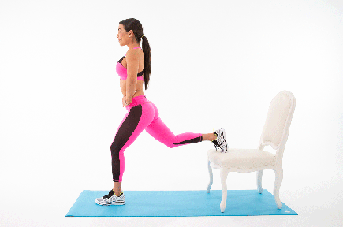
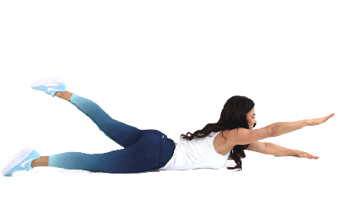
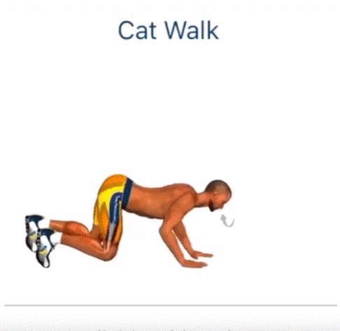
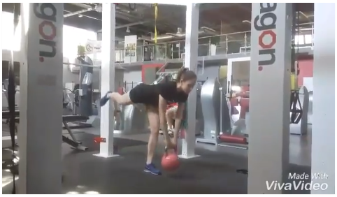
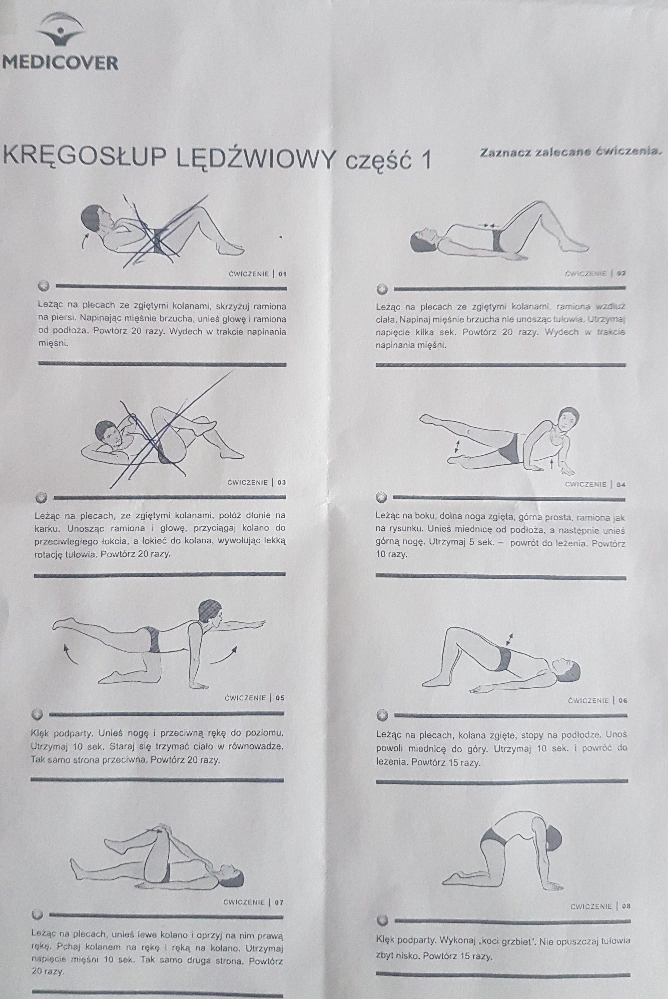
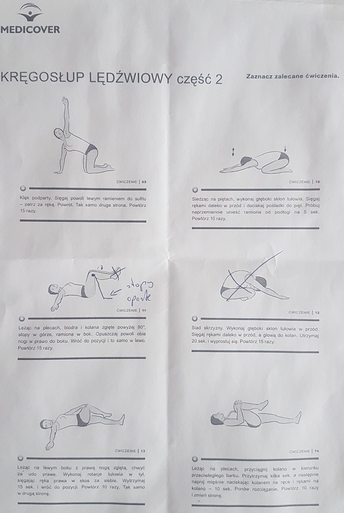
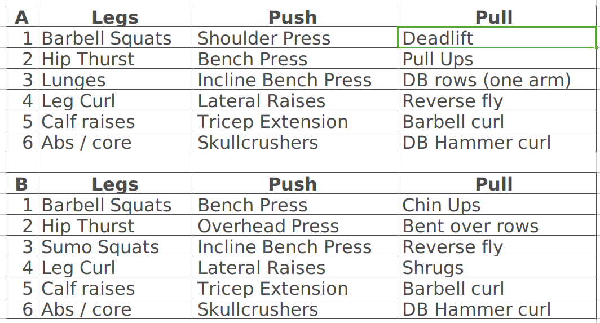

### Ćwiczenia

1. Leżymy na macie trzymając w obu rękach piłkę, unosimy obie nogi i wyknujemy ruchy piłką do podłoża, raz w prawo raz w lewo.

2. Po robieniu brzucha nalezy polozyc sie na materac i na rekach uniesc sie na 20 sek.

3. Pompki na piłce

4. plecami na piłce i unosimy się (można naprzemiennie dotykać prawą ręką lewego kolana)

---

---

<video width="640" height="480" controls>
  <source src="./img/others/sport/1308002.mp4" type="video/mp4">
Your browser does not support the video tag.
</video>

---

<video width="640" height="480" controls>
  <source src="./img/others/sport/Rosyjski-chirurg-pokaz.mp4" type="video/mp4">
Your browser does not support the video tag.
</video>

---

<video width="640" height="480" controls>
  <source src="./img/others/sport/Rozgrzewkaprzedbieganiem.mp4" type="video/mp4">
Your browser does not support the video tag.
</video>

---

<video width="640" height="480" controls>
  <source src="./img/others/sport/Yoga-balansnaramionach.mp4" type="video/mp4">
Your browser does not support the video tag.
</video>

---

<video width="640" height="480" controls>
  <source src="./movies/sport/cwiczenia-yoga.mp4" type="video/mp4">
Your browser does not support the video tag.
</video>

<!-- ---

<video width="640" height="480" controls>
  <source src="./movies/sport/w-domu.mp4" type="video/mp4">
Your browser does not support the video tag.
</video> -->

---

<video width="640" height="480" controls>
  <source src="./movies/sport/zbudujsylwetkę_360p.mp4" type="video/mp4">
Your browser does not support the video tag.
</video>

<video width="640" height="480" controls>
<source src="./movies/sport/DOMOWY_Trening_Na_Brzuch.mp4" type="video/mp4">
Your browser does not support the video tag.
</video>

#### Plank

Podstawowe ćwiczenie zaczynamy od położenia się na brzuchu, oparciu przedramion tak, by łokcie były dokładnie pod barkami, a stopy na palcach. Napinamy mięśnie brzucha, unosimy tułów, biodra i nogi – całe ciało musi znajdować się w linii prostej. Bardzo ważne jest prawidłowe wykonywanie ćwiczenia, dlatego nie wyginamy w dół odcinka lędźwiowego kręgosłupa i nie opuszczamy bioder. Wytrzymujemy 30 sekund, robimy 10-cio sekundową przerwę i całe ćwiczenie powtarzamy 5 razy.
Jak często ćwiczyć plank? Na początku 2-3 razy w tygodniu. Przy regularnych treningach i dobrej kondycji można ćwiczyć nawet codziennie. Nie zapomnij o ważnym elemencie, czyli rozciąganiu po wykonywaniu każdego rodzaju planka.

Jeśli ćwiczysz już plank, z czasem serie mogą stać się nudne. Masz dwie opcje, aby urozmaicić sobie trening: wydłużyć czas, który wytrzymujesz w pozycji lub spróbować innych odmian deski.

##### Pajacyki plankowe

Pomyśl o nich jak o pajacykach wykonywanych na leżąco. Ułóż się na macie, przyjmij pozycję do standardowego planku, napnij mięśnie brzucha, a następnie wyskocz samymi stopami poza matę i złącz je z powrotem, tak jak w pajacyku. Wykonaj 3 serie po 10 powtórzeń.

##### Plank z wyrzutem nogi

Przyjmij pozycję deski. Pamiętaj o mięśniach brzucha, wyprostowaniu nóg i złączeniu stóp. Oprzyj ciężar ciała na jednej nodze, a drugą zegnij i przyciągnij do klatki piersiowej. Następnie wyrzuć stopę do góry, tak, by noga ułożyła się w kształt litery „L”. Powtórz ćwiczenie 10 razy, a później zmień nogę.

##### Plank bokiem z unoszeniem nogi

Połóż się na boku. Oprzyj ciężar ciała na lewym łokciu. Unieś ciało tak, by lewe ramię, biodro i pięta były w jednej linii. Utrzymaj pozycję, napinając mięśnie brzucha. Połóż prawą rękę na prawym biodrze, skieruj łokieć do góry i unieś prawą nogę najwyżej jak możesz, następnie opuść. Powtórz 10 razy i zmień stronę.

##### Plank z pompką

Ułóż się w pozycji standardowej. Prostując ręce, przejdź z deski na przedramionach do planku na dłoniach i wróć do pozycji na ugiętych. Zrób 4 serie ćwiczeń po 10 powtórzeń.Z czasem plank będzie dla ciebie coraz łatwiejszy i z chęcią dołączysz do niego różne utrudnienia. Efekty nie będą widoczne po kilku dniach, ale systematyczność jest kluczem do sukcesu. Polecamy te ćwiczenia na brzuch wszystkim, którzy marzą o zgrabnej sylwetce i mocnych mięśniach.

### Odchyły..

1. kolano kinomana

2. przodopochylenie miednicy

<video width="640" height="480" controls>
  <source src="./img/others/sport/przodopochylenie.mp4" type="video/mp4">
Your browser does not support the video tag.
</video>

### Inne

Glutes and hamstrings

Oddech navy seals

Metoda oddechu Butejki

---

3 weeks in.

4 sets each, 8-15 reps, increase weights after each set.

Lots of volume, because lots of time during lockdowns.

Will continue for 9 more weeks.

  

### Książki

- Mocne Plecy Proste Ćwiczenia W Służbie Siedzenia - Harriet Griffey

- Bóle kręgosłupa i stawów (okładka miękka) - Górnicka Jadwiga

- Stretching rozciąganie porady lekarza rodzinnego - Kujawa-Kamińska Grażyna, Guzowska Beata, Jagielski Mateusz

---

<a href="https://github.com/TomaszWaszczyk/historia.waszczyk.com/edit/master/src/content/art.md" target="_blank">Edytuj tę stronę dzieląc się własnymi notatkami!</a>
