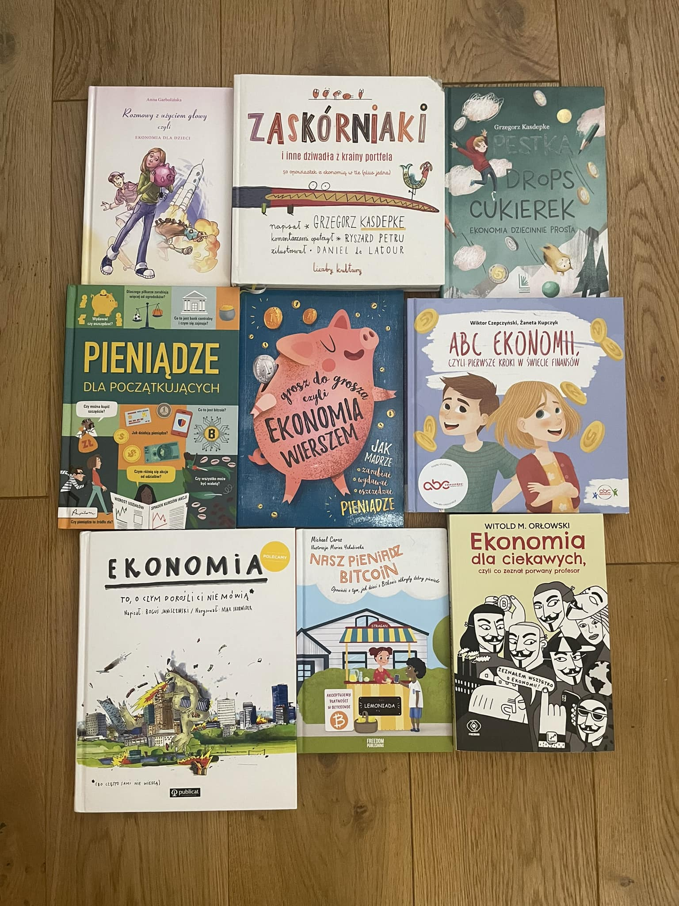
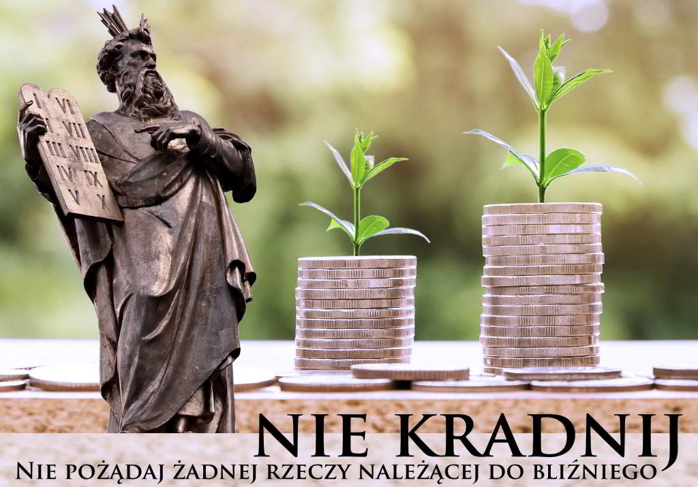
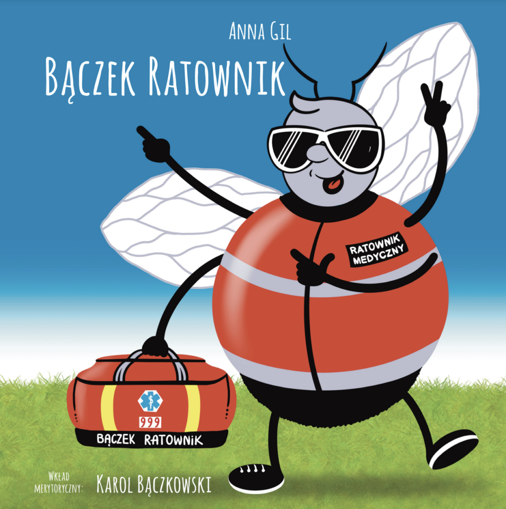
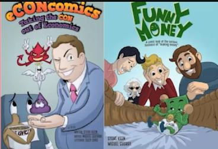

> I don't want a nation of thinkers, I want a nation of workers - John D. Rockefeller (John D. Rockefeller on Making Money: Advice and Words of Wisdom on Building and Sharing Wealth)

<a href="./documents/wychowanie-mlodego-czlowieka/ED349475.pdf" target="_blank">Rockefeller and General Education Board</a>

<!-- 
https://hourofcode.com/us/pl
kaszojad

John Dury
https://www.brainyquote.com/authors/johann-gottlieb-fichte-quotes
https://unibot.us.edu.pl/dzieci-moga-patentowac/
https://www.pap.pl/aktualnosci/news,944867,prof-jedrzejko-cyfrowe-piekielko-naszych-dzieci.html

https://www.chesskid.com/
A boy becomes a man when he chooses dangerous freedom over comfortable slavery.
-->

### Książki i bajki

* https://github.com/HollyAdele/awesome-programming-for-kids

* Kodowanie dla dzieci, Marc Scott

* Edukacja Domowa, Wiesław Stebnicki

* Czy to puszcza bąki?

* https://lubimyczytac.pl/autor/7000/janusz-korczak

* https://lemgalaxy.com/en

* Underground History of American Education - https://archive.org/details/JohnTaylorGattoTheUndergroundHistoryOfAmericanEducationBook

* https://github.com/TomaszWaszczyk/historia.waszczyk.com/blob/master/src/content/documents/Americas%20Great%20Depression_Polish_3.pdf

* Anna Pierzchała, Pasywność w szkole. Diagnoza zjawiska z punktu widzenia analizy transakcyjnej, Wydawnictwo im. S. Podobińskiego Akademii im. J. Długosza w Częstochowie, Częstochowa 2013

* Kot Biznesik - Arkadiusz Błażyca

* Wielcy myśliciele i wielkie idee. Wschodnia i zachodnia filozofia dla dzieci.

* Johnny Profit - Malgeri Michael A.

* Jak powstaje bogactwo, i kiedy nie powstaje

* Wielka Wyprawa Felicii

* Opowiadania dla dzieci cz. 2 4CD - Singer Bashevis Isaac

* BLIŹNIĘTA TUTTLE I CUDOWNY OŁÓWEK - Connor Boyack

* BLIŹNIĘTA TUTTLE POZNAJĄ PRAWO - Connor Boyack

* Seria książek o ulicy Czereśniowej

* Rok w lesie

* Robert Patrick Murphy, Lessons for the Young Economist

* Mądroboty - bajka

* Na tropie angielskich słówek

* Tajemniczy Tunel. Ucieczka Leonarda, Olaf Fritsche (~10+)

* 88/89, Michał Rzecznik, Przemek Surma

* Piaskowe malowanki

* Piaskowe ozdoby choinkowe

* Toledo told to children - Maria Aguado Molina

* Przyjaciele żyrafy - Joanna Berendt, Aneta Ryfczyńska (Bajki o empatii)

* Dlaczego tańczymy ze szczęścia i kipimy ze złości? Historyjki dla ciekawskich dzieci

* Róża, a co chcesz wiedzieć? Komiks edukacyjny o technologiach dla dzieci

* Mała encyklopedia nauki, Emmanuel Chanut

* Bitcoin Money, A Tale of Bitville Discovering Good Money

* Renata Piątkowska "Opowiadania do chichotania" audiobook.

* https://abc-ekonomii.edu.pl

* https://www.nbportal.pl/wiedza/prezentacje

* Świat pieniądza, Fundacja Świat Pieniądza

* https://ukochaneprzygody.pl/ - https://www.youtube.com/channel/UCfWxydXsFgTuMIoyTUICMLw

* ABC ekonomii, czyli pierwsze kroki w świecie finansów – Wiktor Czepczyński, Żaneta Kupczyk

* Złoto Johnnego - Michael A. Malgeri

* Bajki Kwantowe: Seria 1 – Kamil Hajduk

* Twoje kompetentne dziecko, Juul Jesper

* https://altenberg.pl/superniania/

* https://bullerbyn.org.pl/

* https://lingumi.com/

* Dzieje Polski opowiedziane dla młodzieży, Feliks Koneczny

* Baby Loves Quantum Physics! (Baby Loves Science) by Ruth Spiro (Author), Irene Chan (Illustrator)

* Opowieści dla dzieci, które chcą uwierzyć w sie...

* https://www.rigb.org/families

* https://www.kursy-zalewski.info/decyduj-i-walcz/

* Bliżej Lasu. Opowiadania przyrodnicze dla dzieci, które ciągle pytają "dlaczego?

* https://wizardzines.com/zines/integers-floats/

<video width="640" height="480" controls>
  <source src="./movies/wychowanie-mlodego-czlowieka/wujek-sknerus.mp4" type="video/mp4">
Your browser does not support the video tag.
</video>

<video width="640" height="480" controls>
<source src="./movies/wychowanie-mlodego-czlowieka/zabic_ciekawosc.mp4" type="video/mp4">
Your browser does not support the video tag.
</video>

* Pismo Święte dla młodych. Biblia tysiąclecia

* https://wakelet.com/@Laboratoria_Przyszlosci

* https://naukatolubie.pl/junior/ oraz https://www.youtube.com/channel/UC8xquvuX_xi7rq_N_L06n5w

* https://strefa-kostek.pl/ukladanki-logiczne-metalowe-222

* https://shamory.com/

---

W wiosce smerfów mieszkało ich - wiadomo - setka. Każdy smerf miał inne umiejętności, które codziennie mógł sprzedać za jedną monetę, za którą mógł następnie kupić u innego smerfa to co mu akurat było potrzebne. Np. Łasuch każdego dnia produkował jedno ciastko i sprzedawał je za jedną monetę. Wszystkim oczywiście zarządzał Papa Smerf – on też będąc szefem wioski jako jedyny miał prawo wydawać nowe monety dla wioskowej społeczności, jeśli zaszłaby taka potrzeba.
Na początku zupełnie wystarczało 100 monet – po jednej dla każdego Smerfa. Pewnego dnia Smerf Malarz zaczął malować dwa obrazy dziennie zamiast jednego – pomyślał, że mógłbym zarabiać dwie monety. W jego ślady poszły jeszcze dwa inne Smerfy. Papa Smerf wyprodukował więc dodatkowe 3 monety i kupił za nie usługi u pracowitych smerfów. Dzięki tej operacji w obrocie były już 103 monety a trzech smerfów pracowało więcej i zarabiało 2 razy więcej od pozostałych – po dwie monety dziennie.
Inne smerfy też zapragnęły dobrobytu i zaczęły mocniej pracować aby zarabiać więcej monet. Papa Smerf stopniowo produkował nowe monety. Nie minął więcej niż rok i w obrocie było już 150 monet i odpowiednio tyle samo produktów i usług wytwarzanych przez społeczność. Wzbudziło to jednak niepokoje i niezadowolenie. Przykładowo taki Smerf Poeta występował 3 razy dziennie i zarabiał 3 monety, nie wspominając o Pracusiu, który prawie nie sypiał ale zarabiał aż 5 monet. Nadal jednak aż 60 smerfów zarabiało tylko 1 monetę. Bardzo drażniło to szczególnie Smerfa Ciamajdę, który niewiele potrafił zrobić dobrze i nadal sprzedawał swoje usługi za 1 monetę. Wraz z Smerfem Marudą i Lalusiem postanowili bardziej sprawiedliwie podzielić monety.
Ogłosili, że jeśli Smerf Ciamajda zostanie wybrany na nowego szefa wioski, to natychmiast da po dodatkowej monecie każdemu smerfowi, który dziś zarabia tylko jedną. Smerfy – reformatorzy zwołali zebranie całej społeczności i ogłosili swój program. Spodobał się on oczywiście 60 smerfom zarabiających po jednej monecie – byli oni chętni na głosowania na nowego szefa. Szefem wioski został Ciamajda a Papę Smerfa odsunięto od rządzenia jako niezdolnego do zapewnienia dobrobytu mieszkańcom.
Nowy szef Ciamajda rozdał więc dodatkowe 60 monet – mieliśmy ich zatem w wiosce już 210. Niestety nadal produkowano łącznie towary i usługi warte jeszcze wczoraj tylko 150 monet. Nowo wzbogacona grupa smerfów posiadająca już do dyspozycji 2 monety ustawiła się w kolejkach na zakupy. Pracuś szybko zorientował się, że nie da rady świadczyć więcej niż 5 usług dziennie a w kolejce stało 10 Smerfów.
Co więc zrobił? Ogłosił, że od dziś każda jego usług kosztuje 2 monety zamiast jednej. Smerfy z kolejki trochę ponarzekały na drożyznę, ale koniec końców pierwszych pięciu szczęśliwców z kolejki zapłaciło tyle ile oczekiwał Pracuś. Ten zakończył dzień z 10 monetami, nie miał zatem problemu aby zacząć płacić na ciastka Łasucha też 2 monety, bo te oczywiście też zdrożały.
Zwykłe smerfy zaczęły się orientować, że wszystko kosztuje coraz więcej, przyszły więc ze skargą do Ciamajdy. Ten jednak uspokajał ich - to wszystko wina Gargamelflacji a nie jego decyzji o rozdaniu 60 monet. W końcu Papa smerf też rozdał 50 monet przez poprzedni rok i nic się nie działo. Ogłosił też, że Smerfy powinny się cieszyć bo zarabiają teraz 2 monety a nie jak za czasów Papy tylko jedną. Kazał nadawać o tym materiał promocyjny codziennie przez wioskowy radiowęzeł. Dodał też, że chętnie rozda kolejne 100 monet i teraz to już na pewno Smerfy będzie na wszystko stać.
zarabiać 3 monety. Pracuś natomiast już drukował nowy cennik za swoje usługi.Smerfy odeszły szczęśliwe do domu, już myśląc jak to będzie wspaniale.

---

### Programowanie = szkoła myślenia

* https://shelly.dev/

* https://scratch.mit.edu/

* https://code.org/curriculum/unplugged

* https://www.tinkercad.com/

* https://www.codingame.com/start

* https://www.geogebra.org/

* Baw się kodem! Twoja własna gra. CoderDojo Nano - Jurie Horneman, CoderDojo

* Lift-the-Flap Computers and Coding

* Code For Teens: The Awesome Beginner’s Guide to Programming Volume 1: Javascript by Jeremy Moritz

* http://www.csforbabies.com/

* https://code.org/learn

* https://www.opentechschool.org/

* https://codecombat.com/

* https://play.elevatorsaga.com

* https://www.ampleforth.org.uk/college/

* https://koderek.edu.pl/

* BBC micro:bit (BeagleBoard.org PocketBeagle)

* https://www.wczesnaedukacja.pl/pakiet-1-polski-karty-do-metody-Domana

* https://www.wowenglish.com/pl/

* https://www.czytajzalbikiem.pl/produkty/

* Python na start! Programowanie dla nastolatków

* Proste projekty dla młodych majsterkowiczów

* Lego Education

* Neural Networks for Babies - Chris Ferrie

* Brainwashed: How Universities Indoctrinate America's Youth

* https://www.kiwico.com/

* https://scottiego.com/pl/edu-scottiego-dojo/about-dojo/

* https://mitsloan.mit.edu/ideas-made-to-matter/lost-einsteins-us-may-have-missed-out-millions-inventors

### Wykształcenie wartości pracy, sens pracy oraz oszczędzania (odwlekanie nagrody w czasie, pieniądze)

* https://usstocks.pl/edukacja-finansowa-dzieci/

### Zachowanie (netykieta)

* https://www.godmother.pl/podcast

* W PARYŻU DZIECI NIE GRYMASZĄ

* odezwać się po spotkaniu

### Toys

* Dobble!!

* Monopoly dla Milenialsów..

* Prawo dżungli (~15)

### Szkoła

* https://ezw.edu.pl

* https://ezw.edu.pl/edukacja-z-wartosciami/

* https://www.edukacja-klasyczna.pl/

* How to survive your twenties Kindle Edition, Przemek Chojecki

### Bajki

* My Neighbor Totoro

* Porco Rosso

* Podniebna Poczta Kiki

* Bajki Ezopa

* Ja Ołówek

* Ekonomia w jednej lekcji, Henry Hazlitt

* Bieda. Przewodnik dla dzieci

* Zaskórniaki i inne dziwadła z krainy portfela. Liczby kultury

* Mrowisko, czyli niezwykłe losy mrówki BAK

* IRWIN A. SCHIFF Jak Powstaje Bogactwo, I Kiedy Nie Powstaje

* Kosmoliski, Marek Marcinowski

* Jak wychować dzieci na szczęśliwych dorosłych, Izabela Antosiewicz

* „Wielka Wyprawa Felicii”

### Inne

* https://www.subscribepage.com/kursRIE

* https://www.ojcowskastronamocy.pl/bedeker-rodzicielski/

* https://hummuseconomicus.pl/dzieci-jako-dobra-publiczne/

* https://pl.wikipedia.org/wiki/John_Dewey

* The Hacking of the American Mind: The Science Behind the Corporate Takeover of Our Bodies and Brains

* Closing of the American Mind: How Higher Education Has Failed Democracy and Impoverished the Souls of Today's Students

* محمدعبد THE MUQADDIMAHAbd Ar Rahman bin Muhammed ibn Khaldun Translated by Franz Rosenthal

* The Case against Education: Why the Education System Is a Waste of Time and Money

* Podręcznik „Wolna przedsiębiorczość”

* Dzieci ojczyzny opowiadania historyczne dla młodzieży
Autor: Maria Dąbrowska

* https://pl.wikisource.org/wiki/Bajki_i_przypowie%C5%9Bci

* https://akademia.nask.pl/baza-wiedzy/dla-rodzicow.html

* https://sciencejournal.withgoogle.com/

* https://www.zooniverse.org/

* https://www.desmos.com/calculator

Tuwim Julian, Słonimski Antoni - W oparach absurdu

Uwięzieni w słowach rodziców

Co każdy nastolatek o rządzących wiedzieć powinien. Ludzie władzy - kompendium

<!-- 
gakureki shakai
https://blog.cdt.pl//89058-zdalna-edukacja-w-czasie-zamkniecia-szkol 
https://pl.wikipedia.org/wiki/Sara_Szenirer - szkoła https://pl.wikipedia.org/wiki/Beis_Jaakow
-->

<a href="./documents/wychowanie-mlodego-czlowieka/The_Case_Against_Education_by_Bryan_Caplan.pdf" target="_blank">The_Case_Against_Education_by_Bryan_Caplan</a>

 

  

<video width="640" height="50" controls>
  <source src="./img/wychowanie-mlodego-czlowieka/Jak-klasa-społeczna-wpływa-na-styl-wychowawczy.mp3" type="video/mp4">
Your browser does not support the video tag.
</video>

---

* metoda zielonego ołówka

docenianie != chwalenie (docenianie to droga, chwalenie to efekt)

myślenie krytyczne

https://pl.wikipedia.org/wiki/Pedagogika_wstydu

<video width="640" height="480" controls>
<source src="./movies/wychowanie-mlodego-czlowieka/Effect_of_emotional_deprivation.mp4" type="video/mp4">
Your browser does not support the video tag.
</video>

Source: https://www.youtube.com/watch?v=ChoOExRLT4Q

<a href="./movies/wychowanie-mlodego-czlowieka/Effect_of_emotional_deprivation.en.srt" target="_blank">Subtitles</a>

<!-- https://globalna.ceo.org.pl/ -->

<!-- https://sklep.blogojciec.pl/ 

https://en.wikipedia.org/wiki/Hamming_code

docenianie (droga) != chwalenie (efekt)

metoda zielonego ołówka

Róża, a co chcesz wiedzieć? Praca zbiorowa

Niekończąca sie opowieść

kodeks rodzinny

-->

evidence based education

https://waitbutwhy.com/2019/08/story-of-us.html

### Kursy online

* https://schoolhouse.world

---

  

  

  

<a href="./documents/others/wychowanie-mlodego-czlowieka/bajka.pdf" target="_blank">Chłopiec, rower i wolny rynek</a>

---

Chrześcijańska szkoła myśli ekonomicznej oparta jest głównie na stwierdzeniu, że Przykazania Dekalogu: „Nie pożądaj żadnej rzeczy należącej do bliźniego” i „Nie kradnij”, oprócz ich znaczenia religijnego i jako podstawowych nakazów moralnych, stanowią też imperatywy ekonomiczne, których nieprzestrzeganie, szczególnie przez prawa stanowione i władze państwowe w stosunku do obywateli, powoduje niepożądane i często katastrofalne skutki gospodarcze.

Inaczej mówiąc: im powszechniejsze jest zjawisko kradzieży w jej różnych postaciach, zwłaszcza w przypadku zalegalizowanej grabieży dokonywanej przez państwo, a więc w „majestacie prawa”, tym dotkliwiej cierpi na tym gospodarka i szybciej następuje ubożenie ludności. Stwierdzenie to powinno szczególnie przemawiać do chrześcijan, dla których Dekalog, jako pochodzący od Boga, stanowi jeden z filarów wiary, a fakt, iż Stwórca zakazuje bezpośrednio aż dwoma Przykazaniami pozbawiania własności naszych bliźnich, wskazuje na wielkie znaczenie, jakie nadał On nietykalności cudzej własności prywatnej.

  

Pomimo tego, państwo i jego urzędnicy spokojnie pozbawiają obywateli ich własności. Czynią to na różne sposoby, takie jak:

    praktykowanie socjalizmu poprzez bezpośrednią konfiskatę własności prywatnej na rzecz państwa i jego różnych instytucji;
    drukowanie papierowych pieniędzy bez pokrycia we wzroście bogactwa narodowego, co powoduje inflację i obniżanie wartości tych pieniędzy, które obywatele już posiadają;
    zaciąganie pożyczek państwowych bez wiedzy i zgody obywateli, którzy wraz z następnym pokoleniem będą musieli je spłacać;
    szerzenie i praktykowanie korupcji poprzez tworzenie korupcjogennych urzędów dla „swoich” i ochrona ich działań, co powoduje duże koszty ponoszone przez całe społeczeństwo;
    tworzenie w instytucjach państwowych stanowisk bezproduktywnej i pasożytniczej pracy, będącej przykrywką dla dystrybucji pieniędzy z kieszeni podatnika;
    przyznawanie przez rząd różnych licencji, koncesji, monopoli i innych przywilejów wybranym jednostkom lub grupom, kosztem wszystkich pozostałych obywateli;
    zalecane przez Marksa opodatkowanie wybiórcze (progresywne) ludzi zamożniejszych, które jest sprzecznie z zasadą równości wszystkich obywateli wobec prawa, a tym samym karanie bogatszych za to, że w gospodarce rynkowej stali się takimi dzięki swej pracowitości, zaradności, uczciwości, wyrzeczeniom, oszczędzaniu i zaspokajaniu potrzeb innych ludzi owocami swej działalności;
    łamanie prawa podaży i popytu przez narzucanie cen minimalnych lub maksymalnych za jakieś dobra, tj. okradanie właściciela z prawa do swobodnego dysponowania swą własnością;
    opodatkowanie na cele, które nie służą dobru całego społeczeństwa, lecz tylko niektórym jego grupom…

…i tak dalej.

W świetle powyższego oczywistą rzeczą jest, dlaczego rządy w państwach socjalistycznych i „opiekuńczych”, oparte na ograniczaniu prawa do własności prywatnej, jej „uszczuplaniu” i konfiskacie, prowadzą kraje do bankructwa, a rodziny i społeczeństwo do rozkładu.

Chrześcijanie winni pozostać czujni, szczególnie jeśli chodzi o rozumienie często występujących haseł o potrzebie realizacji zasad sprawiedliwości społecznej (co, między innymi, ujmuje artykuł 2 Konstytucji Rzeczypospolitej Polskiej), gdyż te hasła pośrednio wzywają do łamania Dziesiątego Przykazania („Nie pożądaj żadnej rzeczy, która należy do bliźniego twego”) i do przymusowego wyrównywania nierówności majątkowych i społecznych.

Są one inspirowane przez różnych zwolenników marksizmu, który, jak wiadomo, za jeden z podstawowych dogmatów uznaje konieczność likwidacji własności prywatnej (za wszelką cenę).

Chrześcijańska myśl ekonomiczna służyć może jako narzędzie intelektualne w zwalczaniu marksizmu. Ponadto zachęca patriotów pragnących jak największego dobrobytu dla swego kraju, aby nie pozwalali rządzącym na ustanawianie i egzekwowanie praw okradania obywateli przez państwo, lecz przeciwnie – czynili wszystko, by doprowadzać takie już istniejące, niemoralne prawa do likwidacji.

---

Dziecko otoczone krytyką uczy się winić;Dziecko otoczone ośmieszeniem uczy się być nieufnym;Dziecko otoczone wrogością uczy się walczyć;Dziecko otoczone gniewem uczy się zadawać ból;Dziecko otoczone niezrozumieniem uczy się nie słyszeć innych;Dziecko otoczone oszustwem uczy się kłamać;Dziecko otoczone wstydem uczy się czuć się winnym;... i tylko silne dusze mogą złamać ten krąg ...

Dziecko otoczone wsparciem uczy się chronić;Dziecko otoczone czekaniem uczy się być cierpliwym;Dziecko otoczone pochwałami uczy się być pewnym siebie;Dziecko otoczone uczciwością uczy się być uczciwym;Dziecko otoczone bezpieczeństwem uczy się ufać;Dziecko otoczone aprobatą uczy się szanować samego siebie;Dziecko otoczone miłością uczy się kochać i obdarzać miłością;Dziecko otoczone swobodą wyboru uczy się być odpowiedzialnym za swoje decyzje.... i taka edukacja jest trudna do złamania ...

---

Nie rób z dziecka "niezdary", czyli lista domowych obowiązków dopasowanych do wieku:

3 lata- zbieranie swoich zabawek- samodzielne mycie zębów- wkładanie wyznaczonych ubrań do pralki lub kosza- ubieranie się- pomoc w karmieniu zwierzaków

4- 5 lat- ścieranie kurzu- sprzątanie ze stołu- zmiana pustej rolki po papierze toaletowym- wyciąganie zakupów z toreb- ścielenie swojego łóżka

6 - 8 lat- opróżnianie i załadowanie zmywarki- składanie prania- podlewanie kwiatów- ścieranie kurzu- pomoc w ogródku (grabienie liści itp.)

9 - 11 lat- wyjście do sklepu- pomoc w przygotowaniu obiadu- wyrzucanie śmieci- odkurzanie- wyprowadzanie psa- samodzielna pobudka (z budzikiem)

12 lat i więcej- opieka nad rodzeństwem- pomoc w sprzątaniu kuchni i łazienki- wspólne mycie samochodu

Pamiętaj, dziecko wcale nie jest zbyt małe, żeby nie robić nic w domu - przyda Ci się pomoc, a dla niego to niesamowita lekcja zaradności.

---

Chcesz zrobić dziecku prezent na święta? Nie masz pomysłu ? To ja mam!

Przytulaj go i całuj, mów że go kochasz i że jesteś. NIe krzycz i nie narzekaj, że nie ma
sz czasu, ciesz się z jego sukcesów, przeżywaj z nim porażki. Gotuj z nim, czytaj, chodź na spacery i graj w gry. Wygłupiaj się bo TY tez jesteś dzieckiem.WARTO!Przytulanie, całkowanie wyzwala w mózgu dziecka ogromne pokłady hormonów i neuroprzekaźników takich jak oksytocyna, dopamina czy serotonina. Oksytocyna to hormon miłości. Powoduje, że pomiędzy dzieckiem a rodzicem buduje się niepowtarzalna więź. Dopamina daje motywację do działania bo uruchamia ośrodek nagrody w mózgu.Serotonina sprawia, że lepiej rozumiemy i regulujemy nasze emocje.TO jest prawdziwy prezent! Na całe życie!na zdjeciu: prof. Rebecca Saxe i dwu-miesięcznego syn Percy. Profesor na co dzień zajmuje się badaniem funcjonalności mózgu.Skany mózgu syna prof. Rebecci Saxe to niepodważalny dowód na to, że rodzicielstwo, bliskość, ma ogromny sens. Tak nie wiele może zdziałać tak wiele.

---

Dyscyplina finansowa dla wierzących

Jezus powiedział bardzo wyraźnie, że tylko ci, którzy byli wierni w używaniu pieniędzy, dostąpią duchowych bogactw (Łk. 16:11). Powodem ubóstwa duchowego wielu braci i sióstr jest ich niewierność w korzystaniu z pieniędzy. Jest to także jeden z powodów braku namaszczenia nauczań głoszonych przez wielu ludzi w dzisiejszych czasach.

Wszyscy wierzący muszą przede wszystkim nauczyć się posłuszeństwa Bożemu nakazowi z Listu do Rzymian 13:8 :  “Nikomu nic winni nie bądźcie”.

Biblia nie mówi “Nie pożyczaj”. Pożyczanie pieniędzy nie jest grzechem, jeżeli potrzebujesz pomocy w nagłych wypadkach. Jednak musisz zwrócić pożyczkę tak szybko, jak to możliwe – ponieważ grzechem jest pozostawać w długach. “dłużnik jest sługą wierzyciela.” (Prz. 22:7). A Bóg nie chce, aby którekolwiek z Jego dzieci było niewolnikiem innego człowieka. Dlatego każdy musi jak najszybciej spłacać swoje długi, nawet jeśli te raty miałyby być bardzo małe. Bóg widzi, czy twoje serce jest chętne do bycia posłusznym Jego Słowu, nawet w przypadku kiedy miałbyś bardzo mało środków do przeznaczenia na każdą ratę, aby oczyścić swój dług (2 Kor. 8:12).

Jeżeli masz dług, który spłacałeś przez ponad sześć miesięcy, powinieneś od kwoty pożyczki doliczyć do niego również odsetki (tak samo jak uczynił to Zacheusz – Łk. 19:8). Tak powinno się uczynić.

Wszyscy starsi kościoła są odpowiedzialni przed Bogiem za nauczanie członków swojego kościoła, aby żyli życiem wolnym od długów. Wierzący nie mogą sobie pozwolić na życie pełne długów, tak samo jak nie mogą sobie pozwolić na życie w cudzołóstwie!

(Uwaga: hipoteki mieszkaniowej lub pożyczki na samochód nie uznaję za dług, ponieważ zakupiony dom lub pojazd jest jej zastawem.) W niektórych przypadkach nawet pożyczka na rozpoczęcie biznesu może być uznana za dozwoloną, jeżeli tylko ten biznes będzie przynosił zyski. Jednak wielu wierzących, którzy nie mieli zdolności przedsiębiorczych, popadło w długi, ponieważ próbowali zacząć swój własny interes, bez uwzględnienia w tym planie, własnego braku zdolności przedsiębiorczych, czy sytuacji panującej na rynku. Wszyscy wierzący, zanim wezmą jakąkolwiek dużą pożyczkę biznesową, powinni konsultować swoje pomysły z którymś ze swoich pobożnych starszych braci.)

Zadłużenie z tytułu kart kredytowych jest bardzo poważnym długiem, ponieważ dług taki może bardzo szybko wzrosnąć. Wierzący muszą nauczyć się posługiwać kartą debetową, zamiast kredytową. Jeśli jednak korzystają z karty kredytowej, muszą co miesiąc spłacać swoje zadłużenie. Jeżeli chociażby miesiąc spóźnią się z tą spłatą, muszą się zdyscyplinować i NIE używać tej karty kredytowej, dopóki w pełni nie spłacą swojego długu. Bóg uhonoruje tych, którzy radykalnie będą postępować z takim długiem. Nigdy nie powinniśmy kupować żadnych drogich przedmiotów na kredyt. Najpierw powinniśmy zaoszczędzić potrzebne nam na ten zakup pieniądze, a dopiero potem kupić ten przedmiot. W taki sposób postąpiłby Jezus.

Większość długów wynika z chciwości, niezdyscyplinowanego sposobu życia oraz nieumiejętnego planowania wydatków.

Wszyscy wierzący muszą co miesiąc odkładać pieniądze. Aby to zrobić, muszą zmniejszyć swoje comiesięczne wydatki, i nie próbować żyć na wyższym poziomie, niż mogą sobie na to pozwolić, próbując naśladując innych, którzy mogą sobie pozwolić na życie na wyższym poziomie. Nie powinni marnować pieniędzy na niepotrzebne zakupy, ani urządzać wystawnych przyjęć dla swoich przyjaciół. Wiele przyjęć jest wyprawianych WYŁĄCZNIE w celu przyjęcia czci od swoich przyjaciół (jest to formą bałwochwalstwa). Gościnność powinna być praktykowana tylko w granicach możliwości finansowych rodziny.

Oszczędzanie pieniędzy na przyszłe potrzeby swojej rodziny jest o wiele ważniejsze niż pozyskanie reputacji w kościele z tytułu swojej gościnności. Biblia mówi, że ojcowie powinni oszczędzać pieniądze dla swoich dzieci (2 Kor. 12: 14b). Zaufanie Bogu w kwestii swoich potrzeb nie oznacza, że powinieneś ignorować potrzebę oszczędzania pieniędzy dla swojej rodziny. Biblia nakazuje nam udać się do jednego z najmniejszych stworzeń na ziemi (mrówki) i nauczyć się od niego mądrości. Mrówka, wiedząc, że nadejdą trudne czasy zimą, gromadzi żywność w lecie (Przypowieści 6:6-11). Musimy uczyć się od tej mrówki, aby potrafić oszczędzać na niespodziewane wydatki w przyszłości. To zdumiewające, że ten maleńki mózg mrówki ma więcej mądrości, niż wielkie mózgi większości ludzi !!

W dzisiejszych czasach edukacja dzieci oraz leczenie medyczne rodziny są bardzo drogie. Dlatego właśnie powinniśmy oszczędzać pieniądze na takie potrzeby. Jeżeli teraz tego nie zrobisz, możesz skończyć jako ten, który będzie musiał żebrać u innych wierzących. Duch Święty naucza, że każdy wierzący, który nie zaspokaja potrzeb swojej rodziny, jest gorszy od niewierzącego (1 Tm. 5: 8). W wielu przypadkach żona (ponieważ nie jest żywicielem rodziny) może wydawać dużo pieniędzy, ponieważ nie ma pojęcia o sytuacji finansowej rodziny. Mężowie powinni wyjaśnić swoim żonom stan finansowy ich rodziny oraz mówić “nie” jakimkolwiek wydatkom, na które rodzina nie może sobie pozwolić, dzięki czemu ich rodziny będą mogły zachować oszczędności na przyszłe wydatki. Takie oszczędności mogą z pewnością być praktykowane w KAŻDYM domu – jeżeli tylko rodzina będzie ćwiczyć dyscyplinę w kwestii wydawania pieniędzy i co miesiąc ograniczać swoje wydatki.

Teraz kiedy zbliżamy się do końca czasów, musimy być coraz bardziej ostrożni w wydawaniu pieniędzy. Nie pokładajmy nadziei w “niepewnych bogactwach”. Nasza nadzieja powinna spoczywać wyłącznie na naszym Ojcu w niebie (1 Tm. 6:17). Musimy jednak pamiętać, że obietnica, że ​​”Bóg zaspokoi wszystkie twoje potrzeby” (Flp. 4:19), spełni się tylko wtedy, gdy będziemy posłuszni Słowu Bożemu, pobierzemy naukę z życia mrówki (jak wyżej opisane), i gorliwie będziemy szukać najpierw Królestwa Bożego – nie inaczej (Mat. 6:33).

Głoszę tylko to, co praktykowałem przez całe 59 lat mojego życia jako wierzącego człowieka, i przez wszystkie 50 lat mojego małżeństwa. My z moją żoną nigdy nie pożyczyliśmy od nikogo pieniędzy, ani nie zaciągnęliśmy długu nawet na jeden dzień. Nawet we wczesnych dniach naszego małżeństwa, kiedy byliśmy bardzo biedni, ściśle przestrzegaliśmy fragment z Listu do Rzymian 13:8 (Nikomu nic winni nie bądźcie prócz miłości wzajemnej; kto bowiem miłuje bliźniego, zakon wypełnił.)  i nigdy nie popadliśmy w długi. Zawsze staraliśmy się żyć według fragmentu z Ewangelii Mateusza 6:33, szukając najpierw Królestwa Bożego. A nasz niebiański Ojciec zawsze zapewniał wszystkie nasze ziemskie potrzeby. Ponadto obdarował mnie niesamowitym duchowym bogactwem. Dzisiaj mogę śmiało powiedzieć każdemu wierzącemu: “Naśladujcie mnie pod względem umiejętności życia tylko z własnego dochodu, będąc wolnymi od długów, jak nakazuje Słowo Boże”.

Niektórzy wierzący nie spłacają swoich długów nawet wtedy, gdy mają dość pieniędzy, by je spłacić. Tacy wierzący są całkowicie nieodpowiedzialni i zachowują się jak niewierzący. Czasami mogą nawet mieć nadzieję, że pożyczkodawca zapomniał o pożyczce! Tacy wierzący są całkowicie bezbożni i źli. Co powinniśmy zrobić z poleceniem Jezusa, aby “Każdemu, kto cię prosi, daj, a od tego, kto bierze, co twoje, nie żądaj zwrotu. ” (Łk. 6:30)?

Nie wolno nam interpretować Słowa Bożego na podstawie pojedynczego wersetu. Kiedy Szatan cytował Jezusowi jeden werset, mówiąc: “Napisano”, Jezus odpowiadał mu, mówiąc: “Napisane jest również …” (Mt. 4:6,7). Zatem pełna prawda Słowa Bożego NIE jest zawarta jedynie w stwierdzeniu “Napisano”, ale zarówno w “Napisano”, jak i w „Napisane jest również “.

Kiedy więc czytamy: “Każdemu, kto cię prosi, daj, a od tego, kto bierze, co twoje, nie żądaj zwrotu.”, musimy pamiętać, że zostało również napisane, że “wszystko na ziemi należy do Pana” (1 Kor. 10:26) Oznacza to, że pieniądze, które zarabiasz i które masz na swoim koncie bankowym i wszystkie twoje mienie, wszystko to należy do Pana, nie do ciebie. Kiedy więc myślisz o podarowaniu lub pożyczeniu komuś pieniędzy, powinieneś najpierw udać się do Prawdziwego Właściciela tych pieniędzy (Pana Jezusa) i otrzymać od Niego jasny rozkaz, aby te pieniądze przekazać tej osobie. Tylko wtedy powinieneś mu je dać. Jednak jeżeli zachowujesz się tak, jakby te pieniądze były twoimi własnymi i sam decydujesz o tym co chcesz z nimi robić, wtedy popadniesz w wiele problemów finansowych. Wszystkie pieniądze na ziemi należą do Pana. Nic nie jest nasze. Zawsze więc, zanim komukolwiek ofiarujesz lub pożyczysz pieniądze, zapytaj Pana czy tak masz właśnie uczynić.

Kiedy będziemy usilnie szukali woli Pana, On czasami będzie mówić nam, abyśmy dali komuś pieniądze, a czasami, abyśmy ich nie dawali, w zależności od tego, co Pan będzie widział w sercu osoby, która prosi o pieniądze. W ten sposób będziesz chroniony przed oszustami.

Niech Pan nam wszystkim pomoże kroczyć śladami Jezusa w tym bardzo ważnym obszarze dyscypliny finansowej.

---

"Society has provided [children] no rituals by which they become members of the tribe, of the community. All children need to be twice born, to learn to function rationally in the present world, leaving childhood behind.

  

  

  

  

<!-- Nie rób z dziecka "niezdary", czyli lista domowych obowiązków dopasowanych do wieku:
3 lata
- zbieranie swoich zabawek
- samodzielne mycie zębów
- wkładanie wyznaczonych ubrań do pralki lub kosza
- ubieranie się
- pomoc w karmieniu zwierzaków
4- 5 lat
- ścieranie kurzu
- sprzątanie ze stołu
- zmiana pustej rolki po papierze toaletowym
- wyciąganie zakupów z toreb
- ścielenie swojego łóżka
6 - 8 lat
- opróżnianie i załadowanie zmywarki
- składanie prania
- podlewanie kwiatów
- ścieranie kurzu
- pomoc w ogródku (grabienie liści itp.)
9 - 11 lat
- wyjście do sklepu
- pomoc w przygotowaniu obiadu
- wyrzucanie śmieci
- odkurzanie
- wyprowadzanie psa
- samodzielna pobudka (z budzikiem)
12 lat i więcej
- opieka nad rodzeństwem
- pomoc w sprzątaniu kuchni i łazienki
- wspólne mycie samochodu
Pamiętaj, dziecko wcale nie jest zbyt małe, żeby nie robić nic w domu - przyda Ci się pomoc, a dla niego to niesamowita lekcja zaradności. -->

<!-- 1. Nie słuchaj ataków.
Dostrzegaj to, co się kryje za słowami.

1. Powstrzymuj pokusę przejścia do ataku.
Zmieniaj styl rozmowy.

1. Przemawiaj do najlepszych cech drugiej osoby.

2. Rozróżniaj potrzeby, interesy i strategie działania.

3. Uświadamiaj sobie emocje.
Traktuj je jako sygnał.

1. Odróżniaj akceptację od przyznania racji.

2. Słuchając, unikaj wtrącania własnych uwag.

3. Odróżniaj oceny od obserwacji.

4. Sprawdzaj, czy twoje przypuszczenia są słuszne.
Odrzucaj je, jeśli okażą się błędne.

1.  Przejawiaj ciekawość i ufaj, że można się dogadać.
Myśl raczej o tym, co się dzieje, a nie czyja to wina, i zatrzymaj się, gdy czujesz, że pogarszasz sytuację. -->

  

---

<a href="https://github.com/TomaszWaszczyk/historia.waszczyk.com/edit/master/src/content/wychowanie-mlodego-czlowieka.md" target="_blank">Edytuj tę stronę dzieląc się własnymi notatkami!</a>
