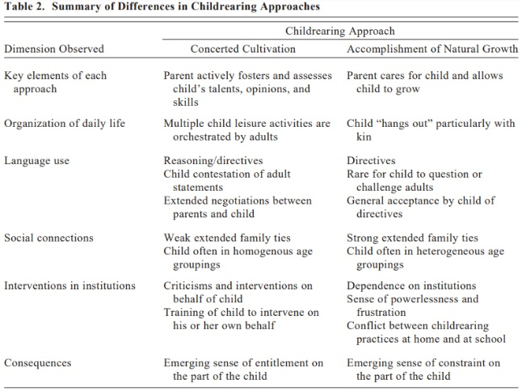
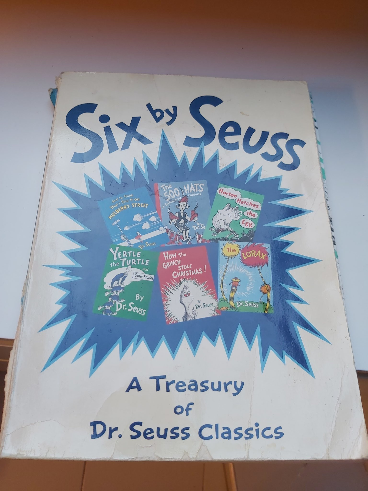
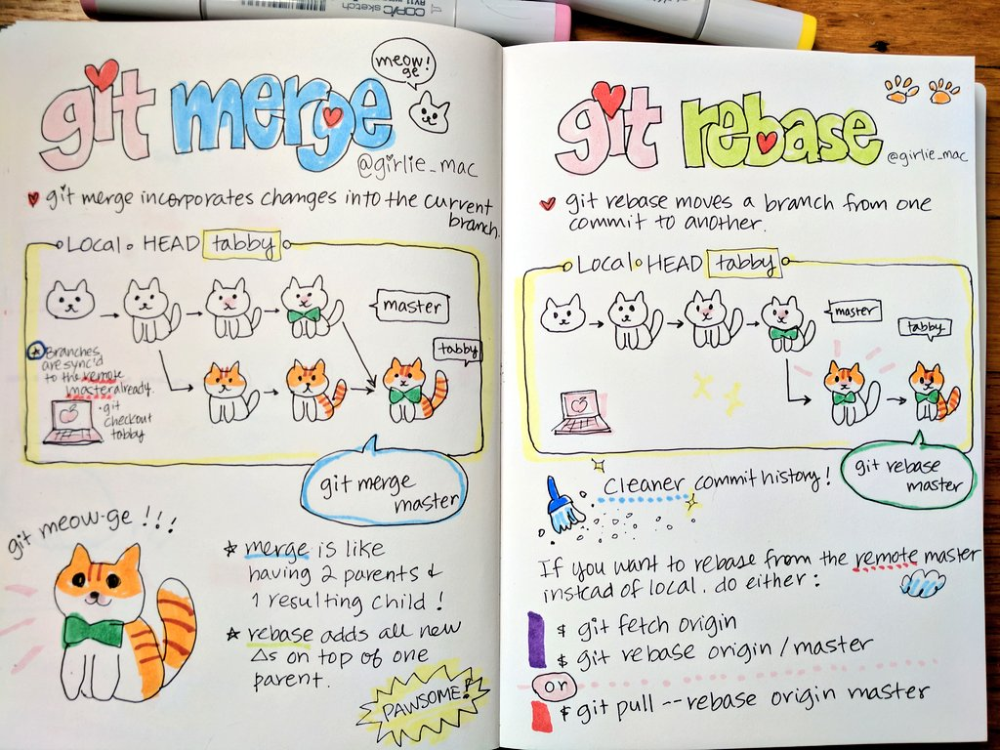
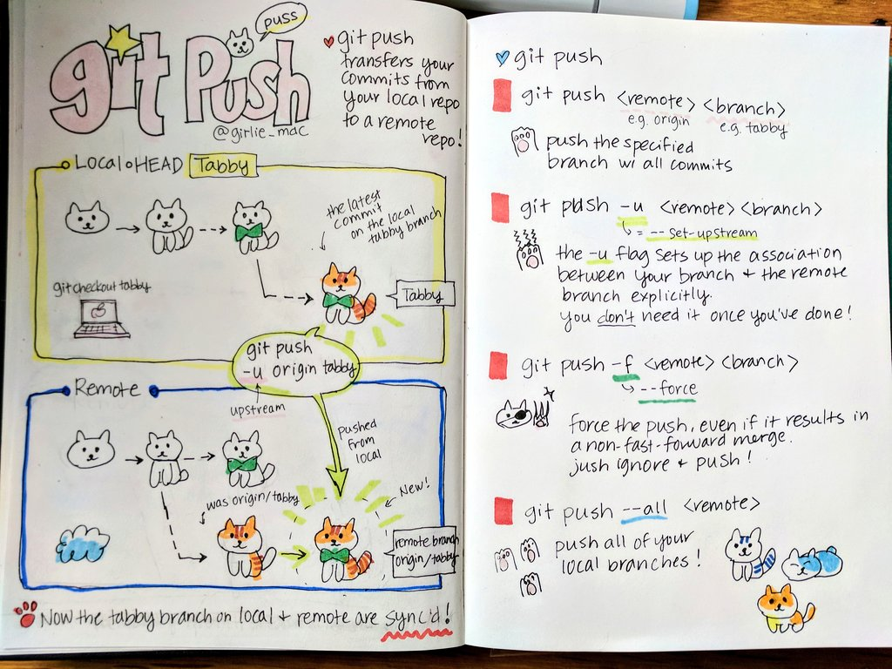

### Książki i bajki

* Kodowanie dla dzieci, Marc Scott

* Edukacja Domowa, Wiesław Stebnicki

* Czy to puszcza bąki? 

* Underground History of American Education - https://archive.org/details/JohnTaylorGattoTheUndergroundHistoryOfAmericanEducationBook

* https://github.com/TomaszWaszczyk/historia.waszczyk.com/blob/master/src/content/documents/Americas%20Great%20Depression_Polish_3.pdf

* Anna Pierzchała, Pasywność w szkole. Diagnoza zjawiska z punktu widzenia analizy transakcyjnej, Wydawnictwo im. S. Podobińskiego Akademii im. J. Długosza w Częstochowie, Częstochowa 2013

* Kot Biznesik - Arkadiusz Błażyca

* Johnny Profit - Malgeri Michael A.

* Jak powstaje bogactwo, i kiedy nie powstaje

* Wielka Wyprawa Felicii

* Opowiadania dla dzieci cz. 2 4CD - Singer Bashevis Isaac

* BLIŹNIĘTA TUTTLE I CUDOWNY OŁÓWEK - Connor Boyack

* BLIŹNIĘTA TUTTLE POZNAJĄ PRAWO - Connor Boyack

* Seria książek o ulicy Czereśniowej

* Rok w lesie

* Robert Patrick Murphy, Lessons for the Young Economist

* Mądroboty - bajka

* Na tropie angielskich słówek

* Tajemniczy Tunel. Ucieczka Leonarda, Olaf Fritsche (~10+)

* 88/89, Michał Rzecznik, Przemek Surma

* Piaskowe malowanki

* Piaskowe ozdoby choinkowe

* Toledo told to children - Maria Aguado Molina

* Przyjaciele żyrafy - Joanna Berendt, Aneta Ryfczyńska (Bajki o empatii)

* Dlaczego tańczymy ze szczęścia i kipimy ze złości? Historyjki dla ciekawskich dzieci

* Róża, a co chcesz wiedzieć? Komiks edukacyjny o technologiach dla dzieci

* Mała encyklopedia nauki, Emmanuel Chanut

* Bitcoin Money, A Tale of Bitville Discovering Good Money

* Renata Piątkowska "Opowiadania do chichotania" audiobook.

* https://abc-ekonomii.edu.pl

* https://www.nbportal.pl/wiedza/prezentacje

* Świat pieniądza, Fundacja Świat Pieniądza

* https://ukochaneprzygody.pl/ - https://www.youtube.com/channel/UCfWxydXsFgTuMIoyTUICMLw

* ABC ekonomii, czyli pierwsze kroki w świecie finansów – Wiktor Czepczyński, Żaneta Kupczyk

* Złoto Johnnego - Michael A. Malgeri

* Bajki Kwantowe: Seria 1 – Kamil Hajduk

* Twoje kompetentne dziecko, Juul Jesper

* https://altenberg.pl/superniania/

* https://lingumi.com/

* Dzieje Polski opowiedziane dla młodzieży, Feliks Koneczny

* Baby Loves Quantum Physics! (Baby Loves Science) by Ruth Spiro (Author), Irene Chan (Illustrator)

* https://www.rigb.org/families

<video width="640" height="480" controls>
  <source src="./movies/wychowanie-mlodego-czlowieka/wujek-sknerus.mp4" type="video/mp4">
Your browser does not support the video tag.
</video>

### Programowanie = szkoła myślenia

* https://shelly.dev/

* https://scratch.mit.edu/

* https://code.org/curriculum/unplugged

* https://www.tinkercad.com/

* https://www.codingame.com/start

* https://www.geogebra.org/

* Baw się kodem! Twoja własna gra. CoderDojo Nano - Jurie Horneman, CoderDojo

* Lift-the-Flap Computers and Coding

* Code For Teens: The Awesome Beginner’s Guide to Programming Volume 1: Javascript by Jeremy Moritz

* http://www.csforbabies.com/

* https://code.org/learn

* https://www.opentechschool.org/

* https://codecombat.com/

* https://play.elevatorsaga.com

* https://www.ampleforth.org.uk/college/

* https://koderek.edu.pl/

* BBC micro:bit (BeagleBoard.org PocketBeagle)

* https://www.wczesnaedukacja.pl/pakiet-1-polski-karty-do-metody-Domana

* https://www.wowenglish.com/pl/

* https://www.czytajzalbikiem.pl/produkty/

* Python na start! Programowanie dla nastolatków

* Proste projekty dla młodych majsterkowiczów

* Lego Education

* Neural Networks for Babies - Chris Ferrie

* Brainwashed: How Universities Indoctrinate America's Youth

* https://www.kiwico.com/

* https://scottiego.com/pl/edu-scottiego-dojo/about-dojo/

* https://mitsloan.mit.edu/ideas-made-to-matter/lost-einsteins-us-may-have-missed-out-millions-inventors

### Wykształcenie wartości pracy, sens pracy oraz oszczędzania (odwlekanie nagrody w czasie, pieniądze)

* https://usstocks.pl/edukacja-finansowa-dzieci/

### Zachowanie (netykieta)

* https://www.godmother.pl/podcast

* W PARYŻU DZIECI NIE GRYMASZĄ

* odezwać się po spotkaniu

### Toys

* Dobble!!

* Monopoly dla Milenialsów..

* Prawo dżungli (~15)

### Szkoła

* https://ezw.edu.pl

* https://ezw.edu.pl/edukacja-z-wartosciami/

* https://www.edukacja-klasyczna.pl/

* How to survive your twenties Kindle Edition, Przemek Chojecki

### Bajki

* My Neighbor Totoro

* Porco Rosso

* Podniebna Poczta Kiki

* Bajki Ezopa

* Ja Ołówek

* Ekonomia w jednej lekcji, Henry Hazlitt

* Bieda. Przewodnik dla dzieci

* Zaskórniaki i inne dziwadła z krainy portfela. Liczby kultury

* Mrowisko, czyli niezwykłe losy mrówki BAK

* IRWIN A. SCHIFF Jak Powstaje Bogactwo, I Kiedy Nie Powstaje

* Kosmoliski, Marek Marcinowski

* Jak wychować dzieci na szczęśliwych dorosłych, Izabela Antosiewicz

* „Wielka Wyprawa Felicii”

### Inne

* https://www.subscribepage.com/kursRIE

* https://www.ojcowskastronamocy.pl/bedeker-rodzicielski/

* https://hummuseconomicus.pl/dzieci-jako-dobra-publiczne/

* https://pl.wikipedia.org/wiki/John_Dewey

* The Hacking of the American Mind: The Science Behind the Corporate Takeover of Our Bodies and Brains

* Closing of the American Mind: How Higher Education Has Failed Democracy and Impoverished the Souls of Today's Students

* محمدعبد THE MUQADDIMAHAbd Ar Rahman bin Muhammed ibn Khaldun Translated by Franz Rosenthal

* The Case against Education: Why the Education System Is a Waste of Time and Money

* Podręcznik „Wolna przedsiębiorczość”

*  Dzieci ojczyzny opowiadania historyczne dla młodzieży
Autor: Maria Dąbrowska

* https://pl.wikisource.org/wiki/Bajki_i_przypowie%C5%9Bci

* https://akademia.nask.pl/baza-wiedzy/dla-rodzicow.html

* https://sciencejournal.withgoogle.com/

* https://www.zooniverse.org/

* https://www.desmos.com/calculator

<!-- https://blog.cdt.pl//89058-zdalna-edukacja-w-czasie-zamkniecia-szkol -->

<a href="./documents/wychowanie-mlodego-czlowieka/The_Case_Against_Education_by_Bryan_Caplan.pdf" target="_blank">The_Case_Against_Education_by_Bryan_Caplan</a>

 

<video width="640" height="50" controls>
  <source src="./img/wychowanie-mlodego-czlowieka/Jak-klasa-społeczna-wpływa-na-styl-wychowawczy.mp3" type="video/mp4">
Your browser does not support the video tag.
</video>

---

* metoda zielonego ołówka

docenianie != chwalenie (docenianie to droga, chwalenie to efekt)

myślenie krytyczne

https://pl.wikipedia.org/wiki/Pedagogika_wstydu

<!-- https://globalna.ceo.org.pl/ -->

<!-- https://sklep.blogojciec.pl/ 

https://en.wikipedia.org/wiki/Hamming_code

docenianie (droga) != chwalenie (efekt)

metoda zielonego ołówka

Róża, a co chcesz wiedzieć? Praca zbiorowa

Niekończąca sie opowieść

kodeks rodzinny

-->

evidence based education

https://waitbutwhy.com/2019/08/story-of-us.html

### Kursy online

* https://schoolhouse.world

---

  

  

  

<a href="./documents/others/wychowanie-mlodego-czlowieka/bajka.pdf" target="_blank">Chłopiec, rower i wolny rynek</a>

---

Dziecko otoczone krytyką uczy się winić;Dziecko otoczone ośmieszeniem uczy się być nieufnym;Dziecko otoczone wrogością uczy się walczyć;Dziecko otoczone gniewem uczy się zadawać ból;Dziecko otoczone niezrozumieniem uczy się nie słyszeć innych;Dziecko otoczone oszustwem uczy się kłamać;Dziecko otoczone wstydem uczy się czuć się winnym;... i tylko silne dusze mogą złamać ten krąg ...

Dziecko otoczone wsparciem uczy się chronić;Dziecko otoczone czekaniem uczy się być cierpliwym;Dziecko otoczone pochwałami uczy się być pewnym siebie;Dziecko otoczone uczciwością uczy się być uczciwym;Dziecko otoczone bezpieczeństwem uczy się ufać;Dziecko otoczone aprobatą uczy się szanować samego siebie;Dziecko otoczone miłością uczy się kochać i obdarzać miłością;Dziecko otoczone swobodą wyboru uczy się być odpowiedzialnym za swoje decyzje.... i taka edukacja jest trudna do złamania ...

---

Nie rób z dziecka "niezdary", czyli lista domowych obowiązków dopasowanych do wieku:

3 lata- zbieranie swoich zabawek- samodzielne mycie zębów- wkładanie wyznaczonych ubrań do pralki lub kosza- ubieranie się- pomoc w karmieniu zwierzaków

4- 5 lat- ścieranie kurzu- sprzątanie ze stołu- zmiana pustej rolki po papierze toaletowym- wyciąganie zakupów z toreb- ścielenie swojego łóżka

6 - 8 lat- opróżnianie i załadowanie zmywarki- składanie prania- podlewanie kwiatów- ścieranie kurzu- pomoc w ogródku (grabienie liści itp.)

9 - 11 lat- wyjście do sklepu- pomoc w przygotowaniu obiadu- wyrzucanie śmieci- odkurzanie- wyprowadzanie psa- samodzielna pobudka (z budzikiem)

12 lat i więcej- opieka nad rodzeństwem- pomoc w sprzątaniu kuchni i łazienki- wspólne mycie samochodu

Pamiętaj, dziecko wcale nie jest zbyt małe, żeby nie robić nic w domu - przyda Ci się pomoc, a dla niego to niesamowita lekcja zaradności.

---

Chcesz zrobić dziecku prezent na święta? Nie masz pomysłu ? To ja mam!

Przytulaj go i całuj, mów że go kochasz i że jesteś. NIe krzycz i nie narzekaj, że nie ma
sz czasu, ciesz się z jego sukcesów, przeżywaj z nim porażki. Gotuj z nim, czytaj, chodź na spacery i graj w gry. Wygłupiaj się bo TY tez jesteś dzieckiem.WARTO!Przytulanie, całkowanie wyzwala w mózgu dziecka ogromne pokłady hormonów i neuroprzekaźników takich jak oksytocyna, dopamina czy serotonina. Oksytocyna to hormon miłości. Powoduje, że pomiędzy dzieckiem a rodzicem buduje się niepowtarzalna więź. Dopamina daje motywację do działania bo uruchamia ośrodek nagrody w mózgu.Serotonina sprawia, że lepiej rozumiemy i regulujemy nasze emocje.TO jest prawdziwy prezent! Na całe życie!na zdjeciu: prof. Rebecca Saxe i dwu-miesięcznego syn Percy. Profesor na co dzień zajmuje się badaniem funcjonalności mózgu.Skany mózgu syna prof. Rebecci Saxe to niepodważalny dowód na to, że rodzicielstwo, bliskość, ma ogromny sens. Tak nie wiele może zdziałać tak wiele.

---

"Society has provided [children] no rituals by which they become members of the tribe, of the community. All children need to be twice born, to learn to function rationally in the present world, leaving childhood behind.

---

<a href="https://github.com/TomaszWaszczyk/historia.waszczyk.com/edit/master/src/content/wychowanie-mlodego-czlowieka.md" target="_blank">Edytuj tę stronę dzieląc się własnymi notatkami!</a>
