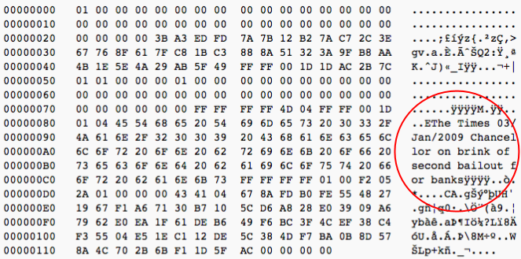

### 2050

~~ https://en.wikipedia.org/wiki/Post-scarcity_economy ~~ Fully Automated Luxury Communism

https://en.wikipedia.org/wiki/Technological_utopianism

### 2038

https://pl.wikipedia.org/wiki/Problem_roku_2038

### 2030

Agenda 2030: https://en.wikipedia.org/wiki/Sustainable_Development_Goals

The megatrend in cryptography of the 2010s was elliptic curves, pairings and general purpose ZKPs/SNARKs.

The megatrend of the 2020s will be (in addition to broad adoption of the above) lattices, LWE, multilinear maps, homomorphic encryption, MPC and obfuscation.

---

Sustainable Development Strategy:Egypt's vision 2030And Planning Reform

---

### The billionaire flippening

As a bonus final item, my friends Olaf Carlson-Wee and Balaji Srinivasan estimate that at a price of $200,000 per Bitcoin, more than half the world’s billionaires will be from cryptocurrency. Whether you think this is a good thing or a bad thing, it means there will be more pro-technology people with access to large amounts of capital in the 2020s. Presumably, this will increase the amount of investment made in science and technology, and I think we’ll see more crypto folks turn to philanthropy (we’ve seen this already with efforts like the Pineapple fund, GiveCrypto.org, and the GivingPledge).

---

Change definition of government:

https://en.wikipedia.org/wiki/Quadratic_voting

---

* Ceny mięsa z powodu kryzysu ekologicznego powinny rosnąć.

* Ceny wody powinny rosnąć z powodu kryzysu ekologicznego.

---

### 2025

Made in China 2025

[OPINION]: Digital currencies from central banks.

### 2020+

Stagflacja??? Inflacje w Polsce???

> W ocenie Falińskiego, sytuacja w Polsce, a już szczególnie w branży handlowej, może przypominać stagflacyjne załamanie z czasów pierwszego kryzysu naftowego (1973 rok). - Wtedy poszło o ropę i jej szok cenowy, wtedy także uruchomiono socjalne wyrzuty pieniędzy na rynek pracy, wtedy też interweniowały banki centralne, co w Polsce pewnie niebawem nastąpi. Nie jest też fantasmagorią mówić o tzw. bańkach spekulacyjnych, np. na rynkach kapitałowych, w żywnościówce, w nieruchomościach. Niedobre to podobieństwa i nie udawajmy, że jest inaczej - podkreśla Andrzej Faliński.

Interest rates are at the lowest point in 5,000 years of history.

They're lower than when FDR, Napoleon, Genghis Khan, Julius Caesar and even Hammurabi were in power.

Written by Rhythm@Twitter

  

  

Wolfgank Streeck - End of Democrasy (https://en.wikipedia.org/wiki/Wolfgang_Streeck)

### 2019

Rozmowy w Polsce o implementacji MMT: https://en.wikipedia.org/wiki/Modern_Monetary_Theory (https://en.wikipedia.org/wiki/Post-Keynesian_economics)

<a href="./books/mmt.pdf" target="_blank">MMT</a>

https://en.wikipedia.org/wiki/Green_New_Deal

Monako jako pierwsze państwo objęte chińskim 5G.

---

George Tritch's strategy from 1872 has a 91% hit rate.

His 150 year old strategy correctly identified the (near) peaks of 1929, 1999, 2007 and 2020.

Despite technology, progress and regulations market cycles don't change much.

Human nature never changes.

  

---

#### August

China, the European Union, and the United States are now emerging as the main competitors for global leadership in AI. Indeed, China, which achieved success in the Internet economy in part by shutting out U.S. firms, has clearly stated its ambition of achieving dominance in AI—both to increase its competitiveness in industries that have traditionally been vital to the U.S. and EU economies, and to expand its military power.

Moreover, the EU’s coordinated plan on AI states that its “ambition is for Europe to become the world-leading region for developing and deploying cutting-edge, ethical and secure AI.” The outcome of this race to become the global leader in AI will affect the trio’s future economic output and competitiveness, as well as military superiority.

Overall, the United States currently leads in AI, with China rapidly catching up, and the European Union behind both. The United States leads in four of the six categories of metrics this report examines (talent, research, development, and hardware), China leads in two (adoption and data), and the European Union leads in none—although it is closely behind the United States in talent.

Europe has no own data platforms nor own software. The is no AI competitiviness nor superiority without own software and platforms. Europe is on path to digital wormhole as real IT power economies are eating data, value flows and monetary assets from the economy with digital software systems and infrastructure.

---

Digital freedom is in jeopardy

Humans and organizations have lost their freedom in the modern digital binary sphere or in more common terms Internet. There are no longer equal opportunities as we have been guided by marketing to demand short terms functional freedom for hedonism, pleasure, cost free and easy to use. This will eventually lead to atrophication and destruction of our own culture and fundamental values in society. This development is limiting our opportunities to control our own destiny and opportunities to innovate, create, exceed and save our own values, society, culture and economy.

The digital age is causing enormous shifts in the balance of power between individuals, the state and monopolistic corporations. The European law-based systems is being challenges by global states by blatant ignorance of multinational and lateral ethics, values, guidelines, procedures, agreements and international laws. Europe cannot play the ethical and free market valedictorian while others are just arrogantly slapping these principles with wet towels on economic unions, societies and people unsuspecting acting in good faith. European should realize this model is no longer working in the interest of Europeans. Europeans should start acting together to safeguard freedom, justice and solidarity. It is us the Europeans who can only stop this outsourcing of values, society, culture and economy. Recognizing this need for special protection of children, youth, teens, adolescents and particularly vulnerable groups suffering from lack on skills and competencies in the digital sphere.

Digital monopolies are today controlling our freedom with software-based products, systems, platforms and clouds. This asymmetric software control of our lives avoids us to excel as free cultures and societies. Our own values, society, culture, legal system and economy must be the leading opportunity, freedom and openness driven approach to the future. Our human cultural values and ethics cannot evolve if they are controlled in secret totalitarian manner which are able to limit and suffocated by outside controls. The free men’s own uncontrolled communication solutions, systems and networks are the very essence on modern progress, development and advancement in open evolution. This openness and free digital cultural ecology is essence and necessity, when creating new foundation for privacy, transparency, digital autonomy, software sovereignty, free society, obey of the law, transparent ethics and open systems.

Software gives digital freedom

European own software gives digital freedom in the information age. Today Europe imports 99,5% of all software and at the same time we have totally neglected the strategic narrative around software role as central and material factor in creating privacy, transparency, digital autonomy, software sovereignty, free society and economically sustaining way of life. It our task to safeguard our own understanding, control, governance, dignity, equality, security, transparency and openness in software defined digital era. The software is the creative digital binary sphere raw material as the electrons, neurons, atoms and molecules are in physical world. Software of the Information Age defining our life by us or by alien outsiders not respecting our own values, society, culture, education and economy.

European software is the core challenges of in order to build a strong information age Europe. It is vital that today’s strategic innovation agenda’s, policies and actions reflect this development to close massive cognitive gap in European knowledge base. The economic freedom must be strengthened by making digital policies more European and thereby strengthen Europe’s position in the digital world as leader, innovation and one setting stage for future from Europe.

---

I have been asked why the term #software is used. The term #software is used from several reasons - here few to start with:

1) Informations systems created with #software have been identified as important as weapons by modern war theorists in 1967
2) In 1968 the NATO meetings development basically banned Europes role in strategic #software domain
3) In 80's software based OS unleased #software based creativity as OS allowed the HW evolve below and SW evolve above it. 
4) In 1984 the worlds richest man stated that #software is the magic inside smart devices
5) In 1996 MIT declared #software as the new general purpose technology
... and many more arguments which would explain the #software words importance as the most strategic and recent symbolic artifact to create what did not exists before.
6) The software as ecology, economy or industry is NOT studied today at all compared to agriculture, traffic, mfg or financial sectors to every little detail and actor even it has over 6 000 billion € indirect effect annually alone in EU.

---

> The central issue is we’re developing into a plutocracy,” he told me. “We’ve got an enormous number of enormously rich people that have convinced themselves that they’re rich because they’re smart and constructive. And they don’t like government, and they don’t like to pay taxes.

Paul Volcker

> “I don’t believe we shall ever have a good money again before we take the thing out of the hands of government. That is, we can’t take them violently out of the hands of government. All we can do is by some sly roundabout way introduce something that they can’t stop.”

Hayek

---

### 2017

https://en.m.wikipedia.org/wiki/Xinjiang_re-education_camps

### 2015

The growth of ConsenSys, like the growth of Ethereum itself, has been explosive. Today, the company has 1,000 employees, working in 28 countries, some from their homes or coffee shops, some in formal office setups in Brooklyn; San Francisco; London; Tel Aviv, Israel; Bucharest, Romania; and Sydney and Queensland, Australia. The company structure is inspired by Lubin's utopian ideals. Employees choose their own titles, and instead of a traditional hierarchy, there's a governance structure called a "holocracy," a ­decentralized system of management where power is "distributed" among self-organizing teams. Funds are doled out for individual projects by a "resource-allocation circle"—individuals who are chosen by their co-workers to serve based on their abilities.

Ron Resnick, a former lead developer of 4G for Intel, who now heads the EEA, says that some financial services, including Santander and JPMorgan, are already integrating Ethereum-based blockchains into their business for settlement and other purposes. But the transition to widespread use is likely to be gradual and won't begin in earnest until standards that ensure interoperability are completed, probably next year.

Michael Casey, co-author of the 2018 book "The Truth Machine: The Blockchain and the Future of Everything," and a senior adviser for the Digital Currency Initiative at MIT's Media Lab, says before mass adoption can occur Ethereum and other blockchain companies will need to address and upgrade the speed and scalability of the technology—problems that thousands of developers are actively working to address. "The internet was ­developed over 40 years. It's really complicated stuff," he says. "The technology has to evolve and become scalable."

### 2013

https://en.wikipedia.org/wiki/Belt_and_Road_Initiative

https://en.wikipedia.org/wiki/Black_Lives_Matter

### 2012

https://liberprimus.org/

### 2009

> The desirable goal of reforming the international monetary system is to create an internation reserve currency that is disconnected from individual nations and is able to remain stable in the long run, thus removing the inherent deficiencies caused by using credit-based national currencies. - Dr Zhou Xiaochuan, Governor of the Poeple's Bank of China

  

### 2008

https://en.wikipedia.org/wiki/Foreign_Intelligence_Surveillance_Act_of_1978_Amendments_Act_of_2008

https://en.wikipedia.org/wiki/Deindustrialisation_by_country

### 2007

https://en.wikipedia.org/wiki/Protect_America_Act_of_2007

https://pl.wikipedia.org/wiki/Klub_Ronina => Józef Orzeł

### 2004

https://en.wikipedia.org/wiki/Electronic_benefit_transfer

### 2003

Jesienią 2013 roku, chiński cesarz ogłasza rozpoczęcie programu „Pasa i Drogi” , którego projekty infrastrukturalne w następnych latach finansowane zostają w całości z funduszy pochodzących z dumpingu papierów UST o świetlanym ratingu AAA. Dla wszystkich rozeznanych w sytuacji stało się jasne, że chiński reżim, będący podówczas największym pożyczkodawcą US, zaprzestał gromadzenia długu US w sytuacji, kiedy ten z roku na rok przyrasta w zawrotnym tempie biliona $.

### 2000

https://en.wikipedia.org/wiki/David_Lyon_%28sociologist%29 - Electronic Eye: The Rise of Surveillance Society: David Lyon

https://en.wikipedia.org/wiki/Michel_Foucault

### 1999

The separation between deposit and investment banking has been removed: https://en.wikipedia.org/wiki/Glass%E2%80%93Steagall_legislation (introduced in https://www.historia.waszczyk.com/may-23)

### 1997

https://pl.wikipedia.org/wiki/Academi prywatna armia

### 1994

Nick Szabo’s 1994 article “Formalizing and securing relationships on public networks”

### 1992

https://en.wikipedia.org/wiki/Hyperinflation_in_Yugoslavia

### 1989

https://pl.wikipedia.org/wiki/Teoria_Deng_Xiaopinga

### 1985

https://en.wikipedia.org/wiki/Great_Moderation

### 1984

https://en.wikipedia.org/wiki/Cyberpunk

### 1983

https://pl.wikipedia.org/wiki/Costco

### 1982

<video width="640" height="480" controls>
  <source src="./img/year-by-year/kartki.mp4" type="video/mp4">
Your browser does not support the video tag.
</video>

https://pl.wikipedia.org/wiki/I_etap_reformy_gospodarczej

---

https://pl.wikipedia.org/wiki/Wojna_o_Falklandy-Malwiny

### 1980

https://en.wikipedia.org/wiki/Reaganomics

https://en.wikipedia.org/wiki/Medicaid

### 1977

https://en.wikipedia.org/wiki/RSA_(cryptosystem)

https://pl.wikipedia.org/wiki/Choroba_holenderska

### 1976

Real King of the World:

https://en.wikipedia.org/wiki/Kohlberg_Kravis_Roberts

https://www.tpg.com/

https://www.carlyle.com/

### 1975

https://en.wikipedia.org/wiki/Metamodernism

https://pl.wikipedia.org/wiki/List_59

### 1974

Stagflacja w USA: https://pl.wikipedia.org/wiki/Stagflacja

https://pl.wikipedia.org/wiki/MKUltra

### 1973

https://pl.wikipedia.org/wiki/Kryzys_naftowy

### 1972

https://pl.wikipedia.org/wiki/Granice_wzrostu_(raport_Klubu_Rzymskiego)

### 1971

https://en.wikipedia.org/wiki/Nixon_shock

China - Kissinger meeting

https://china.usc.edu/getting-beijing-henry-kissingers-secret-1971-trip

"Your dollar will be worth just as much tomorrow as it is today." Nixon believing in Santa Claus in 1971. Bye bye Gold Standart!

"Gentlemen, you can calm down. The printing presses run day and night again in three shifts."

Rudolf Havenstein, German President of the Reichsbank (German central bank) during the Weimar Republic hyperinflation of 1921–1923

### 1970

https://en.wikipedia.org/wiki/Bloom_filter

https://en.wikipedia.org/wiki/Eco-capitalism

https://en.wikipedia.org/wiki/Demoscene

https://en.wikipedia.org/wiki/Reverse_racism

---

Paul Volcker was Chairman of the Federal Reserve under U.S. presidents Jimmy Carter and Ronald Reagan from August 1979 to August 1987. He is widely credited with having ended the high levels of inflation seen in the United States during the 1970s and early 1980s.

### 1966

By the summer of 1966, the pressure on sterling was acute but Wilson was determined to resist devaluation. To him the pound was a symbol of national status, of Britain’s role in the world as a key player. On 12 July 1966 the Cabinet rejected the devaluation option and agreed to a tough package of deflation and austerity instead.

However, due to several factors including international crises and dock strikes, by November 1967 the financial pressures had become overwhelming. On 16 November the Chancellor of the Exchequer, James Callaghan, with Wilson’s backing, recommended to the Cabinet that sterling should be devalued by just under 15 per cent. This was agreed and then implemented, at 14 per cent on 18 November. A package of measures including defence cuts, restrictions on hire purchase (credit), and higher interest rates was also agreed.

---

Nie ma boga! (Radziecki plakat antyreligijny z lat 60. XX wieku)

  

### 1958

https://en.wikipedia.org/wiki/Meritocracy

https://pl.wikipedia.org/wiki/Dwie_koncepcje_wolno%C5%9Bci

"Społczeństwo zostanie zmiażdżone ciężarem zbiorowej przeciętności, wszystko co bogate i różnorodne zostanie zmiażdżone ciężarem przyzwyczajenia, stałą tendencją ludzi do konformizmu który rodzi jedynie zwiędnięte zdolności skrępowane i storreryzowane, skórczone i skarwołaciałe istoty ludzkie" - Isaiah Berlin

### 1956

https://en.wikipedia.org/wiki/Hyperinflation

### 1954

https://en.wikipedia.org/wiki/Value-added_tax

### 1953

https://pl.wikipedia.org/wiki/Zniewolony_umys%C5%82

---

In February 1953, the first trainload of European coal crossed national borders without the need for traditional customs duties. The European common market for coal and steel became a reality.

### 1950

https://en.wikipedia.org/wiki/Schuman_Declaration

https://pl.wikipedia.org/wiki/Historia_Indii - niedpodległość Indii względem Wielkiej Brytani

https://en.wikipedia.org/wiki/Pax_Europaea

Wynaleziono wskaźnik PKB - Produkt Krajowy Brutto

### 1949

A rush to retrieve gold from the bank before the Communist victory, Shanghai, 1949.

---

  

### 1948

Jakub Berman zmienia sposób kształcenia elit polskich poprzez usunięcie przedmiotów związanych z krytycznym myśleniem, samodzielnym myśleniem oraz logiką: https://en.wikipedia.org/wiki/Jakub_Berman

Książka z 1938 roku do nauki propedeutyki filozofii: https://github.com/TomaszWaszczyk/historia.waszczyk.com/blob/master/src/content/books/ajdukiewicz-propedeutyka_filozofii.pdf

### 1945

https://en.wikipedia.org/wiki/The_Open_Society_and_Its_Enemies

### 1940

https://en.wikipedia.org/wiki/Bancor

https://en.wikipedia.org/wiki/Operation_Bernhard - próba wyparcia pieniądza!!

### 1939

https://en.wikipedia.org/wiki/Monster_Study

https://pl.wikipedia.org/wiki/Operacja_Tannenberg

### 1938

  

  

### 1937

https://pl.wikipedia.org/wiki/Strajk_ch%C5%82opski_(1937)

### 1932

Wörgl was the site of the "Miracle of Wörgl" during the Great Depression. It was started on July 31, 1932, with the issuing of "Certified Compensation Bills", a form of local currency commonly known as Stamp Scrip, or Freigeld.

https://pl.wikipedia.org/wiki/Wielki_g%C5%82%C3%B3d_na_Ukrainie

https://pl.wikipedia.org/wiki/Reforma_j%C4%99drzejewiczowska

https://pl.wikipedia.org/wiki/Socrealizm

<!-- reforma edukacji -->

### 1931

https://pl.wikipedia.org/wiki/Jednostka_731

### 1930

https://pl.wikipedia.org/wiki/Getto_%C5%82awkowe

---

BIS (Bank Rozrachunków Międzynarodowych) został założony w 1930 roku przez gubernatora Banku Anglii, Montague Normana i jego niemieckiego kolegę Hjalmar-a Schacht-a, który później został ministrem finansów Adolfa Hitlera.

Bank został założony w celu ułatwienia przekazów pieniężnych związanych z niemieckimi reparacjami wynikającymi z traktatu wersalskiego, ale już na początku drugiej wojny światowej, BIS w dużej mierze był kontrolowany przez głównych nazistowskich urzędników. Ludzi takich jak Walter Funk, który był mianowany na ministra propagandy hitlerowskiej w 1933 roku, zanim został ministrem gospodarki. Kolejnym dyrektorem BIS w tym okresie był Emil Puhl, który jako dyrektor i wiceprezes Banku Rzeszy w Niemczech był odpowiedzialny za kontrolę nazistowskiego złota. Zarówno Funk jak i Puhl zostali skazani w procesie norymberskim za zbrodnie wojenne.

Inni dyrektorzy BIS to Herman Schmitz, dyrektor IG Farben, którego spółka odpowiedzialna była za min produkowane cyklonu B, gazu stosowanego w hitlerowskich komorach gazowych służącego do zabijania żydów i dysydentów politycznych, w czasie Holokaustu. Podczas drugiej wojny światowej, IG Farben współpracował ze Standard Oil Co. Johna D. Rockefeller-a.
Kolejny to Baron von Schroeder, właściciel JHStein Bank, banku który przetrzymywał depozyty gestapo.

W książce “Trading With The Enemy, How the Allied multinationals supplied Nazi Germany throughout World War Two” opisano jak międzynarodowe siły podczas konferencji Bretton Woods w lipcu 1944 r. chciały zlikwidować Bank Rozrachunków Międzynarodowych, ponieważ wspierał wykradnie majątków w krajach okupowanych przez hitlerowskie Niemcy. Norwegia wezwała do likwidacji banku i była popierana przez Harryego Dexter Whitea, amerykańskiego sekretarza skarbu i Henryego Morgenthau, ale BIS przetrwał mimo oczywistych powiązań z nazistami.

Higham pisze, że BIS stał się: "ścieżką dla transferów funduszy amerykańskich i brytyjskich płynących do Hitlera by pomóc mu budować maszynę wojenną". Minister finansów Hjalmar Schacht, określił zadanie banku jako "instytucji, która zachowa kanały komunikacji i porozumienia między przywódcami świata finansowego, nawet w przypadku konfliktu międzynarodowego. Zostało to zapisane w Statucie Banku i poparte przez rządy, że BIS powinien być zwolniony od zajęcia, zamknięcia lub wotum nieufności, bez względu na to czy jego współwłaściciele są w stanie wojny czy nie."

"BIS był całkowicie pod kontrolą Hitlera od wybuchu II wojny światowej", pisze Higham.
"Wśród dyrektorów pod przewodnictwem Thomasa H. McKittrickza był Hermann Shmitz, szef słynnej nazistowskiej IG Farben, baron Kurt von Schröder, szef J.H. Stein Bank of Cologne oficer i finansista Gestapo, dr Walter Funk szef Banku Rzeszy, oraz, oczywiście, Emil Puhl. Te dwie ostatnie osoby były osobiście obsadzone przez Hitlera ".

Higham również szczegółowo opisał jak złoto zrabowane z krajów okupowanych przez hitlerowców było złożone w sejfach kontrolowanych przez BIS i jak hitlerowcy, którzy następnie kontrolowali ten bank zakazali wszelkich dyskusji na temat kradzieży. "BIS był narzędziem Hitlera, ale jego dalsze istnienie zostało zatwierdzone przez Wielką Brytanię, nawet po tym jak Wielka Brytania udała się na wojnę z Niemcami. Brytyjski dyrektor Sir Otto Niemeyer i przewodniczący Montagu Norman, pozostali na stanowisku do końca wojny", pisze Higham.

Kongresman John M. Coffee sprzeciwiał się, że amerykańskie pieniądze były inwestowane przez bank w 1944 roku. "Nazistowski rząd ma 85 milionów franków szwajcarskich w złocie w depozycie BIS. Większość członków zarządu składa się z nazistowskich urzędników. Jednak amerykańskie pieniądze są zdeponowane w banku ", skarżył się Coffee. W 1948 roku BIS został zmuszony do przekazania jedynie 4 mln funtów zrabowanego złota aliantom, ale dzięki ludziom takim jak Harry Truman i rodzinie Rockefellerów, bank nie został rozwiązany. Jeden z najbardziej wpływowych dyrektorów, nazistowskich, bankier Emil Puhl został zaproszony do Stanów Zjednoczonych jako gość honorowy w 1950 roku.

Pomimo niechlubnej przeszłości, BIS trwa do dziś jako główne ramie zarządzania światowych elit. Bank posiada władzę, poprzez kontrolę ogromnych ilości globalnej waluty. BIS kontroluje nie mniej niż 7% dostępnych światowych środków dewizowych, a także posiada 712 ton złota, prawdopodobnie znaczną część, tego złota została skradziona z krajów okupowanych przez nazistów, którzy kontrolowali bank w trakcie wojny.

Dzięki kontroli wymiany walut, a także złota, BIS może kontrolować warunki ekonomiczne w praktycznie każdym kraju. Pamiętaj, że następnym razem gdy Ben Bernanke czy prezes Europejskiego Banku Centralnego Jean-Claude Trichet zapowiedzą podwyżki stóp procentowych, nie stało się to bez zgody zarządu BIS.

BIS jest po prostu ogromnym funduszem globalnego rządu, przez który przetacza się transfer majątku obywateli do IMF-u. "Na przykład, pieniądze amerykańskich podatników można przepuścić przez BIS do IMF-u i stamtąd właściwie gdziekolwiek indziej. W istocie, BIS pierze pieniądze, ponieważ nie ma konkretnych rachunkowości ani zapisów pochodzenia transferów, ani informacji o odbiorcach", pisze Casey.

Fakt, że naziści byli ściśle zaangażowani w działalność globalnego banku centralnego, który jest obecnie reklamowany jako podstawa potęgi gospodarczej rządu światowego jest przerażające. Za każdym razem, gdy poznajemy historyczne korzenie światowego rządu, okazuje się, że naziści odegrali główną rolę w tworzeniu i administrowaniu instytucji, które dzisiaj mają na celu wprowadzenie zarządzania globalnego.

Podobnie jak w przypadku instytucji, które złożyły się na powstanie Unii Europejskiej, nazistowskie odciski palców widoczne są wszędzie, podobnie z planami zmierzającymi w kierunku globalnej władzy, niszczącej państwa narodowe i ich suwerenność.
Fakt ten obala jakiekolwiek przesłanki, że globalny rząd jest przychylny, humanitarny i służy ludzkości. Centralizacja władzy w rękach nielicznych z natury jest niedemokratyczna, elitarna, i na niekorzyść zwykłych ludzi.

Naziści, którzy tchnęli życie w przeszłe systemy globalnego autorytaryzmu są wykorzystywani do utworzenia obecnego światowego rządu. Ich dorobek został przywłaszczony przez elity, które okazały się bardziej cierpliwe w dążeniu do narzucenia światu dyktatury. Niemniej jednak ostateczny program pozostaje ten sam - rząd światowy, za zgodą społeczną lub przez podbój, którego jesteśmy świadkami.

"To Schacht, nie Owen Young, był autorem koncepcji, która urzeczywistniła się jako Bank Rozrachunków Międzynarodowych BIS. Szczegóły zostały wypracowane na konferencji, której przewodniczył Jackson Reynolds, „jeden z ważniejszych nowojorskich bankierów”, a w której uczestniczyli też Melvin Traylor z First National Bank of Chicago, sir Charles Addis, wcześniej z korporacji banków Hong Kongu i Szanghaju (bank Brytyjski), oraz wielu bankierów francuskich i niemieckich10. BIS był instytucją kluczową z punktu widzenia sprawnego wdrożenia Planu Younga jako miejsce umożliwiające prowadzenie międzynarodowej polityki walutowej.

Schacht poddał także Youngowi pomysł, który już po II wojnie światowej zaowocował powołaniem Międzynarodowego Banku Odbudowy i Rozwoju IBRD (znanego także jako Bank Światowy)."

...Na początku lat 30. najdoskonalszym narzędziem finansowej i politycznej kontroli nad światem, który Quigley określa „wierzchołkiem całego systemu”, był Bank Rozrachunków Międzynarodowych w Bazylei, w Szwajcarii. BIS świetnie funkcjonował w czasie II wojny światowej, gdy bankierzy – którzy, wszystko na to wskazuje, nie prowadzili ze sobą wojny – kontynuowali obopólnie korzystną wymianę pomysłów i informacji i snuli plany, jak należy urządzić powojenny świat. Jak zauważył jeden z autorów, wojna nie stanowiła dla międzynarodowych bankierów żadnej przeszkody:

"Okoliczność, że bank zatrudniał prawdziwie międzynarodową ekipę, tworzyła w czasie wojny dziwaczną sytuację. Prezes banku, Amerykanin, współpracował na co dzień z zasiadającym w zarządzie banku Francuzem, którego zastępcą był z kolei Niemiec, podczas gdy funkcję Sekretarza Generalnego pełnił Włoch. Obywatele innych krajów zajmowali pozostałe kluczowe stanowiska. Wszyscy na bieżąco kontaktowali się ze sobą wyjątkiem pana McKittricka wszyscy na stałe przebywali w Szwajcarii i oczekiwano po nich, że okażą się niepodatni na naciski ze strony swoich władz. Jednak regionalni dyrektorzy banku pozostawali w swoich macierzystych krajach i nie mieli bezpośredniego kontaktu z centralą.     Mówi się jednakowoż, że H. Schacht, prezes Reichsbanku, przez cały ten okres utrzymywał w Bazylei osobistego przedstawiciela."  - Henry H. Schloss, The Bank for International Settlements, (Amsterdam: North Holland Publishing Company, 1958)

### 1929

https://pl.wikipedia.org/wiki/Rozku%C5%82aczanie

### 1926

https://pl.wikipedia.org/wiki/Sanacja

### 1922

https://pl.wikipedia.org/wiki/%C5%BBydzi_w_parlamencie_II_Rzeczypospolitej

https://en.wikipedia.org/wiki/Monetary_reform_in_the_Soviet_Union,_1922%E2%80%9324

https://en.wikipedia.org/wiki/Operation_Trust

### 1919 (pomyśleć nad dokładnym rokiem)

WWI was possible because using inflation and central banking, the state wasn't limited to it's own savings, but could exhaust the savings of the populace in the war effort. Those conditions still exist today.

Bitcoin will return us to pre-war la belle epoque.

---

https://pl.wikipedia.org/wiki/Mi%C4%99dzynarod%C3%B3wka_Komunistyczna

### 1918

https://pl.wikipedia.org/wiki/Pandemia_grypy_w_latach_1918%E2%80%931919

Gdyby nie wybuchła I Wojna Światowa, to Polska w roku 1918 na pewno nie odzyskałaby niepodległości. Gdyby dwaj najważniejsi gwaranci naszego rozczłonkowania państwowego i naszego zniewolenia narodowego nie skoczyli sobie do gardeł w morderczym boju Polska nie odzyskałaby niepodległości – podkreśla w specjalnym komentarzu z okazji 100. rocznicy odzyskania przez Polskę niepodległości Jerzy Wolak

https://pl.wikipedia.org/wiki/Cesarstwo_Niemieckie

### 1917

Rewolucja bolszewicka: https://pl.wikipedia.org/wiki/Rewolucja_pa%C5%BAdziernikowa

### 1916

Wprowadzenie w USA 16 poprawki - podatku dochodowego - IRS.

### 1913

Utworzenie FED

## 1904

https://en.wikipedia.org/wiki/Protestant_work_ethic

### 1900

https://en.wikipedia.org/wiki/Gold_Standard_Act

https://en.wikipedia.org/wiki/Human_zoo

### 1884

https://en.wikipedia.org/wiki/Berlin_Conference

### 1880

https://pl.wikipedia.org/wiki/Faszyzm

### 1870

https://pl.wikipedia.org/wiki/Wielka_przebudowa_Pary%C5%BCa_w_latach_1852%E2%80%931870

### 1863

The Office of the Comptroller of the Currency (OCC) is an independent bureau within the United States Department of the Treasury that charters, regulates and supervises national banks and savings associations to ensure a safe, sound and fair banking system. The bureau was created by the National Currency Act of 1863 (later amended by the National Bank Act) to oversee a national banking system. The OCC is the primary regulator of banks chartered under the National Bank Act and federal savings associations chartered under the Home Owners' Loan Act. Institutions that seek to be nationally chartered (i.e. to build a nationwide branch networkii) must undergo an in-depth application process with the OCC. The OCC regulates almost 1,200 institutions that hold $12.9 trillion in total assets, almost 70% of all U.S. commercial banking assets.iii A few of the largest national banks include JPMorgan Chase Bank, N.A., Bank of America N.A., and Wells Fargo Bank, N.A.iv

The OCC is led by the Comptroller of the Currency. The Comptroller of the Currency is the administrator of the federal banking system and chief officer of the OCC. The Comptroller is also a director of the Federal Deposit Insurance Corporation and a member of the Financial Stability Oversight Council and the Federal Financial Institutions Examination Council. Brian P. Brooks is the current Acting Comptroller. Brian joined the OCC in March 2020 as chief operating officer (second in command) and took office as Acting Comptroller upon resignation of the former Comptroller (Joseph Otting) at the end of May 2020. Prior to joining the OCC, Brian was Chief Legal Officer at Coinbase, a crypto company that provides retail and institutional clients with trading, custody, payment, and other services for digital assets.

### 1850

https://pl.wikipedia.org/wiki/Tatarzy_krymscy - ZSRR wyrzuciło tatarów z Krymu, wzamian sprowadzili górników i dziwki

https://pl.wikipedia.org/wiki/Agraryzm

https://pl.wikipedia.org/wiki/Niemiecka_szko%C5%82a_historyczna

### 1847

https://en.wikipedia.org/wiki/Labour_power

### 1846

https://pl.wikipedia.org/wiki/Rze%C5%BA_galicyjska => https://pl.wikipedia.org/wiki/Strajk_ch%C5%82opski_(1937)

### 1842

https://pl.wikipedia.org/wiki/Podatek_dochodowy_od_os%C3%B3b_fizycznych

### 1841

https://en.wikipedia.org/wiki/Thomas_Cook

### 1839

https://pl.wikipedia.org/wiki/Wojny_opiumowe

### 1832

https://pl.wikipedia.org/wiki/Cytadela_Warszawska

### 1820

https://en.wikipedia.org/wiki/Creditanstalt

### 1815

https://pl.wikipedia.org/wiki/Kongres_wiede%C5%84ski

### 1814

https://pl.wikipedia.org/wiki/Kongres_wiede%C5%84ski

### 1811

https://pl.wikipedia.org/wiki/Friedrich_Krupp_AG

### 1806

W 1806 roku Napoleona witano go na ziemiach polskich jak prawdziwego zbawiciela. Polacy dołączali do jego wojsk, mając nadzieję, że doprowadzi do odtworzenia niezależnej Rzeczpospolitej. Nie mogli być w większym błędzie – w świecie Napoleona nie było miejsca na żadne sentymenty.

Napoleon, podobnie jak większość Europejczyków, w zasadzie współczuł Polakom, którzy utracili swój kraj. Podczas swej pierwszej kampanii włoskiej poznał wartość wielu polskich oficerów, a szczególnie swego adiutanta, Sułkowskiego.

Kiedy zdał sobie sprawę, że wśród wziętych do niewoli austriackich żołnierzy są Polacy przymusowo wcieleni do wojska przez Austriaków i gotowi z nimi walczyć, stworzył Legiony Polskie, które biły się po stronie Francuzów. Ale kiedy przestali mu oni być potrzebni, bez skrupułów wysłał ich na San Domingo, gdzie większość z nich straciła życie.

Jeszcze w marcu 1806 roku kazał Fouchému umieszczać w prasie artykuły opisujące rosyjskie okrucieństwa i akty przemocy wobec Polaków — zapewne tylko po to, by postawić w niezręcznej sytuacji Rosję, z którą negocjował wówczas traktat.

Napoleon w Poznaniu
Liczni Polacy wcieleni do armii pruskiej również uciekali do Francuzów, więc stworzył z nich 1. Legię Północną, dowodzoną przez generała Józefa Zajączka, który służył pod nim we Włoszech i w Egipcie (około tysiąca pięciuset Polaków wcielono do legionu, złożonego z irlandzkich powstańców 1798 roku, sprzedanych przez brytyjski rząd królowi Prus do pracy w kopalniach, a następnie przymusowo wcielonych do pruskiej armii).

24 września [1806 roku] Napoleon polecił Eugeniuszowi oddelegować wszystkich polskich oficerów sztabowych służących w armii włoskiej do legii Zajączka. Niecały tydzień po przybyciu do Berlina, 3 listopada, napisał do przebywającego w Paryżu Fouchégo, każąc mu przysłać do pruskiej stolicy Tadeusza Kościuszkę, powszechnie szanowanego przywódcę polskiego powstania 1794 roku, oraz wszystkich innych Polaków, jakich znajdzie w Paryżu.

17 września, dwa dni przed spotkaniem z poznańskimi delegatami, polecił rozpuszczać pogłoski, że zamierza odtworzyć polskie państwo. Talleyrand był zwolennikiem tego pomysłu i sondował reakcję Austrii, usiłując się dowiedzieć, czy byłaby skłonna zrezygnować z Galicji w zamian za bogatszą pruską prowincję, czyli Śląsk.

Wielka Armia maszerowała już wtedy przez ziemie polskie na spotkanie nadchodzących Rosjan, więc 25 listopada Napoleon opuścił Berlin, by do niej dołączyć. 27 listopada wjechał do rzęsiście iluminowanego na jego cześć Poznania. Był witany jak zbawca, a młodzi ludzie zjeżdżali się z okolicznych wsi w nadziei, że będą mogli walczyć za swój kraj pod jego dowództwem.

„Powierzchowni i nieodpowiedzialni”
Murat, który dotarł następnego dnia do Warszawy, donosił mu, że „nigdy nie widział tak silnego ducha narodowego”. Mieszkańcy zapraszali oficerów i żołnierzy do swoich domów, częstując ich potrawami i napojami. „Wszyscy Polacy proszą o broń, przywódców i oficerów” — pisał do cesarza.

Następnego dnia, po rozmowach z kilkoma warszawiakami, wyraził przekonanie, że są oni gotowi stanąć do walki i zaakceptują każdego władcę, jakiego zechce dla nich wybrać. Prosił więc o instrukcje dotyczące sposobu ich traktowania.

Napoleon odpisał mu z Poznania, zapewniając go, że Polacy są powierzchowni i nieodpowiedzialni, zakazując składania jakichkolwiek obietnic. „Daj im do zrozumienia, że nie przychodzę po to, by błagać o tron dla któregoś z moich bliskich, bo nie brakuje mi tronów, które mogę zaoferować moim krewnym” — ostrzegał Murata, który według krążących już po Paryżu plotek miał zostać następnym królem Polski.

Zawsze ubierał się fantazyjnie i nigdy nie nosił regulaminowych mundurów, preferując ozdobione  lampasami obcisłe bryczesy z koźlej skóry, haftowane kaftany i wywijane pirackie buty, ale kiedy zobaczył tradycyjny szlachecki polski strój, poznał inny wymiar ekstrawagancji. Sprawił sobie własną wersję polskiego ubioru i nosił odtąd obszywane futrem aksamitne kaftany z rozciętymi, obszernymi rękawami oraz futrzane czapki w najróżniejszych kolorach.

„Wyglądał tak majestatycznie jak aktor usiłujący zagrać króla” — stwierdziła Anna Potocka, przyznając jednak, że zostałby zaakceptowany, gdyby objęcie przezeń tronu oznaczało niepodległość kraju.

Napoleon nie zamierzał wiązać sobie rąk przed rozstrzygnięciem „ważkich kwestii”, będących rezultatem jego zwycięstwa nad Prusami. Zachęcał Polaków do wstępowania w szeregi swoich wojsk, ale w rozmowach z miejscowymi osobistościami nie wykraczał za bardzo poza żądania dostaw dla swojej armii. 2 grudnia wziął udział w balu wydanym przez miejscową szlachtę z okazji rocznicy jego koronacji, ale oznajmił jego organizatorom, że powinni nosić buty z ostrogami, a nie pończochy i lakierki (…).

### 1800

  

### 1787

Angielski filozof Jeremy Bentham projektuje więzienie idealne. W pracy naukowej wykłada nowe zasady budowy instytucji, w których ludzie powinni znajdować się pod nadzorem. W tytule precyzuje, że chodzi o architekturę „w szczególności więzień, ale też aresztów, fabryk, warsztatów, przytułków, lazaretów, manufaktur, szpitali, domów wariatów i szkół”.

Jego Dom Nadzoru ma kształt pierścienia, podzielonego na pojedyncze cele tak, by komunikacja między więźniami była niemożliwa. W centrum znajduje się oddzielona od reszty wieża strażnicza. Cele są dobrze oświetlone, wieża – ciemna, dźwiękoszczelna, otoczona lustrami weneckimi. Dzięki temu więźniowie nigdy nie wiedzą, w którą stronę spogląda strażnik. Nie widzą, czy w ogóle tam jest. Wiedzą tylko, że mogą być obserwowani w każdej chwili. Bentham twierdził, że dzięki temu staną się strażnikami dla samych siebie, a więzienie...

### 1797

https://pl.wikipedia.org/wiki/Pa%C5%84szczyzna_w_Polsce

### 1789–1796 - Francja

https://pl.wikipedia.org/wiki/Rewolucja_francuska

https://en.wikipedia.org/wiki/Hyperinflation

### 1776

Decline in morals. The Roman Empire Falls – Decline And Fall Of The Roman Empire - https://en.wikipedia.org/wiki/The_History_of_the_Decline_and_Fall_of_the_Roman_Empire

### 1773

https://pl.wikipedia.org/wiki/Sejm_Rozbiorowy_(1773%E2%80%931775)

### 1768

Władysław Konopczyński - Konfederacja barska Tom I & II
<!-- ważne -->
Konfederacja barska (1768-1772) była zbrojnym związkiem szlachty utworzonym w Barze na Podolu pod hasłem obrony wiary katolickiej i wolności. Szlachta sprzeciwiała się polityce Stanisława Augusta Poniatowskiego i mieszaniu się Rosji w sprawy wewnętrzne Polski, a za cel postawiła sobie wprowadzenie na tron Wettynów. W końcówce konfederackich bojów nastąpił pierwszy rozbiór Polski, podpisany przez ostatniego króla Rzeczypospolitej Obojga Narodów.

Konfederacja należy do najbardziej kontrowersyjnych wydarzeń w historii Polski, a ocena ruchu nie jest jednoznaczna. Romantyczni twórcy opiewali antyrosyjską postawę konfederatów i podkreślali ich patriotyczne zasługi. W okresie pozytywizmu przeciwnie – zryw ten potępiano z powodu zaściankowości i braku tolerancji religijnej.

Publikacja Władysława Konopczyńskiego, ujawniająca skomplikowaną sieć intryg politycznych, intencje obcych dworów i postępującą zależność Stanisława Augusta od Rosji, została wydana w kraju po raz pierwszy w latach 1936-1938. Autor uważał ją za dzieło swojego życia.

### 1763

https://pl.wikipedia.org/wiki/Pax_Britannica

### 1721

https://en.wikipedia.org/wiki/Mississippi_Company

### 1697 - czasy saskie przed rozbiorami

https://pl.wikipedia.org/wiki/Historia_Polski_(1697%E2%80%931763)

### 1668

https://en.wikipedia.org/wiki/Fractional-reserve_banking

Modern Commercial Credit System

### 1604

https://pl.wikipedia.org/wiki/Dymitriady

### 1400

https://pl.wikipedia.org/wiki/Johannes_Gutenberg

### 1596

https://pl.wikipedia.org/wiki/Unia_brzeska

### 1545

https://pl.wikipedia.org/wiki/Sob%C3%B3r_trydencki

### 1542

https://pl.wikipedia.org/wiki/Powstanie_Nilsa_Dacke

### 1522

Monetae cudendae ratio - Traktat o biciu monety i poglądy ekonomiczne Kopernika (kliknij aby rozwinąć)

Traktat Mikołaja Kopernika o reformie monety pruskiej powstał w trzech wersjach w latach 1517-1526. Znamy go z kilku odpisów i tłumaczeń, które – jak dowodzi analiza treści – stanowią kolejne redakcje jednej rozprawy.

Tekst pierwszej wersji został spisany po łacinie w 1517 r. i określany jest zazwyczaj jako Rozmyślania (Meditata). Był on przeznaczony dla biskupa Fabiana Luzjańskiego i kapituły warmińskiej, którym miał służyć pomocą w dalszych dyskusjach na zjazdach Stanów Prus Królewskich w sprawie reformy monetarnej. Składa się on z dwóch części. W pierwszej Kopernik podjął ogólne zagadnienia dotyczące teorii pieniądza, formułując między innymi prawo o wypieraniu z obiegu lepszego pieniądza przez gorszy. W części drugiej skupił się na aktualnych stosunkach pieniężnych w Prusach Królewskich, a przede wszystkim na spadku wartości monety pruskiej, wyliczając jej rodzaje i wyjaśniając przyczyny spadku wartości poszczególnych rodzajów monet. Wersja druga, nazwana w XVI wieku Modus cudendi monetam, była niemieckim tłumaczeniem łacińskiego traktatu Meditata z 1517 r. Tłumaczenie to, które zawiera wiele uproszczeń i nieścisłości, sporządzono w 1519 r., zapewne w związku z grudniowym zjazdem radców Stanów Pruskich z królem Zygmuntem I Starym. Traktat ten w wersji niemieckiej został odczytany przez Kopernika na zjeździe Stanów Prus Królewskich i posłów króla Zygmunta I w Grudziądzu w dniu 21 marca 1522 r. W nawiązaniu do dyskusji w czasie tego zjazdu, Kopernik dodał w zakończeniu swego traktatu propozycję zrównania wartości nowej monety pruskiej z koronną, przez wybijanie 3 szelągów pruskich równoznacznych 1 groszowi polskiemu.

Trzecia wersja traktatu monetarnego, zwana Monete cudende ratio, zachowała się w trzech kopiach i powstała najprawdopodobniej przed kwietniem 1526 r. W wersji tej, opartej częściowo na tekście z 1517 r., wzbogacona została część dotycząca teorii pieniądza, a zwłaszcza podkreślone zostało spodlenie monety jako jedna z głównych przyczyn upadku państwa. Po raz pierwszy Kopernik objaśnił tu przyczynę spadku wartości pieniądza na skutek zbytniego dodawania miedzi przy produkcji złotych i srebrnych monet. Dość szerokiej analizie poddał on proces spadku wartości monety pruskiej, nawiązując do roli dobrej monety w czasach krzyżackich, która systematycznie pogarszała się od I połowy XV w. Zupełnie nowy był również ustęp dotyczący stosunku ceny (wartości) monet srebrnych i złotych, który jego zdaniem winien być identyczny do stosunku ceny czystego srebra i złota. W podsumowaniu autor przedstawił w sześciu punktach główne zasady reformy monetarnej w Prusach Królewskich i Książęcych:

* reforma powinna być przeprowadzona po gruntownych naradach i na mocy jednomyślnej uchwały;
* bicie monet powinno zostać scentralizowane (jedna mennica pruska);
* z chwilą wprowadzenia do obiegu nowej monety stara winna być wycofana;
* z jednego funta czystego srebra należy wybijać 20 grzywien dwudziestogroszowych, przez co nastąpi zrównanie monety pruskiej z polską;
* nie należy wybijać zbyt wielkiej ilości monet;
* wszystkie rodzaje monet powinny być puszczone w obieg jednocześnie.

Analizując całość poglądów Mikołaja Kopernika na sprawy monetarne widać wyraźnie, że był on zwolennikiem metalistycznej teorii pieniądza, czyli źródła wartości monety upatrywał w kruszcu. Za monetę uważał on znaczone (stemplowane) złoto lub srebro, którym się płaci ceny rzeczy kupionych lub sprzedawanych, stosownie do postanowienia każdego państwa lub władcy. Rozróżniał przy tym w pieniądzu wartość (valor) i szacunek – wartość szacunkową (estimatio). Wartość w jego ujęciu zależała od ilości i jakości kruszcu w monetach, natomiast szacunek oznaczał wartość nominalną, ustanowioną przez władzę zwierzchnią. Dobra moneta winna mieć taką wartość nominalną, która byłaby równa wartości rzeczywistej materiału, z którego została wybita.

Kopernik rozróżniał też kilka funkcji pieniądza. Uważał go za miernik wartości (wyraża ceny), konieczny środek cyrkulacji (pieniądzem się płaci i za niego się kupuje) oraz środek tezauryzacji (jako skarb). Najważniejsze jednak dla dziejów ekonomii stało się sformułowane przez niego prawo złego pieniądza, mówiące że pieniądz gorszy, czyli wykonany z gorszego kruszcu i mający mniejszą wartość, wypiera z obiegu pieniądz lepszy, czyli wykonany z lepszego kruszcu i mający wartość większą. Prawo to odnajdujemy między innymi w trzeciej wersji traktatu monetarnego, w którym Kopernik zapisał: kiedy do dawnej, lepszej monety, pozostawionej w obiegu, wprowadzono nową, gorszą, która nie tylko zaraziła dawną, ale że tak powiem, z obiegu ją wypędziła. Dopiero kilkadziesiąt lat później podobne opinie wygłaszał angielski finansista, Thomas Gresham, od którego nazwiska prawo złego pieniądza określane bywa często jako prawo Greshama.

### 1412

https://pl.wikipedia.org/wiki/Czerwiec_polski

### 1410

https://pl.wikipedia.org/wiki/Kronika_konfliktu

### 1254

https://pl.wikipedia.org/wiki/%C5%9Awi%C4%99te_Cesarstwo_Rzymskie

### 1220

https://en.wikipedia.org/wiki/Chivalryanch

### 325

https://pl.wikipedia.org/wiki/Celibat

### 12 n.e

https://pl.wikipedia.org/wiki/Biblioteka_Aleksandryjska

### 149-146 p.n.e.

https://pl.wikipedia.org/wiki/III_wojna_punicka

### 431-404 p.n.e.

https://pl.wikipedia.org/wiki/Tukidydes który opisał https://pl.wikipedia.org/wiki/Wojna_peloponeska_(utw%C3%B3r)

### 560 p.n.e

https://en.wikipedia.org/wiki/Croesus

---
---
---

* https://pl.wikipedia.org/wiki/Historia_Japonii

---

<a href="https://github.com/TomaszWaszczyk/historia.waszczyk.com/edit/master/src/content/year-by-year.md" target="_blank">Edytuj tę stronę dzieląc się własnymi notatkami!</a>
